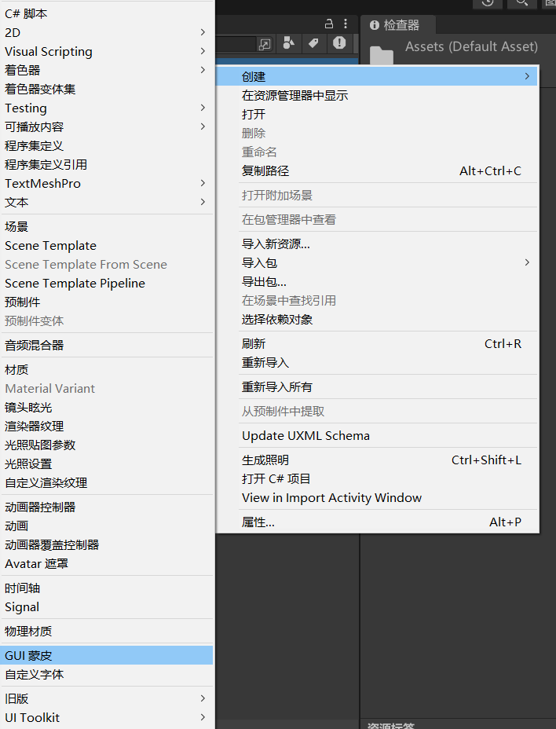
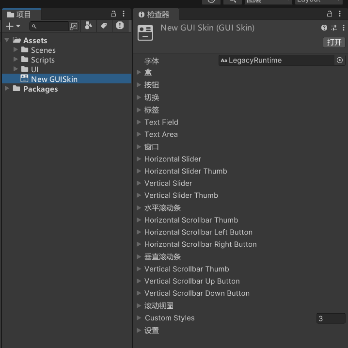

# 颜色*
## color静态变量 全局的着色颜色
```cs
// GUI 的全局着色颜色。
GUI.color = Color.red;
GUI.Label(new Rect(0, 50, 150, 30), "全局着色颜色标签红");
GUI.Button(new Rect(0, 100, 150, 30), "全局着色颜色按钮红");
GUI.color = Color.white;
GUI.Button(new Rect(0, 150, 150, 30), "全局着色颜色按钮白", style);
```

## contentColor静态变量 文本着色颜色
```cs
// 文本着色颜色，会和全局颜色相乘。
// 为 GUI 渲染的所有文本着色。
GUI.contentColor = Color.yellow;
GUI.Button(new Rect(0, 200, 150, 30), "文本着色颜色");
```

## backgroundColor静态变量 背景元素着色颜色
```cs
// 用于 GUI 渲染的所有背景元素的全局着色颜色。
// 背景元素着色颜色会和全局颜色相乘。
GUI.backgroundColor = Color.green;
GUI.Button(new Rect(0, 250, 150, 30), "背景元素着色颜色", style);
```

# 整体皮肤样式
在Project窗口可以右键创建GUI皮肤





skin静态变量 全局皮肤
```cs
public GUISkin mySkin;

private void OnGUI()
{
    GUI.skin = mySkin;    // 为null就是默认的样式，单个Style会覆盖
}
```