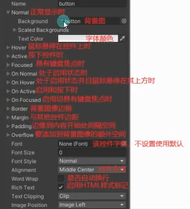
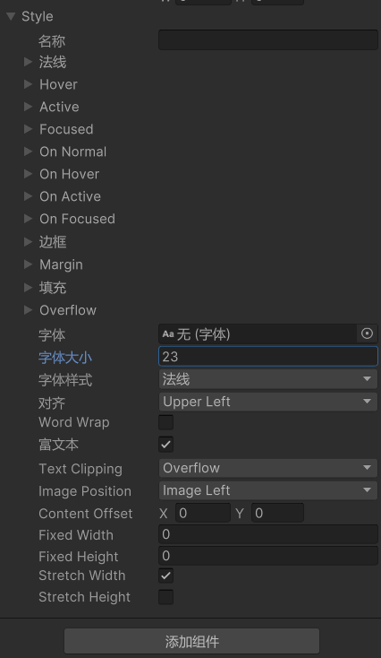

# GUI控件绘制的共同点
1. 他们都是GUI公共类中提供的静态函数，直接调用即可。
2. 他们的参数都大同小异：
    - 位置参数：Rect参数（x、y位置，w、h尺寸），左上角为坐标系原点
    - 显示文本：string参数
    - 图片信息：Texture参数
    - 综合信息：GUIContent参数    （综合显示 文本，图片，tooltip）
    - 自定义样式：GUIStyle参数
3. 每一种控件都有多种重载，都是各个参数的排列组合。

注意：
- 必备的参数内容是**位置**信息和**显示**信息
- GUI的原点（0,0）Rect在左上角，x向右，y向下 为正

# 文本控件

**Label静态方法所有重载**
```cs
// 在屏幕上创建一个文本或纹理标签。
// Label静态方法所有重载
public static void Label(Rect position, string text);
public static void Label(Rect position, Texture image);
public static void Label(Rect position, GUIContent guiContent);
public static void Label(Rect position, string text, GUIStyle style);
public static void Label(Rect position, Texture image, GUIStyle style);
public static void Label(Rect position, GUIContent guiContent, GUIStyle style);
```

**string参数 和 Texture参数**
```cs
// 基本使用 传入位置信息和显示信息 显示信息可以是显示文本和图片信息
GUI.Label(new Rect(100, 20, 100, 20), "666666欢迎你");
// public static void Label(Rect position, Texture image);
GUI.Label(labelRect1, image);
```

**GUIContent**
```cs
// 综合使用 传入位置信息和综合信息
// 综合信息GUIContent类里包括显示文本和图片信息
// public static void Label(Rect position, GUIContent labelGuiContent);
GUI.Label(labelRect2, guiContent);
// tooltip静态变量 可以获取当前鼠标或者键盘选中的GUI控件 对应的 tooltip信息
// 鼠标指针当前悬停在其上或具有键盘焦点的控件的工具提示。（只读）
Debug.Log(GUI.tooltip);
```

**GUIStyle参数**





字体在：C:\Windows\Fonts 下面

# 按钮控件
参数和使用方式与[文本控件](#文本控件)一毛一样
```cs
// 按钮控件  (在按钮范围内 按下鼠标再抬起鼠标 才算一次点击 才会返回true
GUI.Button(btnRect, btnContent, btnStyle);
```

```cs
// 长按按钮控件   (只要在长按按钮范围内 按下鼠标 就会一直返回true
if (GUI.RepeatButton(btnRect, btnContent))
{
    Debug.Log("只要在长按按钮范围内 按下鼠标 就会一直返回true");
}
```


# 练习
请用GUI制作一个游戏开始界面，上面有开始游戏，退出游戏，设置等等按钮选项，点击开始游戏可以切换到游戏场景

```cs
using UnityEngine;

public class StartMenu : MonoBehaviour
{
    // 游戏标题
    public Rect labPos;
    public GUIContent labContent;
    public GUIStyle labStyle;

    // 三个按钮位置和样式
    public Rect btn1Pos;
    public Rect btn2Pos;
    public Rect btn3Pos;
    public GUIStyle btnStyle;

    void OnGUI()
    {
        // 渲染游戏标题
        GUI.Label(labPos, labContent, labStyle);

        // 渲染三个按钮
        if (GUI.Button(btn1Pos, "开始游戏", btnStyle))
        {
            // 点击开始游戏按钮事件处理
            // SceneManager.LoadScene("GameScene");
            LoginPanel.ShowMe();
            HideMe();
        }

        if (GUI.Button(btn2Pos, "设置游戏", btnStyle))
        {
            // 点击设置游戏按钮事件处理
            SettingPanel.ShowMe();
            HideMe();
        }

        if (GUI.Button(btn3Pos, "退出游戏", btnStyle))
        {
            // 点击退出游戏按钮事件处理
            QuitTipPanel.ShowMe();
            HideMe();
        }
    }

    // 隐藏当前界面
    void HideMe()
    {
        gameObject.SetActive(false);
    }
}
```