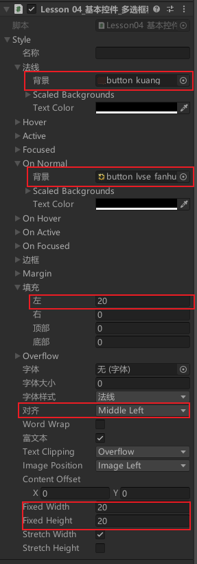

# 多选框
**GUI.Toggle的返回值是该Toggle被点击后是否选中**
Toggle静态方法 创建多选框
```cs
// 创建一个打开 / 关闭的开关按钮。
// 要传入一个布尔值，true为选中，false为不选中
// Toggle静态方法会返回一个布尔值，返回的布尔值是, 上次鼠标改变Toggle后是否选中
// 普通样式
isSel = GUI.Toggle(new Rect(0, 0, 100, 30), isSel, "效果开关");
// GUI.Toggle的点击范围是用的Rect中的宽高
// 用fixedWidth和fixedHeight 改变图片的大小，但是不改变点击范围
// 修改从GUIStyle边缘到内容起始处的空间 padding
isSel2 = GUI.Toggle(new Rect(0, 40, 100, 30), isSel2, "音效开关", style);
```

修改多选框样式


# 单选框
单选框通过多选框来实现的
```cs
// 单选框    (一般通过一个int来控制所有的flag, 可通过点击来改变是否选中)
if (GUI.Toggle(rect, selIndex == 1, "选项1"))
{
	selIndex = 1;
}
if (GUI.Toggle(rect, selIndex == 2, "选项2"))
{
	selIndex = 2;
}
```

# 练习
控制一个面板（比如设置面板的UI）的显隐，通常是将显示面板的脚本挂载到一个Pannel的游戏对象上，在控制这个游戏对象的失活与激活来是否显示面板和隐藏面板
1. 要完成面板之间相互控制显示有3种方法：
    - 第一种：都写在一个 `OnGUI` 中，通过 `bool` 标识去控制显影。
    - 第二种：挂载在同一个对象上，通过控制脚本的 `gameObject.SetActive(true/false)` 去控制面板的显影。
    - 第三种：挂载在不同对象上，通过控制对象的 `gameObject.SetActive(true/false)` 来达到面板的显影。
2. 关键的是如何在多个面板之间相互调用显隐。我们是通过静态变量和静态方法的形式，在 `Awake` 方法中初始化静态变量。如果要用该方法，**一开始这个对象不能失活**。

**制作一个游戏设置面板，上面有背景音乐的开关和音效的开关，并且点击开始界面的设置面板可以打开设置面板**


## 单例模式，控制各个面板的显隐
```cs
// 开始面板脚本
public class BeginPanel : MonoBehaviour
{
    // 开始面板的显示隐藏
    private static BeginPanel instance;

    public static void ShowMe()
    {
        if (instance != null)
        {
            instance.gameObject.SetActive(true);
        }
    }

    public static void HideMe()
    {
        if (instance != null)
        {
            instance.gameObject.SetActive(false);
        }
    }

    private void Awake()
    {
        instance = this;
        HideMe();
    }

    // 其他代码...

    private void OnGUI()
    {
        // 其他代码...
    }
}
```


## **设置面板脚本SettingPanel.cs**
```cs
// 设置面板脚本
public class SettingPanel : MonoBehaviour
{
    // 音乐开关和音效开关
    public Rect toggleMusicPos; // **API: Rect**
    public Rect toggleSoundPos; // **API: Rect**
    private bool isSelMusic = true;
    private bool isSelSound = true;

    private static SettingPanel instance;

    public static void ShowMe()
    {
        if (instance != null)
        {
            instance.gameObject.SetActive(true);
        }
    }

    public static void HideMe()
    {
        if (instance != null)
        {
            instance.gameObject.SetActive(false);
        }
    }

    private void Awake()
    {
        instance = this;
        HideMe();
    }

    private void OnGUI()
    {
        // 音乐开关和音效开关
        isSelMusic = GUI.Toggle(toggleMusicPos, isSelMusic, "音乐开关");
        isSelSound = GUI.Toggle(toggleSoundPos, isSelSound, "音效开关");

        // 关闭按钮 设置面板 
        if (GUI.Button(btnPos, "", btnStyle))
        { 
            // 关闭自己这个面板的功能 
            HideMe(); 
            // 显示开始界面 
            BeginPanel.ShowMe(); 
        }
    }
}
```

## **开始面板BeginPanel.cs**
```cs
//开始面板
public class BeginPanel : MonoBehaviour
{
    //面板的显示隐藏 所有地方都能够快速使用的
    //静态 方法 和静态变量 就可以直接通过类名就用了
    private static BeginPanel instance;

    public static void ShowMe()
    {
        if (instance != null)
        {
            instance.gameObject.SetActive(true);
        }
    }

    public static void HideMe()
    {
        if (instance != null)
        {
            instance.gameObject.SetActive(false);
        }
    }

    //游戏标题
    public Rect labPos;
    public GUIContent labContent;
    public GUIStyle labStyle;

    //3个游戏按钮
    public Rect btn1Pos;
    public Rect btn2Pos;
    public Rect btn3Pos;
    public GUIStyle btnStyle;

    private void Awake()
    {
        instance = this;
    }

    private void OnGUI()
    {
        //游戏标题
        GUI.Label(labPos, labContent, labStyle);

        //3个游戏按钮
        if (GUI.Button(btn1Pos, "开始游戏", btnStyle))
        {
            //SceneManager.LoadScene("GameScene");
            LoginPanel.ShowMe();
            HideMe();
        }
        if (GUI.Button(btn2Pos, "设置游戏", btnStyle))
        {
            //显示设置界面
            SettingPanel.ShowMe();
            //隐藏自己
            HideMe();
        }
        if (GUI.Button(btn3Pos, "退出游戏", btnStyle))
        {
            QuitTipPanel.ShowMe();
            HideMe();
        }
    }
}
```