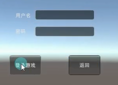

# 输入
## 普通输入TextField
- 输入框 重要参数：
    1. 显示内容 string
    2. 最大输入字符串的长度
- 和多选框类似 要不停得到自己输入的内容

```cs
public string inputStr = "hello";

// 创建一个可供用户编辑字符串的单行文本字段。
inputStr = GUI.TextField(new Rect(0, 0, 100, 30), inputStr, 5);//最多显示5个字符 超过了不会在打出来了
```

## 密码输入框PasswordField
```cs
public string inputPW = "";

// 创建一个可让用户输入密码的文本字段。
inputPW = GUI.PasswordField(new Rect(0, 50, 100, 30), inputPW, '★');//密码文本是★
```

# 拖动条
## 水平拖动条
- 拖动条重要参数
    1. 当前的值
    2. 最小值 left
    3. 最大值 right
- 也是要不停得到自己输入的内容

```cs
public float nowValue = 0;

// 用户可以拖动的水平滑动条，用于在最小值和最大值之间更改某值。
nowValue = GUI.HorizontalSlider(new Rect(0, 100, 100, 50), nowValue, 0, 1);
Debug.Log(nowValue);
```

## 竖直拖动条
```cs
 // 用户可以拖动的垂直滑动条，用于在最小值和最大值之间更改某值。
nowValue = GUI.VerticalSlider(new Rect(0, 150, 50, 100), nowValue, 0, 1);
```


# 练习
**在设置面板中加入拖动条控制音乐大小**
```cs
// 设置面板脚本
public class SettingPanel : MonoBehaviour
{
    // 拖动条控制音乐大小
    private float musicValue = 1;
    public Rect musicPos;
    private float soundValue = 1;
    public Rect soundPos;

    private void OnGUI()
    {
        // 拖动条
        musicValue = GUI.HorizontalSlider(musicPos, musicValue, 0, 1);
        soundValue = GUI.HorizontalSlider(soundPos, soundValue, 0, 1);
    }
}
```

**制作一个登陆面板**
请在之前的基础上,制作一个登陆面板,有用户名输入和密码输入,有进入游戏和返回上一级按钮,点击开始界面中的开始游戏后 进入登陆面板,输入的用户名为admin密码为8888才能切换场景


```cs
public class LoginPanel : MonoBehaviour
{
    //面板的显示隐藏 所有地方都能够快速使用的
    //静态 方法 和静态变量 就可以直接通过类名就用了
    private static LoginPanel instance;

    public static void ShowMe()
    {
        if (instance != null)
        {
            instance.gameObject.SetActive(true);
        }
    }

    public static void HideMe()
    {
        if (instance != null)
        {
            instance.gameObject.SetActive(false);
        }
    }

    //两个 按钮
    public Rect btn1Pos;
    public Rect btn2Pos;
    //两个 label
    public Rect lab1Pos;
    public Rect lab2Pos;
    //两个 输入框
    public Rect input1Pos;
    public Rect input2Pos;

    //用户名和密码
    private string userName = "";
    private string passWord = "";

    private void Awake()
    {
        instance = this;
        HideMe();
    }

    private void OnGUI()
    {
        //登录按钮
        if ( GUI.Button(btn1Pos, "登录游戏") )
        {
            if(userName == "admin" && passWord == "8888")
            {
                SceneManager.LoadScene("GameScene");
            }
            else
            {
                Debug.Log("用户名或者密码错误");
            }
        }

        //返回按钮
        if( GUI.Button(btn2Pos, "返回") )
        {
            BeginPanel.ShowMe();
            HideMe();
        }

        //文本
        GUI.Label(lab1Pos, "用户名");
        GUI.Label(lab2Pos, "密码");

        //输入框
        userName = GUI.TextField(input1Pos, userName);
        passWord = GUI.PasswordField(input2Pos, passWord, '*');
    }
}
#endregion

```