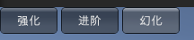
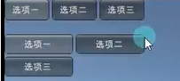
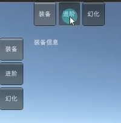

# 工具栏Toolbar

```cs
// 创建一个工具栏。
// 需要声明一个 int 变量用于选择 和一个 string 数组用于显示当前选择的工具栏的内容。
public int toolbarIndex = 0;
public string toolbarInfos = new string[] { "选项1", "选项2", "选项3" };
// Toolbar静态方法会返回一个 int 值，也需要重新赋值个给选择的 int 变量。
toolbarIndex = GUI.Toolbar(new Rect(0, 0, 200, 30), toolbarIndex, toolbarInfos);

// 工具栏可以帮助我们根据不同的返回索引 来处理不同的逻辑
switch (toolbarIndex)
{
    case 0:
        // 处理索引为0的逻辑
        break;
    case 1:
        // 处理索引为1的逻辑
        break;
    case 2:
        // 处理索引为2的逻辑
        break;
}
```

# 选择网格SelectionGrid

```cs
// 创建一个按钮网格。
// 也需要声明一个 int 变量用于选择 和一个 string 数组用于显示当前选择的工具栏的内容。
// 相对 toolbar 多了一个参数 xCount 代表 水平方向最多显示的按钮数量 比如有三个按钮 这参数天了填了2 那么一行最多只要两个按钮。
selGridIndex = GUI.SelectionGrid(new Rect(0, 50, 200, 60), selGridIndex, toolbarInfos, 2);
```

# 练习

```cs
public class TestPanel : MonoBehaviour
{
    public Rect toolbarPos;
    public Rect selGridPos;

    public string[] strs = new string[] { "装备", "进阶", "幻化" };

    private int nowSelIndex = 0;

    public Rect labelPos;

    private void OnGUI()
    {
        nowSelIndex = GUI.Toolbar(toolbarPos, nowSelIndex, strs);
        nowSelIndex = GUI.SelectionGrid(selGridPos, nowSelIndex, strs, 1);

        switch (nowSelIndex)
        {
            case 0:
                GUI.Label(labelPos, "装备信息");
                break;
            case 1:
                GUI.Label(labelPos, "进阶信息");
                break;
            case 2:
                GUI.Label(labelPos, "幻化信息");
                break;
        }
    }
}

```