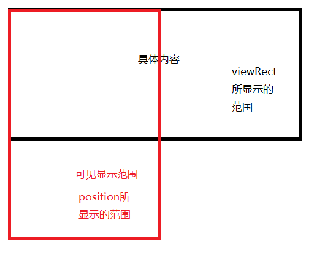
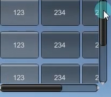
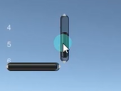
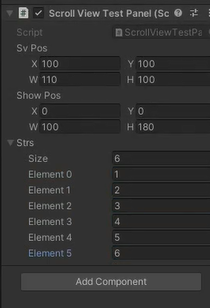

# 分组 BeginGroup
```cs
//BeginGroup静态方法 开始分组
//开始一个组。必须与 EndGroup 调用配对使用。
//用于批量控制控件位置 
//可以理解为 包裹着的控件加了一个父对象 
//可以通过控制分组来控制包裹控件的位置
GUI.BeginGroup(groupRect);    // 必须搭配EndGroup来使用

//组内的组件
GUI.Button(new Rect(0, 0, 100, 50), "测试按钮");
GUI.Label(new Rect(0, 60, 100, 20), "Label信息");

//EndGroup静态方法 结束分组
//结束组。
GUI.EndGroup();
```

# 滚动列表 BeginScrollView

在Unity中，GUI.BeginScrollView函数用于创建一个可以滚动的视图区域，允许在较小的矩形区域内显示较大的内容。该函数的参数如下所示：
- **position (Rect)**：指定  **滚动视图**  的矩形区域，使用Rect类型来表示，包含了左上角的位置坐标和宽度、高度。
- **scrollPosition (Vector2)**：指定当前滚动位置的二维向量，表示在滚动视图中内容的偏移量。
- **viewRect (Rect)**：指定  **具体内容**  的矩形区域大小，使用Rect类型来表示，包含了左上角的位置坐标和宽度、高度。


```cs
public Rect scrollPos;
public Rect showView;
public Vector2 nowPos;

nowPos = GUI.BeginScrollView(scrollPos, nowPos, showView);

// 中间填想要放在滚动列表里面的UI    eg:
GUI.Toolbar(new Rect(0, 0, 300, 50), 0, strs); 
GUI.Toolbar(new Rect(0, 60, 300, 50), 0, strs); 
GUI.Toolbar(new Rect(0, 120, 300, 50), 0, strs); 
GUI.Toolbar(new Rect(0, 180, 300, 50), 0, strs);

GUI.EndScrollView();
```

# 练习
**制作一个滚动视图，外部有一个字符串数组，通过在Inspector修改这个字符串数组数量，会在滚动视图内部动态的创建label依次显示内容**
想让滚动视图的真实内容大小 随内容(这里是strings)大小变化而变化



```csharp
public string[] strs;
public Rect scrollPos;
public Rect showView;
public Vector2 nowPos;

private void OnGUI()
{
    // 想让滚动视图的真实内容大小 随内容(这里是strings)大小变化而变化
    // 在绘制滚动视图之前把变化的数据计算好
    showView.height = strs.Length * 30;    // 计算你要生成的内容的高度
    
    nowPos = GUI.BeginScrollView(scrollPos, nowPos, showView);
    
    for (int i = 0; i < strs.Length; i++)
    { 
        GUI.Label(new Rect(0, i * 30, 100, 30), strs[i]);
    }
    
    GUI.EndScrollView();
}
```
