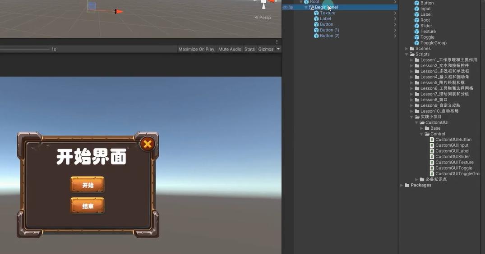

先拼面板



# TestBeginPanel.cs
```cs
public class BeginPanel : MonoBehaviour
{
    public CustomGUIButton btnBegin;
    public CustomGUIButton btnEnd;
    public CustomGUIButton btnQuit;

    void Start()
    {
        btnBegin.clickEvent += () =>
        {
            Debug.Log("Begin");
        };
        btnEnd.clickEvent += () =>
        {
            Debug.Log("End");
        };
        btnQuit.clickEvent += () =>
        {
            this.gameObject.SetActive(false);
        };
    }
}

```