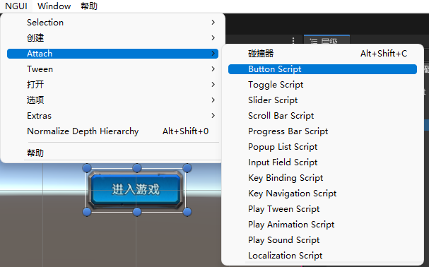
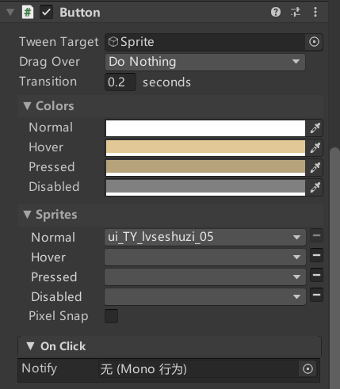
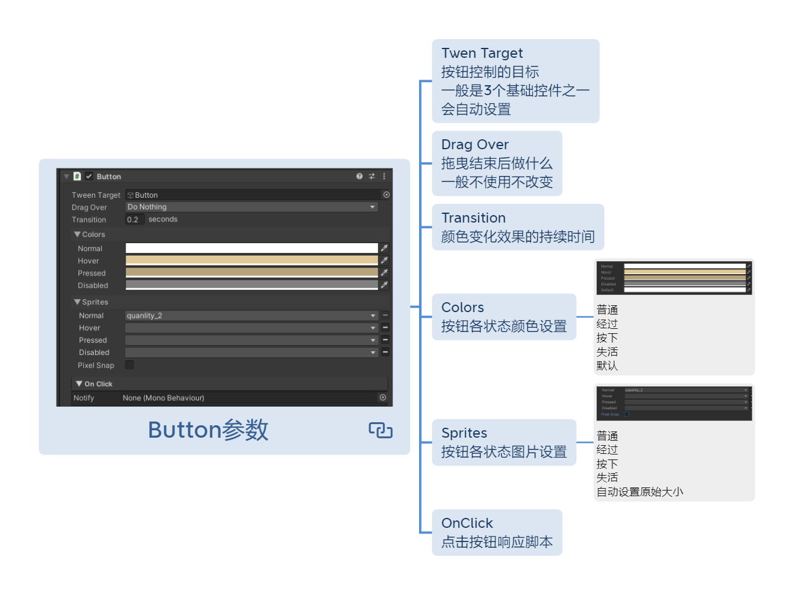
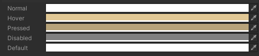
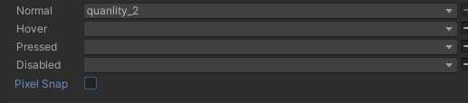
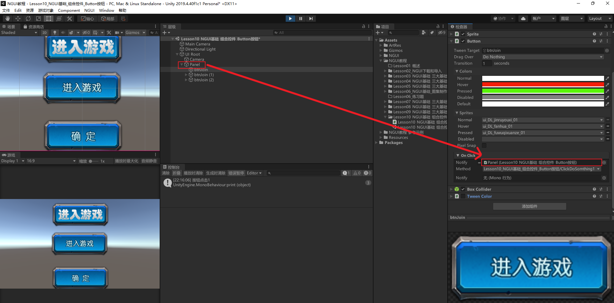
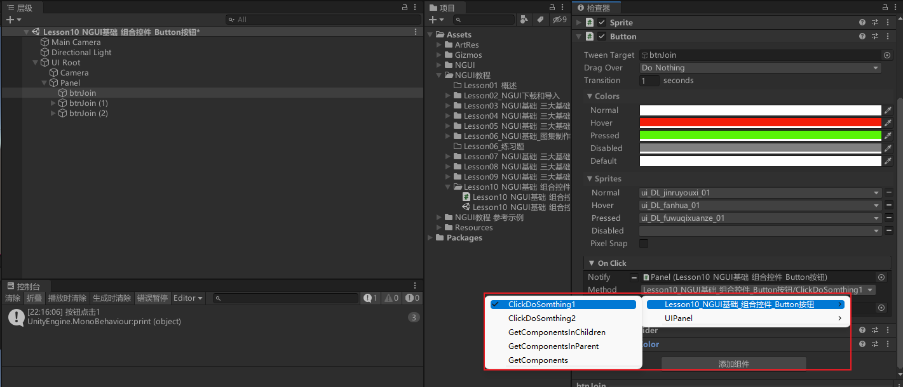
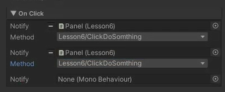
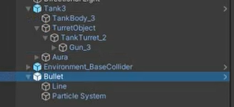
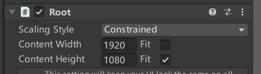

# 所有组合控件的共同特点
- 组合控件都是在三大基础控件 精灵图片、标签文本、纹理大图对象上添加对应组件。
- 如果希望响应点击等事件，需要添加NGUI碰撞器。

# Button是用来干嘛的？
UI界面中的按钮，当点击按钮后我们可以进行一些处理。

# 制作Button
1. 添加一个Sprite（需要文字再加一个Label子对象）
2. 为Sprite添加Button脚本
3. 添加NGUI的碰撞器




# Button参数相关





## Twen Target 按钮控制的目标 
一般是3个基础控件之一 会自动设置

## Drag Over  拖曳结束后做什么 
一般不使用不改变

## Transition 颜色变化效果的持续时间

## Colors 按钮各状态颜色设置

普通 经过 按下 失活 默认

## Sprites 按钮各状态图片设置

普通 经过 按下 失活 自动设置原始大小

## OnClick 点击按钮响应脚本

## Pixel Snap 是否使用图片默认大小
勾选后，点击或者经过等各种按钮的状态就会使用原有的图片的大小

# 监听Button按钮点击事件的两种方式
## 拖脚本监听按钮点击事件
在脚本里写要按钮点击要执行的函数
```cs
public void ClickDoSomthing1()
{
    print("按钮点击1");
}
```

挂载脚本到一个对象上（这里挂载了Panel上），把对象拖拽到按钮的Notify变量上


选择按钮点击要执行的函数所在的脚本，再选择点击要执行的函数


注意：
- 点击执行的函数是私有的，就不能在Inspector的窗口选择关联。
- 可以选择多个对象拖拽到按钮的Notify变量上，然后可以选择多个按钮点击要执行函数，这样按钮点击时可以执行多个函数。


## 代码获取按钮对象监听 （更常用
```cs
public UIButton uIButton;

void Start()
{
    //获取UIButton实例对象后，给UIButton添加监听，传入要监听的函数
    //其中onClick其实是UIButton实例对象中的一个List<EventDelegate>类型的变量
    //无非就是调用Add方法给这个列表 添加一个新的EventDelegate类型的对象
    //EventDelegate类型有一个构造函数 是传入一个无参无返回的委托 我们就传入我们的无参无返回值的函数即可
    //public delegate void Callback();

    //添加一个名为ClickDoSomthing2的方法作为UIButton组件的点击事件处理程序，该方法在按钮被点击时被调用
    uIButton.onClick.Add(new EventDelegate(ClickDoSomthing2));

    //添加一个匿名方法作为UIButton组件的第二个点击事件处理程序，在按钮被点击时执行打印语句
    uIButton.onClick.Add(new EventDelegate(() => {
        print("那么大表达式添加的 点击事件处理");
    }));
}

public void ClickDoSomthing2()
{
    print("按钮点击2");
}

```

# 练习
请用现在所学知识，制作一个这样的功能:场景上有一个坦克，点击NGUI的发射按钮，可以让坦克发射一颗子弹

场景中创建地板对象，坦克对象，子弹对象


子弹脚本BulletObj.cs
```cs
public class BulletObj : MonoBehaviour
{
    public float speed = 20; 

    private void Start()
    {
        // 在子弹生成后，经过 3 秒自动销毁该 GameObject（包括其所有组件）
        Destroy(this.gameObject, 3f); 
    }

    void Update()
    {
        // Time.deltaTime 可以保证每一帧更新都是平滑的
        this.transform.Translate(Vector3.forward * Time.deltaTime * speed); 
    }
}
```


坦克脚本TankObj.cs
```cs
public class TankObj : MonoBehaviour
{
    public Transform shootPos; // 开火位置，指明子弹的发射位置
    
    public void Fire()
    {
        // 发射子弹
        // 方法一：使用GameObject直接拖拽方式实例化出一个Bullet预制体
        
        // 方法二：使用Resources动态加载Bullet预制体到游戏场景中。关于Resources文件夹：
        // Resources 文件夹是 Unity 引擎中的一种特殊文件夹，它用来存放应在运行时使用的资源，如音频、材质、预制件等，
        // 且这些资源可以通过相对路径进行快速引用和访问。
        
        // 加载名为 "Obj/Bullet" 的 GameObject 预制体，返回其 GameObject 类型。
        // 在设计中，"Obj/Bullet" 表示 Bullet 预制体所在的相对路径，也就是位于 Obj 文件夹下的 Bullet 预制体。
        GameObject go = Instantiate(Resources.Load<GameObject>("Obj/Bullet"),// 接受隐藏字符串2个字符开始的问题 猫大
                                      shootPos.position, // 设置子弹初始出现的位置坐标
                                      shootPos.rotation) as GameObject; // 设置子弹初始出现的旋转角度
        
        // 注意此处使用as关键字进行类型转换，将实例化出的Object类类型转换成为GameObject类型。
    }
}
```


创建UIRoot，设置模式为手游的限制模式为Constrained，设置好美术资源的分辨率


GamePanel.cs脚本，用于管理所有GamePanel下的控件
```cs
public class GamePanel : MonoBehaviour
{
    public UIButton btn;   // 通过inspector在面板中拖放按钮组件
    
    public TankObj player; // 关联场景中的坦克对象
    
    // Start 函数会在第一帧开始前被调用
    void Start()
    {
        btn.onClick.Add(new EventDelegate(() => { 
            player.Fire();
        }));
    }
}
```