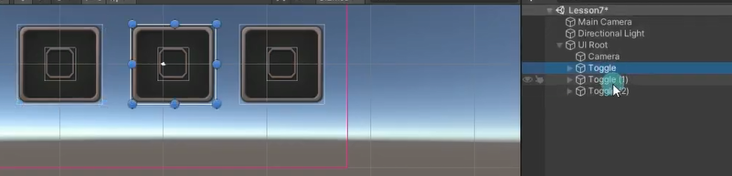

# Toggle是用来干嘛的？
单选框和多选框都可以使用它来制作。


# 制作Toggle
创建两个Sprite对象，一个父对象，一个子对象。


为Sprite父对象添加Toggle脚本。


为Sprite父对象添加NGUI的碰撞器。


还没完，父与子还没建立联系，将子对象拖到Toggle脚本关联


# Toggle脚本参数


## Group 多选框分组
多个多选框分为一组则变为单选框


三个单选框

把参数Group都改成1组，（0组是不分组的意思）
三个就会互斥，只能选一个


- State of None
  单选框状态时 是否允许不选中


## Starting State开始默认状态
勾选为选中

## Sprite 选中用图片

## Invert State 反转状态
如果选中不显示
不选中显示
就勾选它

## Animator  状态变化时播放动画（新动画系统）
## Animation  状态变化时播放动画（老动画系统）
## Tween  状态变化时缓动

## Transition 过渡模式
平滑过渡
瞬间过渡

## OnValueChange 状态变化时响应脚本

# 监听Toggle单多选框选择改变事件的两种方式


**拖脚本**


**代码获取按钮监听**
```cs
public UIToggle uIToggle;
public UIToggle uIToggle1;
public UIToggle uIToggle2;
public UIToggle uIToggle3;

void Start()
{
    //代码进行监听添加
    uIToggle1.onChange.Add(new EventDelegate(Change2));
    uIToggle2.onChange.Add(new EventDelegate(Change2));
    uIToggle3.onChange.Add(new EventDelegate(Change2));
}

//代码进行监听添加，建议private
private void Change2()
{
    print("Toggle变化执行的内容");

    //UIToggle的value变量可以判断单选框有没有被选中
    if (uIToggle1.value)
    {
        print("tog1选中");
    }
    else if (uIToggle2.value)
    {
        print("tog2选中");
    }
    else if (uIToggle3.value)
    {
        print("tog3选中");
    }
}
```


# 练习
在基础上，请用现在所学知识，制作一个这样的功能，场景上坦克发射子弹有音效，通过用NGUI的Toggle开关 控制音效开关

把开火的音效资源放到Resource文件夹下


在坦克脚本的开火函数里添加播放音效的逻辑
注意：
这里是讨巧写法，真正开发会有音效管理器之类的东西

TankObj.cs
```cs
public class TankObj : MonoBehaviour
{
    public Transform shootPos;
    
    // 音效片段文件
    private AudioClip clip;
    
    public void Fire()
    {
        // 添加一个 Audio Source 组件以用于播放声音
        AudioSource source = this.gameObject.AddComponent<AudioSource>();
        
        // 设置音效片段文件
        if (clip == null)
            clip = Resources.Load<AudioClip>("Sound/CannonShoot");
        source.clip = clip;
        
        // 命令 Audio Source 组件开始播放音效
        source.Play();
        
        // 控制声音开关的代码
        // 如果设置了静音，则将声音关闭
        source.mute = !MusicData.isOpenSound;
        
        // 为了避免组件过多，可以在一定时间后移除当前添加的组件
        Destroy(source, 2);
        
        Instantiate(Resources.Load<GameObject>("Obj/Bullet"), shootPos.position, shootPos.rotation);
    }
}
```

制作一个Toggle


创建一个音效数据管理类，创建一个静态变量设置音效的开关，这个静态的音效开关变量可以在坦克脚本的开火函数中设置开火是否开音效，也可以监听面板音效框是否选中的回调
MusicData.cs
```cs
public class MusicData
{
    //音效开关
    public static bool isOpenSound = true;
}
```

GamePanel.cs
```cs
public class GamePanel : MonoBehaviour
{
    public UIButton btn;
    
    public TankObj player;
    
    // 此变量用于存储一个 UIToggle 类型的引用，代表音效开关组件
    public UIToggle togSound;
    
    void Start()
    {
        btn.onClick.Add(new EventDelegate(() =>
        {
            player.Fire();
        }));
        
        // 注册音效开关事件，让静态的 MusicData.isOpenSound 与当前 UIToggle 组件中 value 值进行同步
        togSound.onChange.Add(new EventDelegate(() =>
        {
            //将“是否打开声效”设置为 toggle 的值：如果它被选中，则为 true；否则为 false
            MusicData.isOpenSound = togSound.value;
        }));
    }
}
```
