# Input是啥？
文本输入框，可以用来制作账号、密码、聊天输入框等。

# 制作Input
1. 一个Sprite做背景，一个Label显示文字。
   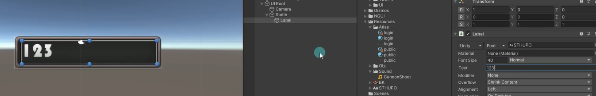
2. 为Sprite对象添加Input脚本。
   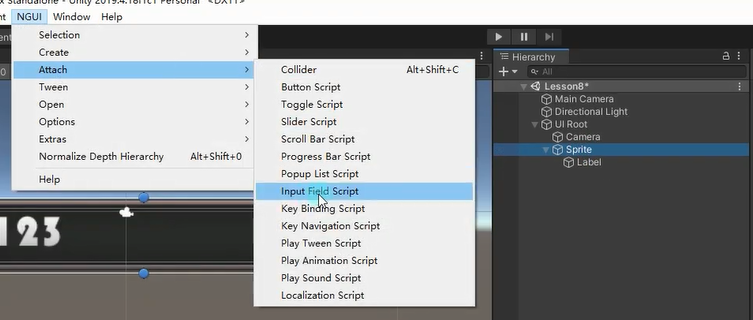
3. 为Sprite对象添加NGUI的碰撞器。
   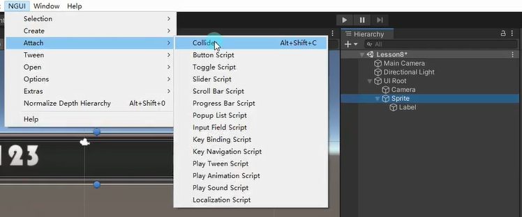


# Input脚本参数
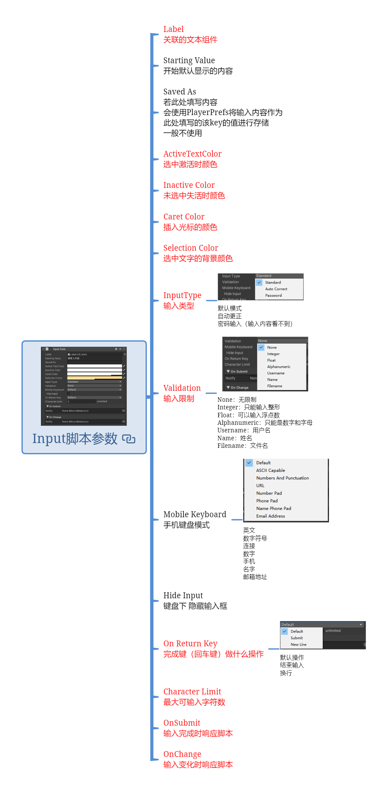

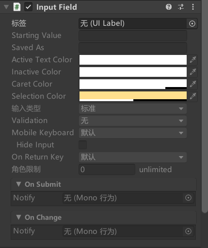


## Label 关联的文本组件

## Starting Value 开始默认显示的内容

## Saved As*
若此处填写内容
会使用PlayerPrefs将输入内容作为
此处填写的该key的值进行存储
一般不使用

## ActiveTextColor 选中激活时颜色

## Inactive Color 未选中失活时颜色

## Caret Color 插入光标的颜色
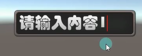
## Selection Color 选中文字的背景颜色
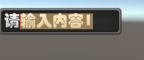
## InputType 输入类型
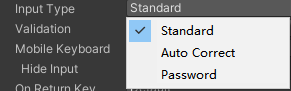
默认模式
自动更正
密码输入（输入内容看不到）

## Validation 输入限制
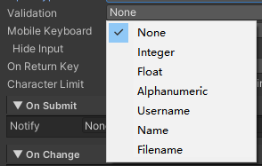
None：无限制
Integer：只能输入整形
Float：可以输入浮点数
Alphanumeric：只能是数字和字母
Username：用户名
Name：姓名
Filename：文件名


## Mobile Keyboard* 手机键盘模式
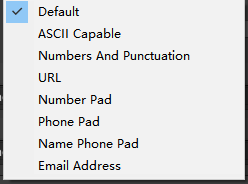


英文
数字符号
连接
数字
手机
名字
邮箱地址

## Hide Input* 键盘下 隐藏输入框

## On Return Key 完成键（回车键）做什么操作
默认操作
结束输入
换行

## Character Limit 最大可输入字符数

## OnSubmit 输入完成时响应脚本

## OnChange 输入变化时响应脚本

# Input文本输入监听输入完成和输入改变事件的两种方式


拖脚本监听输入完成和输入改变的点击事件
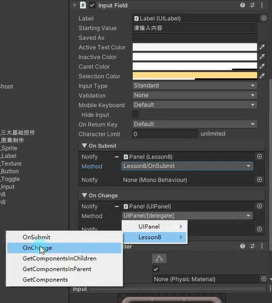


代码监听输入完成和输入改变的点击事件
```cs
public UIInput uIInput;

void Start()
{
    //1.拖曳脚本
    //2.通过代码关联

    uIInput.onSubmit.Add(new EventDelegate(() =>
    {
        print("完成输入 通过代码添加的监听函数");
    }));

    uIInput.onChange.Add(new EventDelegate(() =>
    {
        print("输入变化 通过代码添加的监听函数");
    }));
}

public void OnSubmit()
{
    print("输入完成" + uIInput.value);
}

public void OnChange()
{
    print("输入变化" + uIInput.value);
}
```

# 练习
在基础上，请用现在所学知识，制作一个这样的功能，场景左上角会显示玩家的姓名，右侧有一个改名按钮，点击改名按钮后会弹出一个改名窗口，在窗口上可以输入你的新名字，点击确定键后，原左上角的名字将改变


在GamePanel下添加一个用于显示用户名的Label和一个用于点击改名的按钮

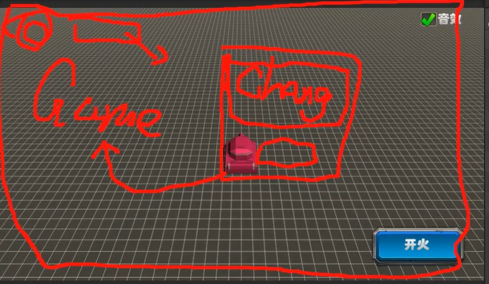


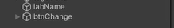
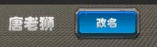

在GamePanel脚本创建一个UILabel变量和UIButton，拖拽赋值给刚刚创建的用户名文本和打开改名面板按钮

GamePanel.cs
```cs
public class GamePanel : MonoBehaviour
{
    public UILabel labName; // 文本标签组件，用于呈现玩家名称等信息
    public UIButton btnChangeName; // 改名按钮组件，用于打开 UI 以修改玩家名称 
}
```

创建一个更详细的面板来改名，还要给背景添加NGUI碰撞器遮挡后面的
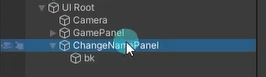
添加相关的显示面板的信息
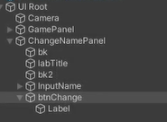
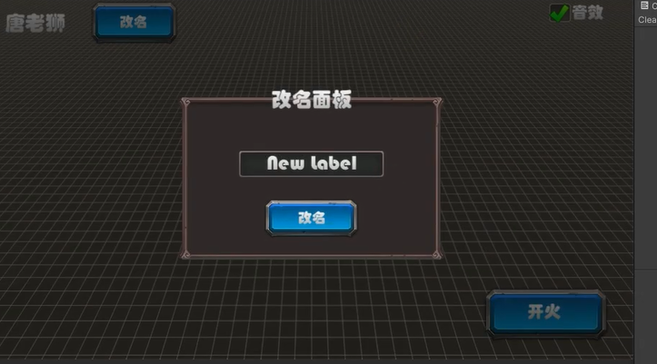

创建ChangeNamePanel脚本，创建变量并关联改名输入框和改名按钮，添加点击改名按钮的的事件监听，并且把ChangeNamePanel做成单例模式

```cs
public class ChangeNamePanel : MonoBehaviour
{
    private static ChangeNamePanel instance; 
    
    public static ChangeNamePanel Instance => instance;
    
    public UIButton btnChange; // UI 按钮组件，用于提交玩家修改的名称
    
    public UIInput inputName; // UI 输入框组件，用于接收玩家输入的新名称字符串
    
    private void Awake()
    {
        instance = this;
    }
    
    void Start()
    {
        // 为按钮注册点击事件，以触发相关操作
        btnChange.onClick.Add(new EventDelegate(() => {
            // 修改主面板上显示的名字
            GamePanel.Instance.labName.text = inputName.value;
            // 隐藏自己的面板
            this.gameObject.SetActive(false);
        }));
        
        // 初始化时将自身面板隐藏起来
        this.gameObject.SetActive(false);
    }
}
```

把GamePanel也做成单例模式，给打开改名面板按钮添加点击打开改名面板的监听
GamePanel.cs
```cs
void Start()
{
    // 为改名按钮注册点击事件，以打开 UI 以修改玩家名称
    btnChangeName.onClick.Add(new EventDelegate(() =>
    {
        // 处理打开改名 UI 的逻辑
        ChangeNamePanel.Instance.gameObject.SetActive(true);
    }));
}
```