# PopupList是啥？
下拉列表
类似在vs中点窗口后下面的功能
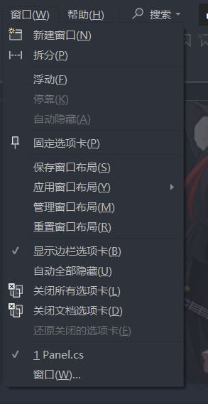

# 制作PopupList
1. 一个sprite做背景，一个label做显示内容。
   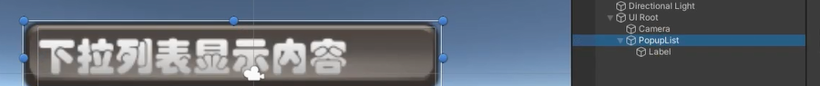
2. 为Sprite对象添加PopupList脚本。
   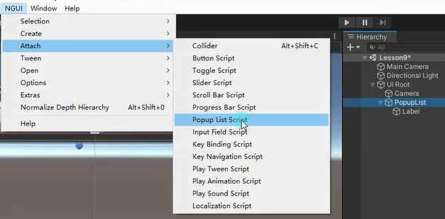
3. 为Sprite对象添加NGUI的碰撞器。
   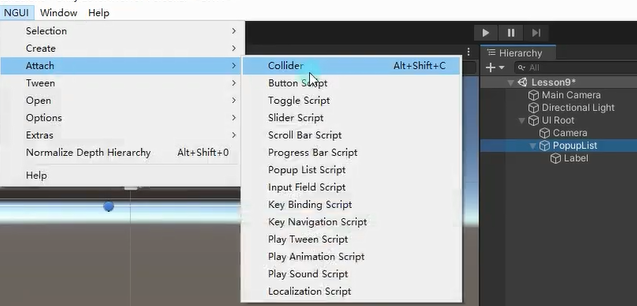
4. 关联label做信息更新，选择Label中的SetCurrentSelection函数。（假如发现点击下拉列表没有反应，检查一下字体设置是不是为空
   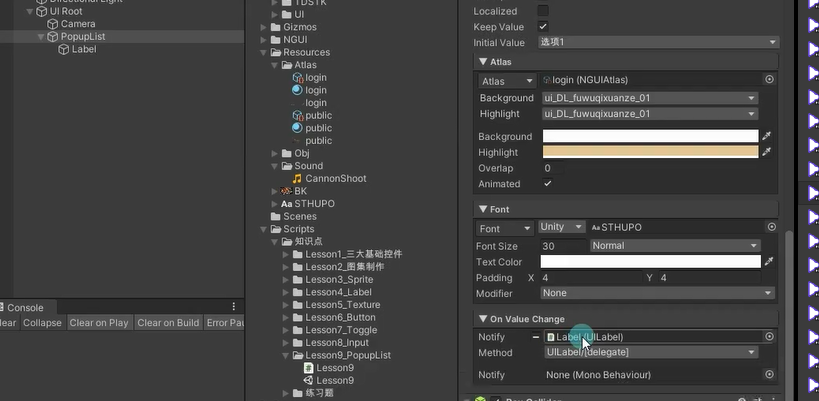
   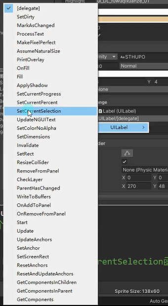


# PopupList脚本参数

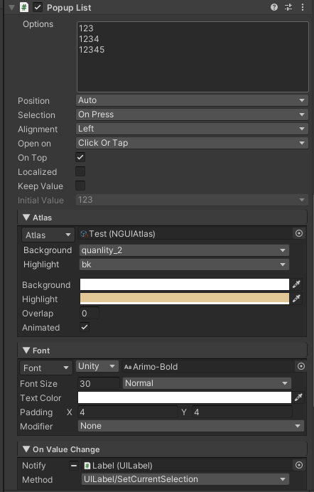


## Options
下拉列表显示内容（空一行表示加一个）
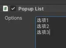

## Position 列表出现位置
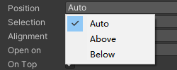
自动（建议自动 让其自动判断）
向上
向下

## Selection* 选中操作
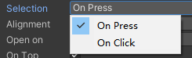
按下选中（一般选这个）
点击选中

## Alignment 对其方式
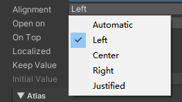
自动对齐
左对齐
居中对齐
右对齐
调整会自动变化

## Open on 下拉列表打开方式
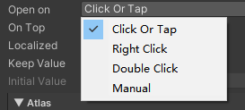
点击或者触碰（一般这个） 
右键
双击
手动（相当于关闭。自己代码处理，一般不选择）

## On Top 始终显示在所有面板之前
默认选择

## Localized* 是否将对弹出列表的值进行本地化

## Keep Value 始终保持有列表中的某个默认值

## Intial Value 默认选择的内容

## Atlas

### Atlas 图集

### Background 下拉列表 背景图

### Highlight 下拉列表 选中图

### Background 背景颜色叠加

### Highlight 选中图颜色叠加

### Overlap* 弹出窗口边框与打开它的内容重叠的数量

### Animated 是否有默认的弹出动画
禁用可以节约性能

## Font

### Font 字体

### Font Size 字体大小

### TextColor 字体颜色

### Padding* 偏移位置

### Modifier* 修饰方式，强制大小写字母
没有限制
大写字母
小写字母
自定义

## OnValueChange 值选择改变时监听脚本

# 事件监听两种方式

拖脚本监听输入完成和输入改变的点击事件

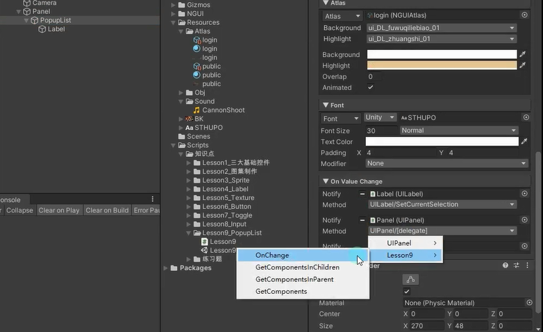


代码监听下拉框改变的点击事件
```cs
public void OnChange()
{
    print("选项变化" + uIPopupList.value);
}
```

```cs
//动态添加选项
uIPopupList.items.Add("新加 选项4");

//代码添加选项监听
uIPopupList.onChange.Add(new EventDelegate(() => {
    print("代码添加的监听" + uIPopupList.value);
}));
```

# 练习
在上，请用现在所学知识，制作一个这样的功能，场景上有一个下拉列表，可以通过改变下拉列表来改变当前场景是白天还是黑夜

白天和黑夜可以通过改变光源的角度来做

在GamePanel创建下拉框对象，设置好文字字体等，注意添加碰撞器，而且要关联子物体label并设置关联的SetCurrentSelection函数
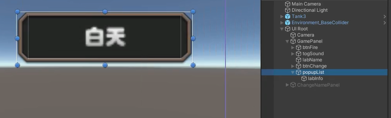
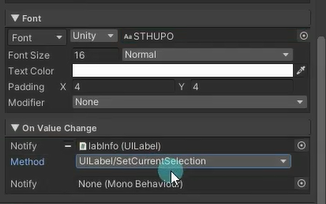


```cs
public class GamePanel : MonoBehaviour
{
    
    public UIPopupList list; // 下拉列表控件
    public Light lightObj; // 灯光对象
    
    void Start()
    {
        
        // 下拉列表选项状态改变时添加对应的回调方法
        list.onChange.Add(new EventDelegate(() => {
            //根据选中的选项，切换游戏场景灯光的强度
            switch (list.value)
            {
                case "白天":
                    lightObj.intensity = 1; // 切换到白天灯光强度为1
                    break;
                case "黑夜":
                    lightObj.intensity = 0.2f; // 切换到夜晚灯光强度为0.2
                    break;
            }
        }));
    }
}
```