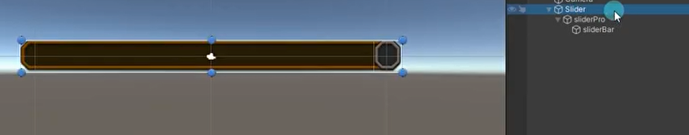
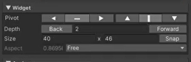
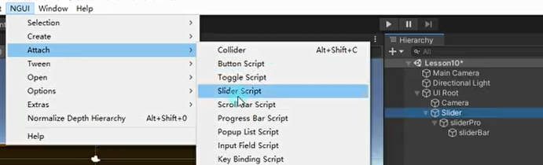
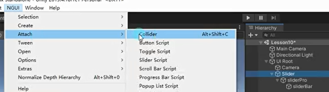
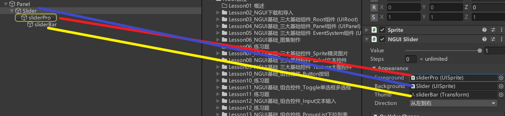
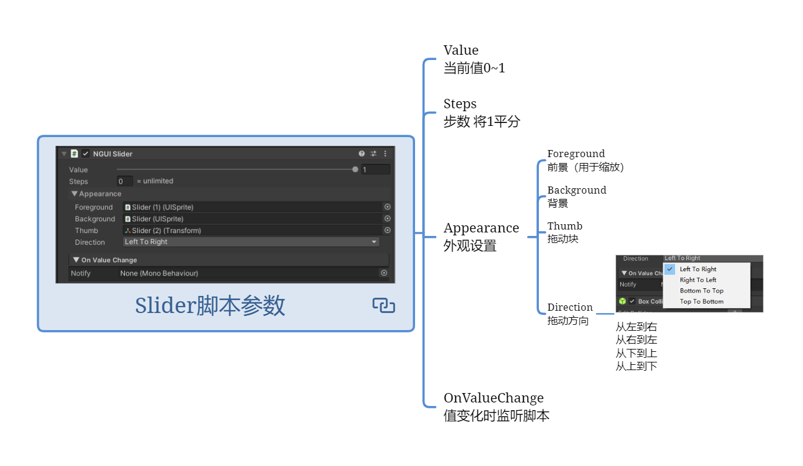
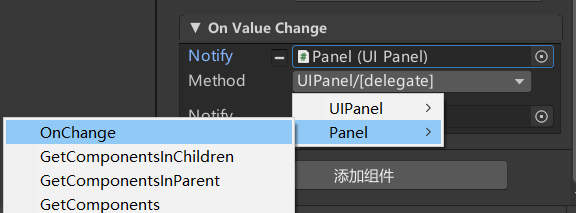
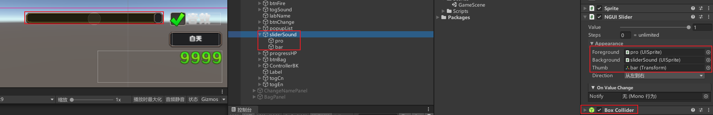

# Slider是啥？
滑动条控件，主要用于设置音乐音效大小等。

# 制作Slider
1. 3个Sprite （一个sprite对象做为根对象的为背景，一个sprite对象作为背景对象的子对象当做进度条对象，一个sprite对象作为进度条对象的子对象当做滑动块对象。）
   
2. 设置层级 （背景对象最小，进度条对象其次，滑动块对象最大。下图的是滑动块sliderBar的）
   
3. 为根背景添加Slider脚本。
   
4. 添加NGUI的碰撞器（背景对象或者滑动块对象）
   添加到背景上按背景所有地方都可以影响到
   添加到滑动块对象上只能鼠标只影响到滑块
   
5. Slider脚本上关联背景对象、进度条对象和滑动块对象。
   
   


# Slider脚本参数



## Value 当前值0~1

## Steps 步数 将1平分

## Appearance 外观设置

### Foreground 前景（用于缩放）

### Background 背景

### Thumb 拖动块

### Direction
拖动方向
从左到右 从右到左 从下到上 从上到下    

## OnValueChange 值变化时监听脚本


# Slider滑动条监听滑动条改变事件的两种方式
拖脚本监听滑动条改变的点击事件



代码监听滑动条改变的点击事件
```cs
//值变化监听
uISlider.onChange.Add(new EventDelegate(() => {
    print("通过代码监听值变化" + uISlider.value);
}));

//拖拽结束后监听
uISlider.onDragFinished += () => {
    print("拖曳结束" + uISlider.value);
};
```


# 练习
在基础上，请用现在所学知识，制作一个这样的功能，场景上有一个滑动条，可以通过它控制音效的音量大小

按创建slider的套路创建三个sprite图片，给背景对象添加slider脚本和碰撞器，调整三个sprite对象的层级，关联slider脚本上的三个对象



音乐数据类添加全局静态控制音量大小的变量
MusicData.cs
```cs
public class MusicData
{
    // 音效开关
    public static bool isOpenSound = true;
    // 音效大小
    public static float soundValue = 1;
}
```

坦克的开火函数的时候设置开火时的音量大小
TankObj.cs
```cs
public void Fire()
{
    // 设置音效的音量
    source.volume = MusicData.soundValue;
}
```

GamePanel中添加slider变量并在外面关联创建的slider对象，添加改变slider后的监听，设置给音乐数据类的全局音量大小
GamePanel.cs
```cs
public class GamePanel : MonoBehaviour
{
    public UISlider sliderSound;
    
    void Start()
    {
        sliderSound.onChange.Add(new EventDelegate(() =>
        {
            // 音量大小
            MusicData.soundValue = sliderSound.value;
        }));
    }
}
```