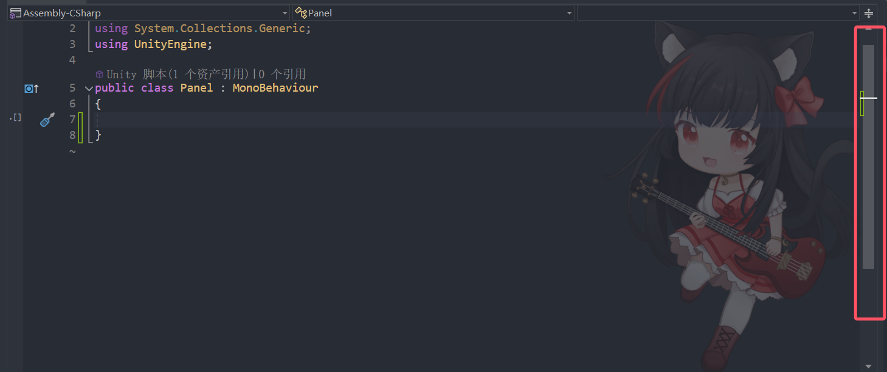

# ScrollBar滚动条和ProgressBar进度条 是啥的？
ScrollBar滚动条一般不单独使用，都是配合滚动视图使用，类似VS右侧的滚动条，随着内容的增多滚动条可能变短。
ProgressBar进度条一般不咋使用，一般直接用即可。
他们的参数和之前的知识很类似，所以这两个知识点不是重点，了解如何制作即可。



# Scrollbar
## 制作Scrollbar
1. 两个Sprite对象，一个Sprite对象充当背景，一个Sprite对象充当滚动条。
   
2. 给Sprite背景父对象添加脚本ScrollBar脚本。
   
3. 给Sprite背景父对象添加NGUI碰撞器。
   
4. ScrollBar脚本关联对象。
   

## 参数相关和基本一样

# ProgressBar
## 制作ProgressBar
1. 两个Sprite对象，一个Sprite对象充当背景，一个Sprite对象充当进度条。
   
2. 给Sprite背景父对象添加脚本ProgressBar脚本。
   
3. ProgressBar脚本关联对象。
   
不添加碰撞器的原因是因为进度条不需要玩家手动改变。


# 练习
在基础上，请用现在所学知识，制作一个这样的功能，长按鼠标可以蓄能，会出现一个进度条表示当前的蓄能进度，按下鼠标出现进度条，松开鼠标进度条消失，鼠标长按过程中，进度条更新，5秒钟后蓄能满，进度条满，坦克的血量+10

GamePanel下创建一个两个sprite充当成进度条，添加进度条脚本，关联两个sprite


在GamePanel脚本下创建进度条变量，关联进度条对象。添加给外部显示隐藏更新蓄能条的方法，开始时默认隐藏
```cs
public class GamePanel : MonoBehaviour
{
    public UIProgressBar progressBar;
    
    void Start()
    {
        HideHpPro();
    }
    
    /// <summary>
    /// 显示蓄能条
    /// </summary>
    public void ShowHpPro()
    {
        progressBar.gameObject.SetActive(true);
    }
    
    /// <summary>
    /// 隐藏蓄能条
    /// </summary>
    public void HideHpPro()
    {
        progressBar.gameObject.SetActive(false);
    }
    
    /// <summary>
    /// 更新蓄能条
    /// </summary>
    /// <param name="nowValue"></param>
    /// <param name="maxValue"></param>
    public void UpdatePro(float nowValue, float maxValue)
    {
        progressBar.value = nowValue / maxValue;
    }
}
```

添加蓄能计时变量和当前血量变量。在Update里处理鼠标操作相关逻辑。鼠标按下时显示蓄能条，重置蓄能条事件。长按时间累加蓄能条也一直增加。五秒后加血重置时间。抬起鼠标隐藏蓄能条
```cs
public class TankObj : MonoBehaviour
{
    // 用于蓄能计时
    private float nowTime;
    // 当前血量
    public int nowHp = 100;
    
    private void Update()
    {
        // 处理按下鼠标蓄能相关
        if (Input.GetMouseButtonDown(0))
        {
            GamePanel.Instance.ShowHpPro();
            nowTime = 0;
            // 更新蓄能条
            GamePanel.Instance.UpdatePro(nowTime, 5);
        }
        else if (Input.GetMouseButtonUp(0))
        {
            GamePanel.Instance.HideHpPro();
        }
        else if (Input.GetMouseButton(0))
        {
            // 按下状态时间一直加
            nowTime += Time.deltaTime;
            // 更新蓄能条
            GamePanel.Instance.UpdatePro(nowTime, 5);
            
            // 判断最大时间
            if (nowTime >= 5)
            {
                // 重置时间
                nowTime = 0;
                nowHp += 10;
                print("当前血量：" + nowHp);
            }
        }
    }
}
```