# ScrollView是用来干啥的？
滚动视图，我们的vs代码窗口就是典型的滚动视图
主要用于背包、商店、排行榜等功能。


# 制作ScrollView
1. 直接在工具栏创建即可 NGUI——Create——ScrollView。（要先创建根对象）
   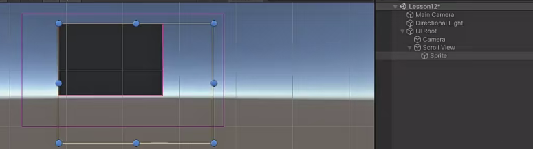
2. 若需要，自行创建ScrollBar，在ScrollView脚本中关联水平滚动条或者竖直滚动条。
   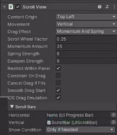
3. 给ScrollView添加**子对象**，为子对象添加Drag ScrollView脚本和NGUI碰撞器。（下图的示例是添加了一个Sprite）
   给Sprite添加一个Drag Scroll View 和 NGUI碰撞器脚本（注意：这里不需要关联，它自己运行的时候会自动关联）
   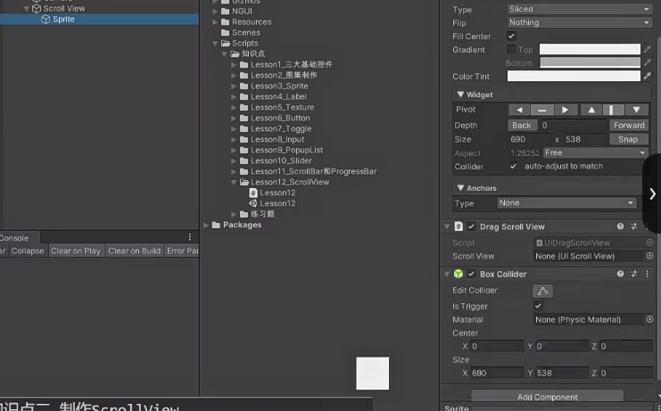


# Panel 脚本
可以更改滚动视图的可视范围
Sprite的大小
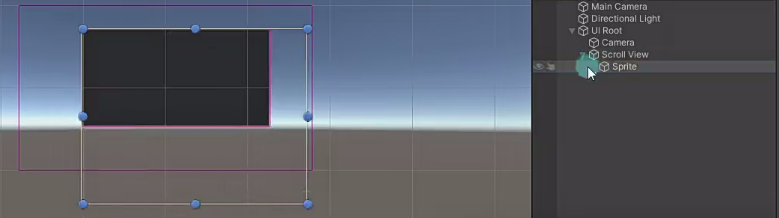

滚动视图只能看到的大小
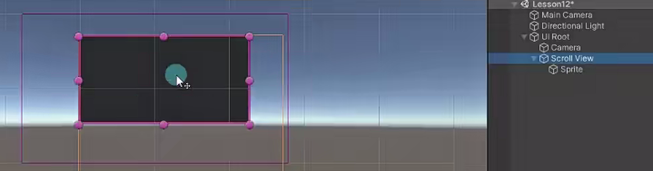

# ScrollView 脚本

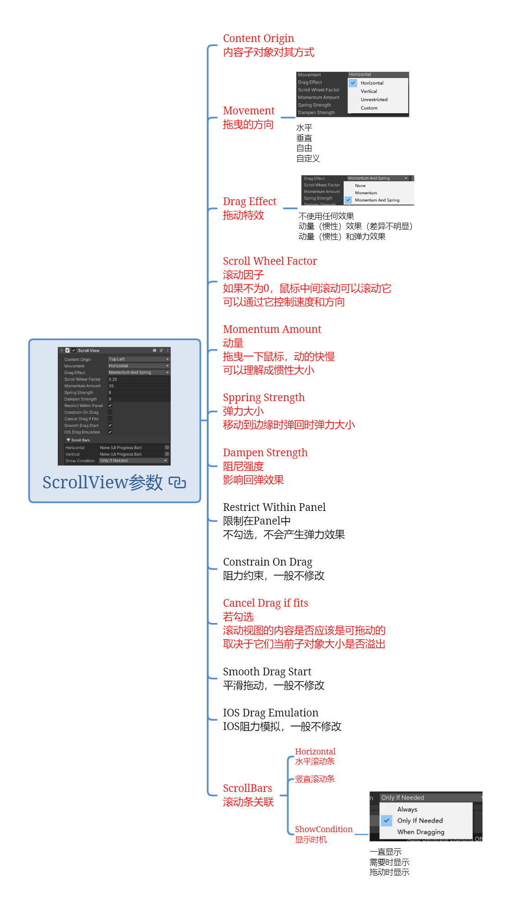

## Content Origin 内容子对象对其方式
正常情况下是从左到右，从上到下
一般选左上角Top Left就行

## Movement 子对象拖曳的方向
绿色的框是**子对象**
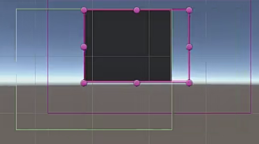
水平 垂直 自由 自定义

## Drag Effect 拖动特效
不使用任何效果
动量（惯性）效果（差异不明显） 
动量（惯性）和弹力效果 （默认，用的最多）
## Scroll Wheel Factor 滚动因子 
如果不为0，**鼠标中键**滚动可以滚动它 可以通过它控制速度和方向

## Momentum Amount 动量 
拖曳一下鼠标，动的快慢 可以理解成惯性大小

## Sppring Strength 弹力大小 
移动到边缘时弹回时弹力大小

## Dampen Strength 阻尼强度 
影响回弹效果

## Restrict Within Panel* 限制在Panel中
一般情况勾选
不勾选，不会产生弹力效果

## Constrain On Drag* 阻力约束
一般不修改

## Cancel Drag if fits 子对象溢出后能否拖动相关
**若勾选 滚动视图的内容是否应该是可拖动的 取决于它们当前子对象大小是否溢出**
如果内容没有溢出， 上下不可以拖动
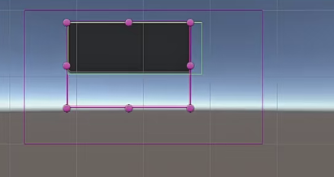
内容溢出上下可以拖动
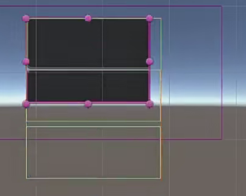


## Smooth Drag Start* 平滑拖动
一般开启， 不修改

## IOS Drag Emulation* IOS阻力模拟
一般开启，不修改

## ScrollBars 滚动条关联

### Horizontal
水平滚动条

### Vertical 竖直滚动条

### ShowCondition 显示时机
一直显示 
需要时显示 
拖动时显示


# Grid 自动对齐脚本
**实际开发中更多的是会自己写代码来对位置进行放置，而不是直接用现成的Grid**

在Scroll View中添加很多物品
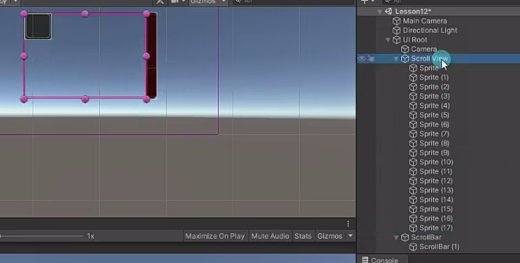

在Scroll View对象上添加Grid脚本
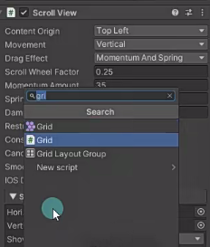
上面的添加的物体自动布局
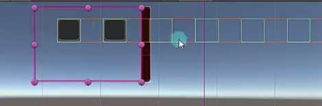


可以通过设置Grid的参数来进行调整


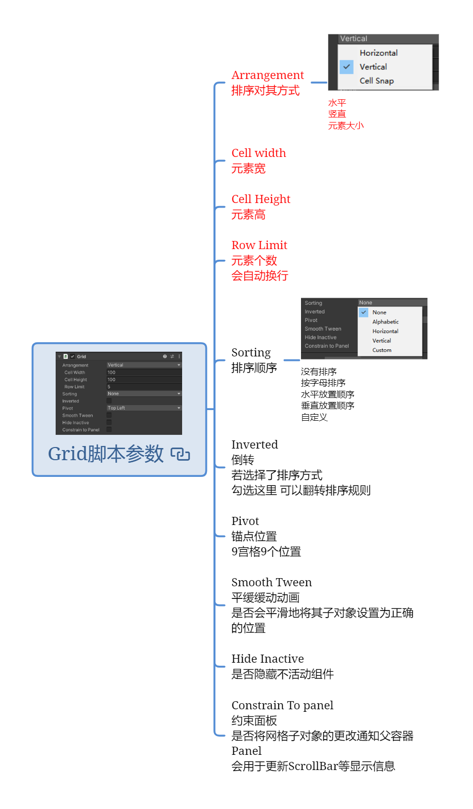


## Arrangement 排序对其方式
水平 竖直 元素大小

## Cell width 元素宽

## Cell Height 元素高

## Row Limit 元素个数 会自动换行
比如现在是水平的 （一般是这样用）
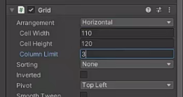
下面填个3后如下：**n行 3 列**
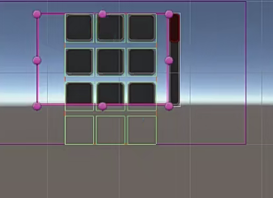


比如现在是竖直的就会变成下图
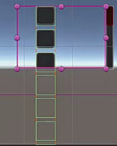
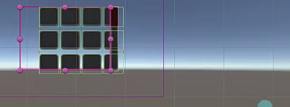

## Sorting* 排序顺序
没有排序 按字母排序 水平放置顺序 垂直放置顺序 自定义

## Inverted* 倒转 
若选择了排序方式 勾选这里 可以翻转排序规则

## Pivot* 锚点位置 
9宫格9个位置

## Smooth Tween* 平缓缓动动画 
是否会平滑地将其子对象设置为正确的位置

## Hide Inactive* 是否隐藏不活动组件

## Constrain To panel 约束面板 
**是否将网格子对象的更改通知父容器Panel 会用于更新ScrollBar等显示信息**


# 练习
在的练习题基础上，请用现在所学知识，制作一个这样的功能，有一个背包按钮，点击后可以打开一个背包面板，面板中有一个滚动视图，滚动视图中动态创建10个道具图标


1. 动态创建问题
2.  布局问题
3. 滑动条更新问题

创建背包面板，修改面板深度
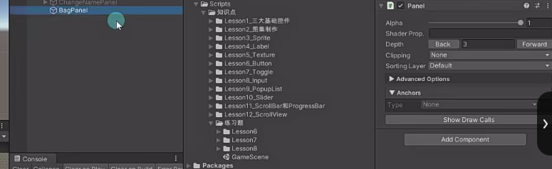

给背包面板创建一个遮罩背景（bk2），一个背包面板背景（bk）。创建一个标题标签写上文字（lableTitle）。
创建滚动视图，设置好大小并设置位置和背包面板背景一致。
创建一个滚动条（ScrollBar），设置好图片和位置，在滚动视图上关联。
注意修改滚动条的子Sprite的层级深度，并且把滚动条模式修改成从上到下。
创建一个关闭按钮。
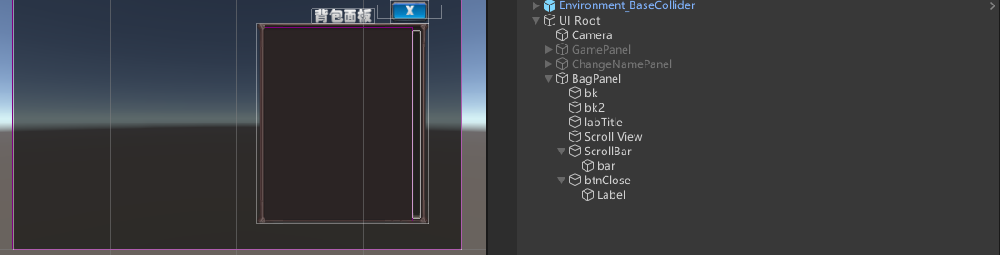

给背包滚动视图添加Grid以解决布局问题，目标是设置格子创建的位置为左上角并排列好。
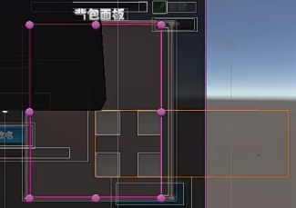

要先全选所有子对象，设置成以左上角对齐。
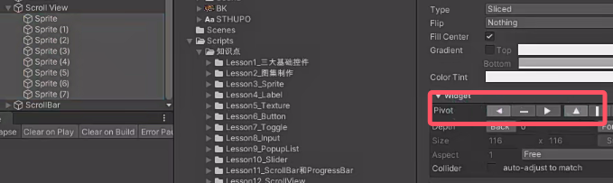

同时修改滚动视图Panel中心点Center的位置。中心点设置X位置为大小Size X的一半,Y取SIze Y的一半且是负数，就是左上角。修改中心点可能会导致上方xy的Offset变化，把它设置为0就好。设置好后重新调整滚动视图到合适的位置即可。注意修改后要重新失活激活Grid组件才能重新排列

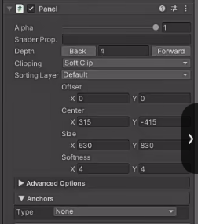


在GamePanel脚本创建背包按钮变量，创建一个背包按钮，关联后在代码添加点击出背包面板的监听
```cs
public class GamePanel : MonoBehaviour
{
    public UIButton btnBag;
    
    void Start()
    {
        // 点击背包按钮 打开背包
        btnBag.onClick.Add(new EventDelegate(() => {
            BagPanel.Instance.gameObject.SetActive(true);
        }));
    }
}

```

创建BagPanel背包面板脚本。动态创建预制体对象Item（背包物品），并且刷新滚动视图的滚动条。这样能让滚动条显示正常。可以选择是否使用滚动视图的Grid来限制动态创建预制体对象Item的位置。如果不使用的话就要通过代码手算。以后假如要自己定义排序规则最好用自己手写代码手算位置。
```cs
public class BagPanel : MonoBehaviour
{
    private static BagPanel instance;
    
    public static BagPanel Instance => instance;
    
    public UIScrollView sv;
    public UIButton btnClose;
    
    private void Awake()
    {
        instance = this;
    }
    
    void Start()
    {
        // 点击关闭按钮 让自己隐藏
        btnClose.onClick.Add(new EventDelegate(() => {
            this.gameObject.SetActive(false);
        }));
        
        // 动态创建10个道具图标
        for (int i = 0; i < 60; i++)
        {
            GameObject obj = Instantiate(Resources.Load<GameObject>("Item"));
            obj.transform.SetParent(sv.transform, false);
            // 如果通过代码 来自己设置位置 就在这里设置即可
            obj.transform.localPosition = new Vector3(120 * (i % 5), 120 * (i / 5), 0);
        }
        
        // 通过sv控制 滚动条更新
        sv.UpdateScrollbars();
        
        this.gameObject.SetActive(false);
    }
}
```