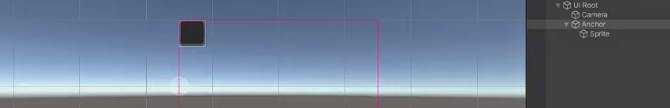
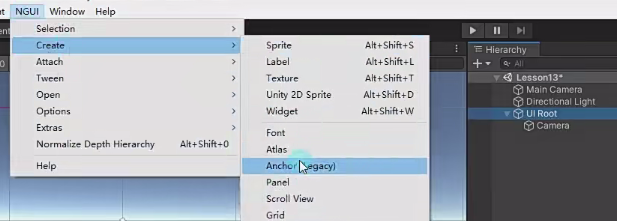
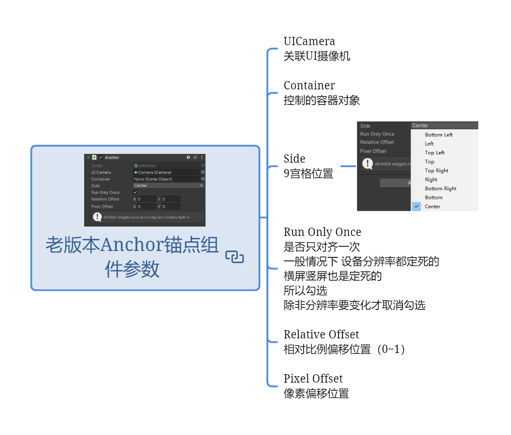
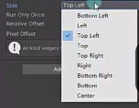
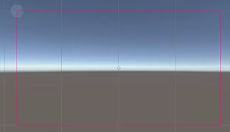
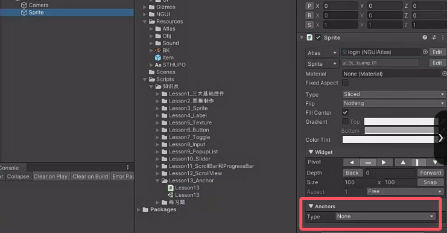
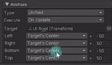
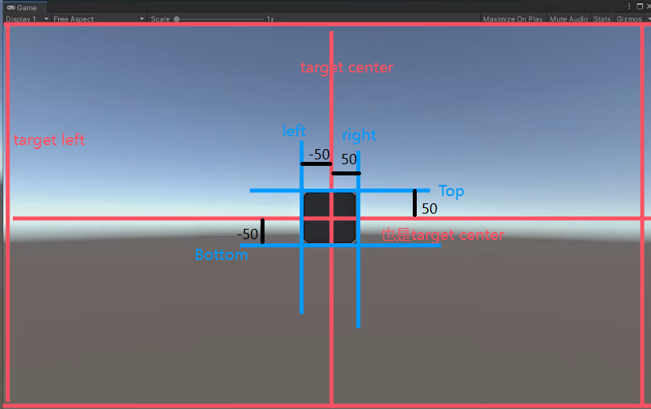
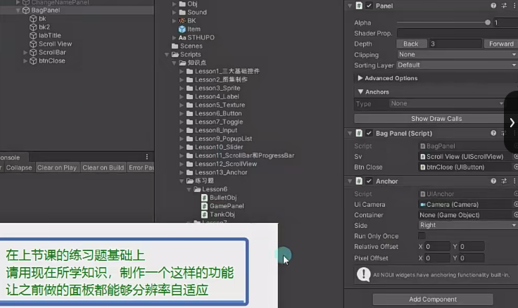

# Anchor是什么？
用于9宫格布局的锚点。
有两个关键知识点：
- 老版本——锚点组件——用于控制对象对齐方式。
- 新版本——3大基础控件自带锚点内容——用于控制对象相对父对象布局。

# 老版本锚点组件
主要用于设置面板相对屏幕的9宫格位置。
用于控制对象对齐方式。
将想要控制的对象设置为Anchor的子对象，子对象就会依照Anchor

## 创建老版本锚点组件

## 老版本Anchor锚点组件参数*

### UICamera 关联UI摄像机
会自动关联，一般不用设置
### Container 控制的容器对象
一般无需专门设置
### Side 9宫格位置

### Run Only Once 是否只对齐一次 
一般情况下 设备分辨率都定死的 横屏竖屏也是定死的 所以勾选 
除非分辨率要变化才取消勾选

### Relative Offset 相对比例偏移位置（0~1）

### Pixel Offset 像素偏移位置

# 新版本锚点组件
自带锚点信息
用于控制对象相对父对象布局。

## Type：尺寸对齐方式。
## Execute：什么时候执行更新。
- 激活时更新
- 每帧更新
- 开始时更新。

高级模式下 Left Right Bottom Top：控件左右底顶每条边都可以关联一个父Panel对象。

# 练习
在的练习题基础上，请用现在所学知识，制作一个这样的功能，让之前做的面板都能够分辨率自适应

逐个设置GamePanel下的控件的Anchor
给BagPanel添加老版本Anchor脚本，设置右对齐，调整BagPanel下控件位置，取消勾选RunOnlyOnce
