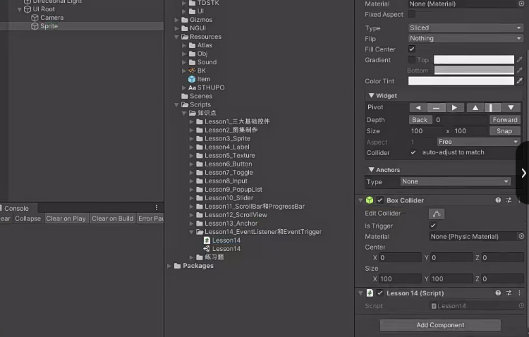
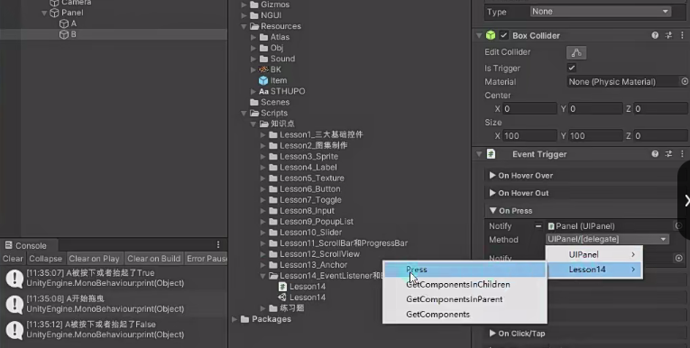
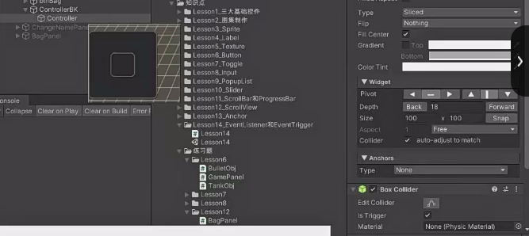

# 控件自带事件的局限性
目前复合控件只提供了一些常用的事件监听方式，比如：
Button —— 点击 uIButton.onClick.Add(new EventDelegate(ClickDoSomthing));
Toggle —— 值变化 uIToggle.onChange.Add(new EventDelegate(Change));
如果想要制作按下、抬起、长按等功能，利用现有的知识是无法完成的。


# NGUI事件响应函数
添加了碰撞器的对象
NGUI提供了一些利用反射调用的函数
原理是NGUI会在EventSystem不停地检测玩家输入，当触发到某种输入时，会去触发对象身上的各个脚本找是否有对应的函数，有的话执行对应事件。

Lesson14 有响应函数

常用NGUI事件响应函数有
- 经过 `OnHover(bool isOver)`
- 按下 `OnPress(bool pressed)`
- 点击 `OnClick()`
- 双击 `OnDoubleClick()`
- 拖曳开始 `OnDragStart()`
- 拖曳中 `OnDrag(Vector2 delta)`
- 拖曳结束 `OnDragEnd()`
- 拖曳经过某对象 `OnDragOver(GameObject go)`
- 拖曳离开某对象 `OnDragOut(GameObject go)`
- 等等等等

```cs
void OnPress(bool pressed)
{
    if (pressed)
    {
        print("按下");
    }
    else
    {
        print("抬起");
    }
}

void OnHover(bool isOver)
{
    if (isOver)
    {
        print("鼠标经过");
    }
    else
    {
        print("鼠标离开");
    }
}

void OnClick()
{
    print("点击相关");
}

void OnDoubleClick()
{
    print("双击相关");
}

void OnDragStart()
{
    print("开始拖曳");
}

void OnDrag(Vector2 delta)
{
    print("拖曳中" + delta);
}

void OnDragEnd()
{
    print("拖曳结束");
}

void OnDragOver(GameObject obj)
{
    // 这个函数传进来的是我拖的对象
    print("拖曳经过" + obj.name);
}

void OnDragOut(GameObject obj)
{
    // 这个函数传进来的是我拖的对象
    print("拖曳离开" + obj.name);
}
```

# 更加方便事件监听的UIEventListener和UIEventTrigger
如果使用上述的NGUI事件响应函数，那么Panel下的所有子控件都要写一个脚本挂上去，很不方便、不面向对象。
NGUI提供了更加方便的UIEventListener和UIEventTrigger。
UIEventListener和UIEventTrigger帮助我们封装了所有特殊响应函数，可以通过它们进行事件监听管理添加。


## UIEventListener 用代码给对象添加事件监听
适合代码添加
在Panel的脚本添加想要监听事件的对象
```cs
public UISprite A; 
public UISprite B;

UIEventListener uIEventListener = UIEventListener.Get(A.gameObject);
uIEventListener.onPress += (obj, isPress) => {
    print(obj.name + "被按下或者抬起了" + isPress);
};

uIEventListener.onDragStart += BeginDrag;
private void BeginDrag(GameObject obj)
{
    print(obj.name + "开始拖曳");
}
```

## UIEventTrigger 
适合Inspector面板关联脚本添加
UIEventTrigger 在Inspector面板给 B 添加UIEventTrigger脚本 添加按下事件监听



**UIEventListener和UIEventTrigger区别**
Listener更适合代码添加监听，Trigger适合拖曳对象添加监听。
Listener传入的参数更具体，Trigger则不会传入参数，我们需要在函数中去判断处理逻辑。


# 联系
在Anchor锚点的练习题基础上，请用现在所学知识，制作一个这样的功能，制作一个NGUI摇杆可以控制场景上的坦克移动

在GamePanel下创建一大一小两个Sprite作为摇杆背景和摇杆，小的摇杆是大摇杆背景的子物体并且层级更高。给小的摇杆添加碰撞器

GamePanel.cs
```cs
public UISprite controller;

void Start()
{
    // 通过给控制图标 GameObject 对象添加的 UIEventListener 组件来监听鼠标/手指的拖曳操作
    UIEventListener listener = UIEventListener.Get(controller.gameObject);
    
    listener.onDrag = (obj, vector) => {
    
        // 根据拖曳偏移量实现控制图标跟随鼠标移动 给本地坐标加位置 本地坐标默认(0,0)
        controller.transform.localPosition += new Vector3(vector.x, vector.y, 0);
    
        // 判断是否超出了可拖曳区域，并进行限制，使其不至于越过设定的最大半径 magnitude是向量求模
        if (controller.transform.localPosition.magnitude > 130)
            //大于最大拖拽区域就把他变成130
            controller.transform.localPosition = controller.transform.localPosition.normalized * 130;
    
        Vector2 dir = new Vector2(controller.transform.localPosition.x,
                                  controller.transform.localPosition.y).normalized;
    
        // 更改玩家对象当前的朝向和位移信息
        player.Move(dir);
    };
    
    listener.onDragEnd = (obj) =>
    {
        // 回到原点位置
        controller.transform.localPosition = Vector3.zero;
    
        // 结束时让玩家停止移动
        player.StopMove();
    };
}
```

TankObj.cs
```cs
public class TankObj : MonoBehaviour
{
    // 移动速度
    public float moveSpeed = 10;
    // 旋转速度
    public float roundSpeed = 20;
    // 移动标识
    private bool isMoving = false;
    // 要移动的方向向量
    private Vector3 moveDir;
    
    private void Update()
    {
        if (isMoving)
        {
            // 坦克沿着前方方向移动
            this.transform.Translate(Vector3.forward * moveSpeed * Time.deltaTime);
            // 旋转坦克使其朝向移动方向
            this.transform.rotation = Quaternion.Lerp(this.transform.rotation, Quaternion.LookRotation(moveDir), roundSpeed * Time.deltaTime);
        }
    }
    
    // 设置位移方向
    public void Move(Vector3 dir)
    {
        // 设置实际要转的角度 摇杆的x轴对应坦克的x轴 摇杆的y轴对应坦克的z轴
        moveDir.x = dir.x;
        moveDir.z = dir.y;
        isMoving = true; // 设置为移动状态
    }
    
    // 停止移动
    public void StopMove()
    {
        isMoving = false;
    }
}
```