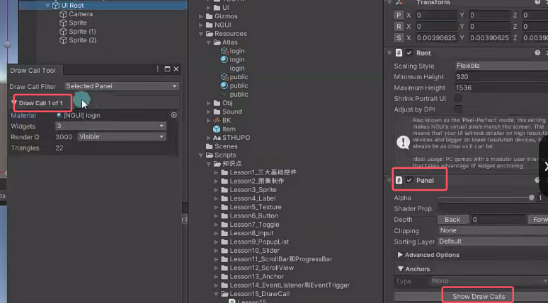
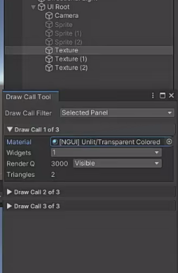

# Drawcall 概念
字面理解DrawCall就是绘制呼叫的意思，表示CPU（中央处理器）通知GPU（图形处理器-显卡）。

DrawCall概念：**CPU准备好渲染数据（顶点，纹理，法线，Shader等等）后，告知GPU开始渲染（将命令放入命令缓冲区）的命令。**

简单来说，一次DrawCall就是CPU准备好渲染数据通知GPU渲染的这个过程。

如果游戏中DrawCall数量较高会影响CPU的效率，最直接的感受就是游戏会卡顿。
举例说明：以拷贝文件来进行类比。如果我们创建10000个小文件，每个文件大小为1kb，然后把这些文件拷贝到另一个文件夹中，你会发现，即使这些文件加起来不超过10MB，但是拷贝花费的时间是很长的。如果我们单独创建1个10MB的文件拷贝到另一个文件夹，基本可以瞬间拷贝完毕。因为每一个文件赋值动作都需要很多额外的操作，比如分配内存，创建数据等等，这些操作就会带来一些额外的性能开销，进行10000个这样的操作额外开销会非常大。简单理解，文件越多额外开销就越大。

渲染过程和上面的例子很类似，每次DrawCall，CPU都需要准备很多数据发送给GPU，那么如果DrawCall越多那么额外开销就越大。其实GPU的渲染效率是很强大的，往往影响渲染效率的都是因为CPU提交命令的速度。如果DrawCall太多CPU就会把大量时间花在提交DrawCall上，造成CPU过载，游戏卡顿。

# 如何降低Drawcall的数量？
在UI层面上，主要是小图合成大图 （图集）
小图合成大图，即多个小DrawCall变为一次大DrawCall。比如当前要绘制的六张图毫无关系，那么会DrawCall六次，有六次开销。假如把当前六张图打成一张图集，那就只会DrawCall一次，减少了开销。

# 制作UI时降低Drawcall的技巧
## 通过NGUI Panel上提供的DrawCall查看工具
同一图集下的三张图，点击Panel下ShowDrawCall按钮，只有一次Drawcall

独立的显示三张图的Drawcall为3

## 注意不同图集之间的层级关系
如果更改Sprite012的层级分别为123，再修改Sprite1的图集不和Sprite0和Sprite2不一样，这样DrawCall会有三次。因为即使0和2属于同一个图集，但是他们在1和3层级，2层级插入了一个不同图集的Sprite1，会导致DrawCall增加。（**同图集之间的合并渲染被打断了**）

## 注意label的层级关系
Label其实最后也会打成一个动态的图集。
假如把他放在相同图集的Sprite的层级中间，也会打断相同图集的Sprite的合并渲染增加DrawCall。
**可以设置Label的层级更高一些避免打断相同图集的合并DrawCall。**
