# NGUI字体的作用
降低DrawCall  
自定义美术字体

# 制作NGUI字体
1. NGUI内部提供了字体制作工具，根据字体文件生成指定内容文字，达到降低DrawCall的目的
2. 使用第三方工具BitmapFont生成字体信息和图集，通过NGUI字体工具使用第三方工具生成的内容制作字体，达到自定义美术字体

假如Label选择Unity字体，可以理解为是动态字体。里面显示的文字会动态生成一个图，把它放到一个大图集里面。所以就会占用一次DrawCall。 
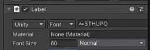
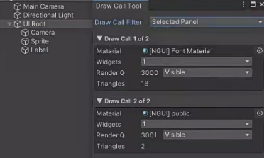

制作NGUI字体第一步打开Font Maker
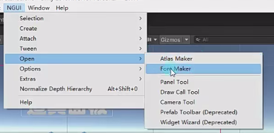

Type主要有三个模式：
生成图片制作的自定义字体
导入图片制作的自定义字体
动态字体。动态字体一般不用，用Unity的字体就是动态字体。

Output是你要把NGUI的字体图打入到哪个图集中

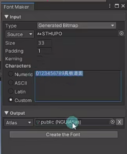
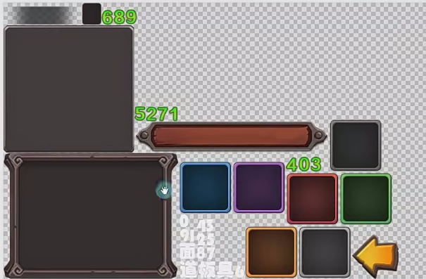
创建的字体

不过图片上如果没有文字就不会显示
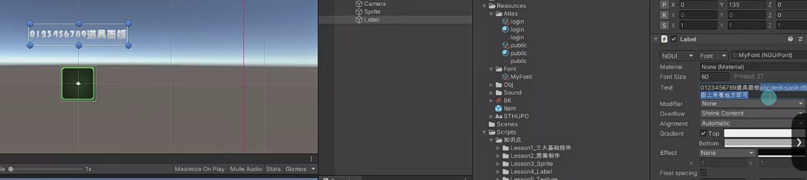

---
使用第三方工具如BitmapFont生成字体信息和 图集

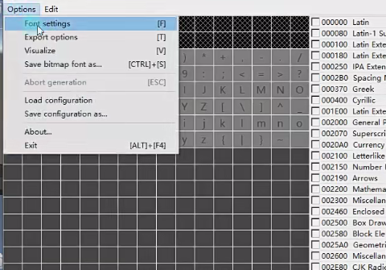
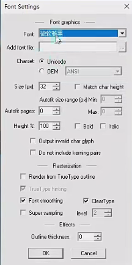

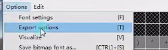

导出的图片选择为png
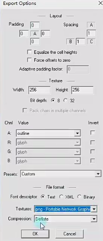

可以按照字文件中的文本来选，txt的文件格式是：带有bom的utf-8
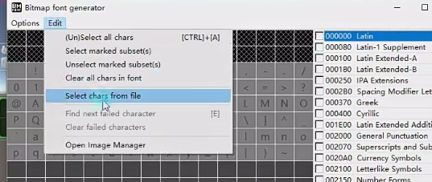
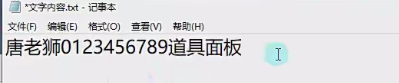

拖入生成的两个文件到工程中
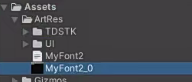

然后把图片和字体信息拖入到Font Maker中
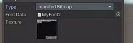

打开BitmapFont的 Image Manager自定义美术字体
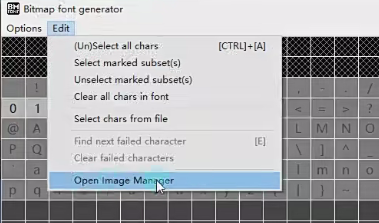
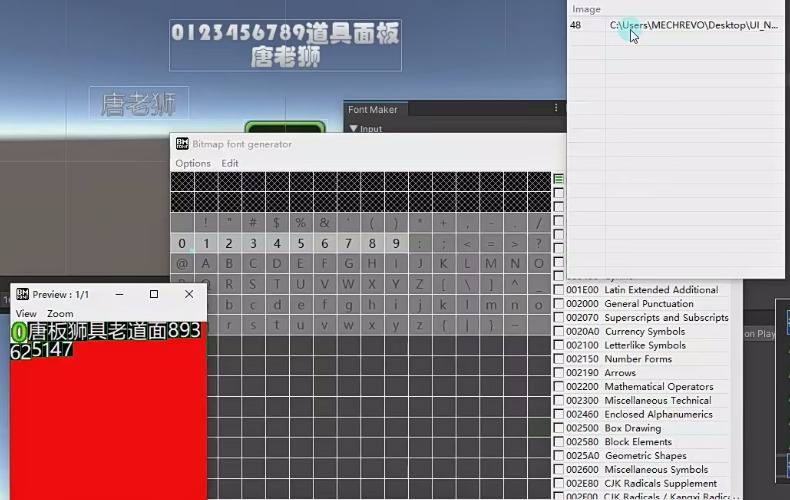

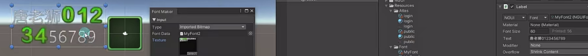

# Unity动态字体和NGUI字体如何选择
文字变化较多用Unity动态字体，变化较少用NGUI字体。
想要减少DrawCall用NGUI字体，用内存换性能。
美术字用NGUI字体

# 练习
在DrawCall的练习题基础上，请用现在所学知识，制作一个这样的功能，请制作一个自定义的美术数字字体，用于显示战斗力，在右上角显示坦克战斗力
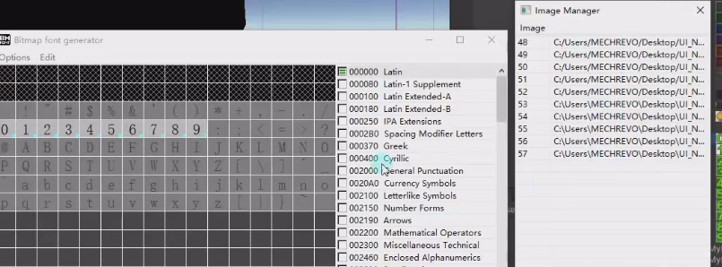

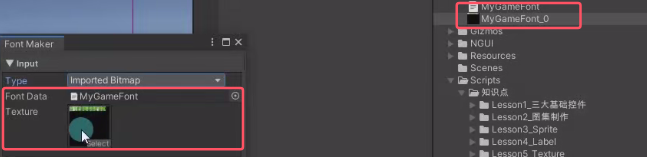

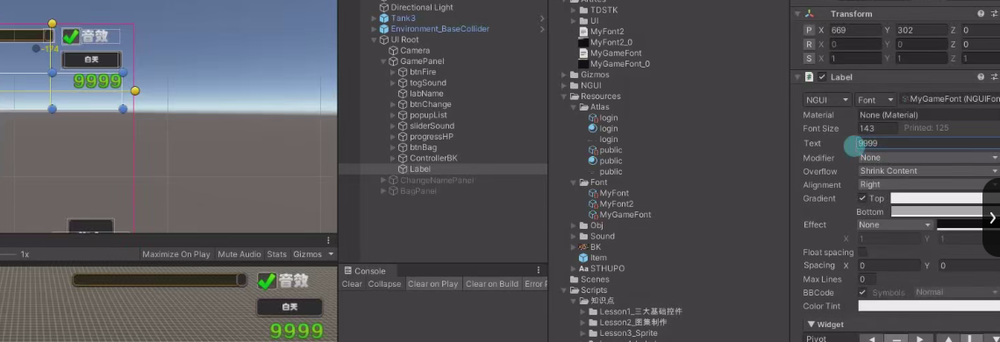