# 什么是NGUI缓动？
NGUI缓动就是让控件交互时进行缩放变化、透明变化、位置变化、角度变化等行为。
从某一种状态慢慢的变成另一种状态
NGUI自带Tween功能来实现这些缓动效果。

# 使用NGUI缓动
1. 关键组件 Tween缓动相关组件
2. 关键组件 Play Tween可以通过它让该对象和输入事件关联

给一个Sprite添加缓动效果
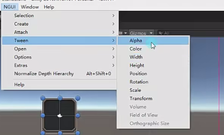
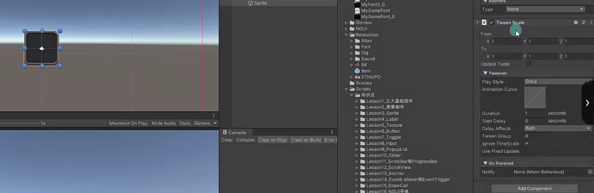

## Tween相关参数
这里拿Tween Scale来举例，其它的大同小异
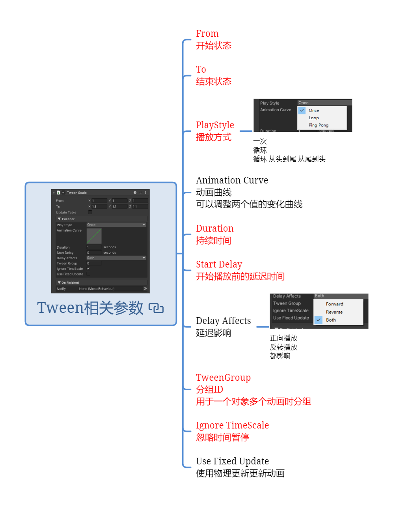

### From 开始状态

### To 结束状态

### Update Table 
一般不开启

### PlayStyle 播放方式
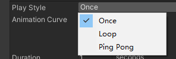
一次
循环
循环 从头到尾 从尾到头

### Animation Curve* 动画曲线
可以调整两个值的变化曲线

### Duration 持续时间

### Start Delay 开始播放前的延迟时间

### Delay Affects* 延迟影响
正向播放
反转播放
都影响（默认，

### TweenGroup 分组ID
用于一个对象多个动画时分组

### Ignore TimeScale 忽略时间暂停

### Use Fixed Update* 使用物理更新更新动画

## Play Tween可以通过它让该对象和输入事件关联
给Sprite添加Play Tween脚本
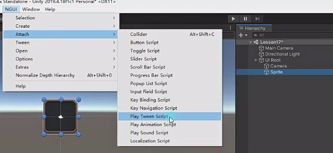

### Tween Target 控制对象

### Include Children 是否带着子对象一起变化
字体开始往往也希望跟着一起变化
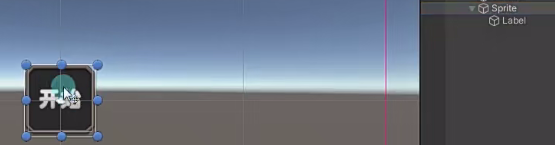

### Start State
如果为真，则在激活触发之前 Play Tween将在启动时将所有关联的Tween重置为其起始状态
就一开始不要不放的话就勾上
### TweenGroup 控制的是哪一组缓动
上面的Tween的分组为0，不受下面分组为1的Play Tween控制

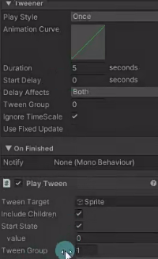

### Trigger condition 触发条件
ps：别忘了添加NGUI碰撞器
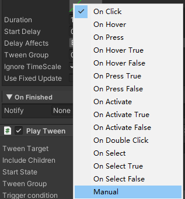

### Play direction 播放的方向
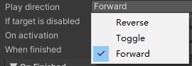
Reverse 反转播放（一开始是结束状态然后变到开始状态）
Toggle 正反状态转换 （一开始开始状态，播放到结束状态后保留到结束状态，再点一次从上一次的状态在再变）
Forward 正向播放（默认）

### If target is disabled* 如果控制对象失活 处理方式
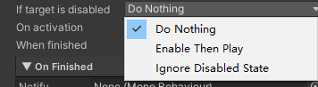
啥也不做
为了播放激活它  
忽略失活状态

### On activation* 激活时
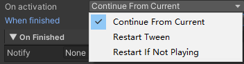
继续当前
重新开始 
如果没有播放重新开始

### When finished* 播放完毕做啥
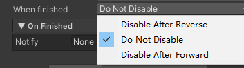
执行完后隐藏
什么也不做 
如果是倒着播，播放完后隐藏

# 练习
给开火按钮添加一个Tween脚本和两个PlayTween脚本，做按着放大功能
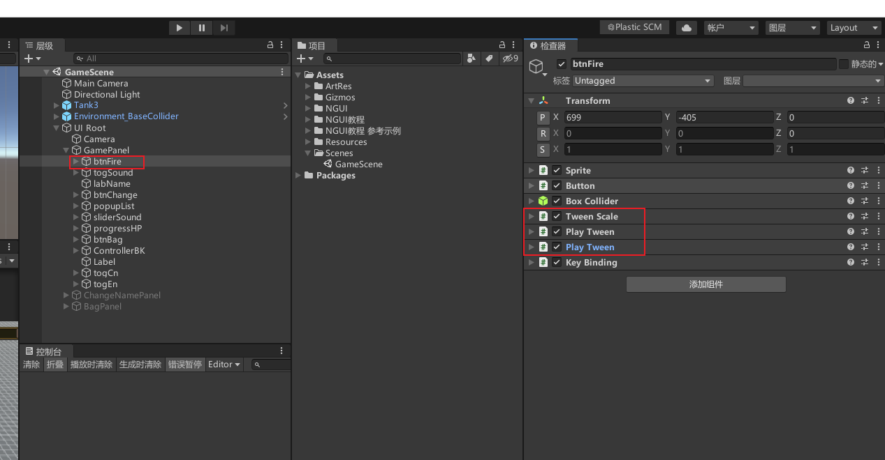

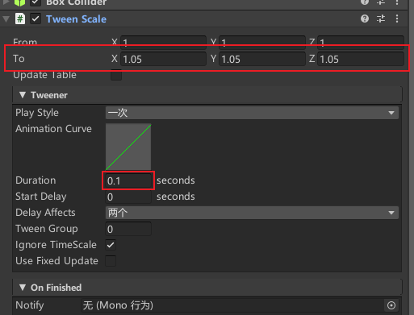

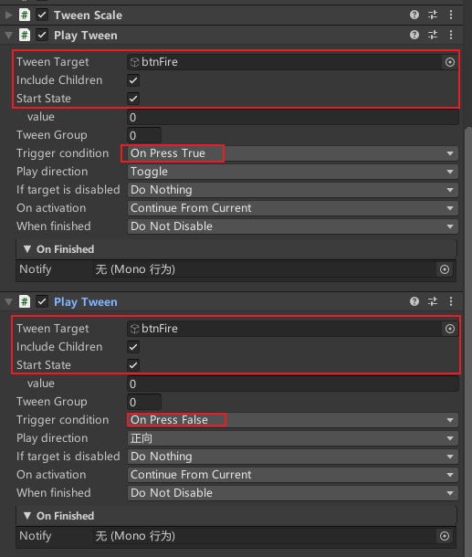