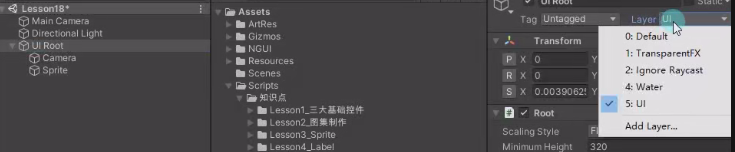
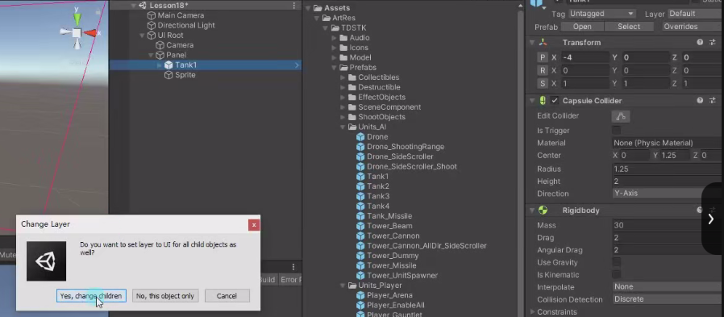
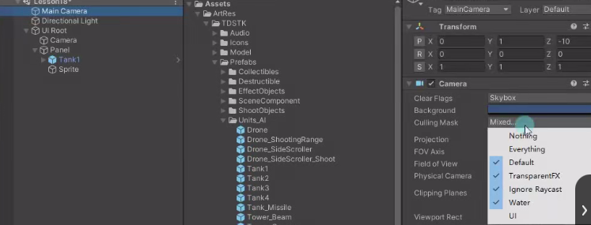
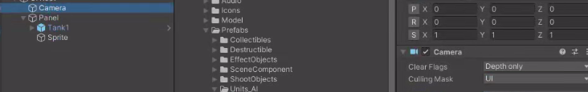
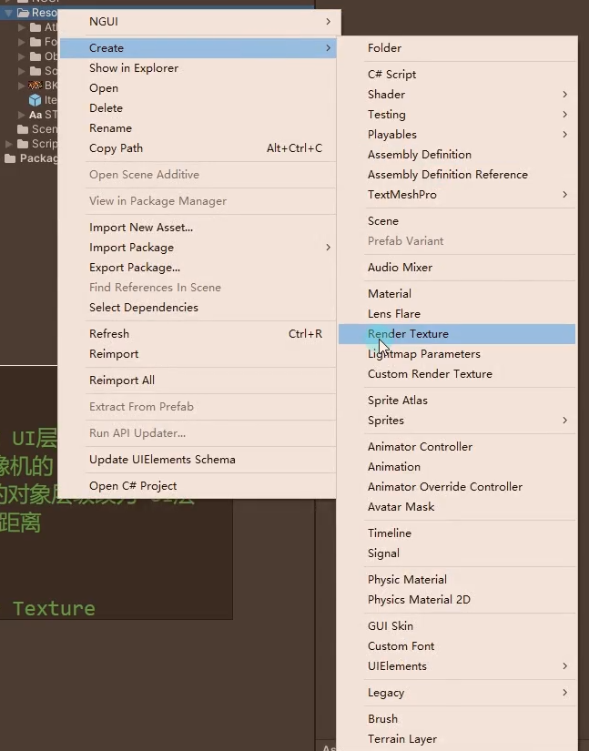
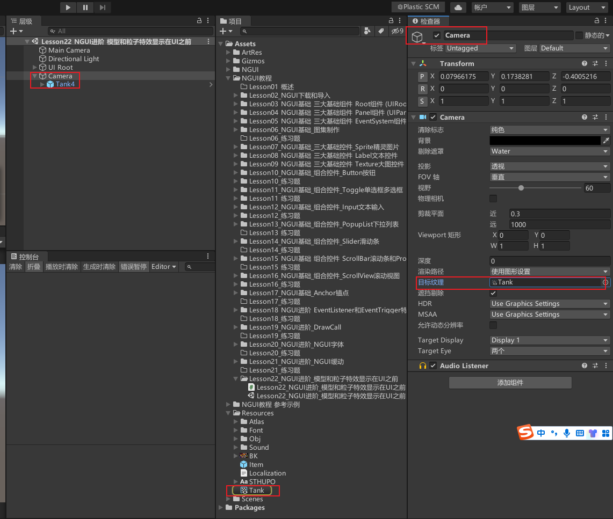
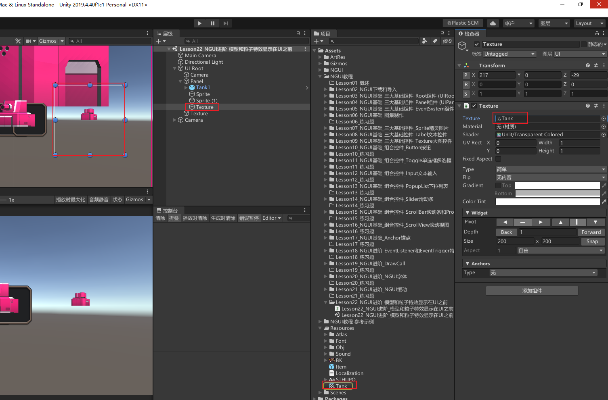
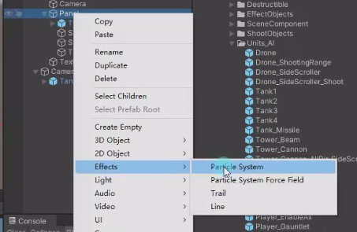
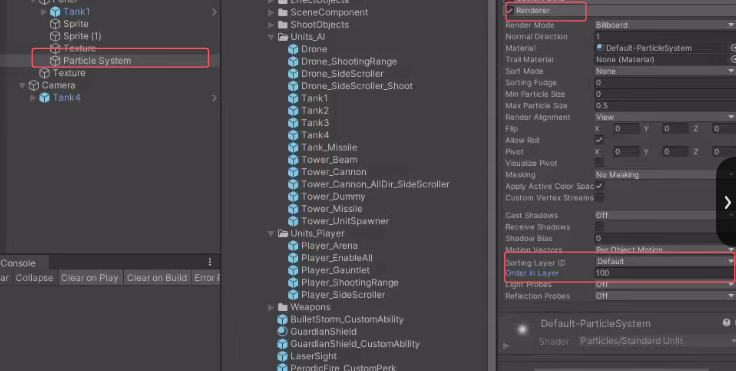

# NGUI中显示3d模型
## 方法一：使用UI摄像机渲染3D模型
1. 改变NGUI的整体层级为UI层
   
   把拖入的3d模型的层级也要改为UI层，因为UIRoot默认的缩放很小，所以一拖进来模型可能也回很小。
   
2. 改变主摄像机和NGUI摄像机的渲染层级
   注意主摄像机的渲染不要选择UI层，因为NGUI有自己的摄像机只渲染UI层，否则可能渲染多个模型。
   
   
3. 将想要被UI摄像机渲染的对象层级改为UI层
4. 调整模型和UI控件的z轴距离
注意3D模型的深度不会收到NGUI的深度影响，只和z轴有关。

## 方法二：使用多摄像机渲染 Render Texture
制作流程类似小地图制作思路。

创建一个RenderTexture

创建一个摄像机，只渲染某一特定的层级，让主摄像机不渲染这一层级。
拖入3D模型，层级也改成那一特定的层级。
把刚刚创建的RenderTexture拖拽到摄像机的目标纹理上，可以看到RenderTexture的图片上是摄像机的渲染。

NGUI下创建一个纹理图片，拖拽RenderTexture到纹理图片上，可以看到模型的显示，这一做的好处是可以设置不同层级摄像机渲染的模式，比如UI要正交3D模型要人眼近大远小。

# NGUI中显示粒子特效
在UI层级创建一个粒子特效，会发现无论怎么移动都显示在UI后面。

1. 让Panel和粒子特效处于一个排序层，比如都是Default。
2. 在粒子特效的 Render参数中 设置自己的层级，或者调高特效的Order in Layer
