# NGUI 事件响应 播放音效
NGUI提供一个现成的脚本PlaySound让我们在响应事件的时候播放一些音效
创建一个按钮来举例，给按钮添加PlaySound脚本
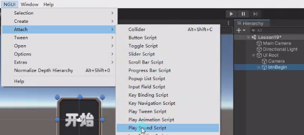
然后关联一个音效就行
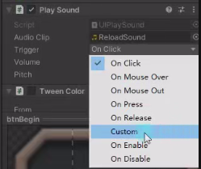

# NGUI控件和键盘按键绑定
NGUI提供一个KeyBinding脚本

给按钮添加KeyBinding脚本
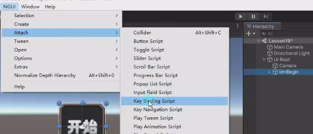
key code ：绑定的按键
Modifier：组合键
Action：动作 （默认是按下和点击）
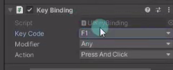

# PC端 tab键快捷切换选中
NGUI提供KeyNavigation脚本。

给按钮添加KeyNavigation脚本。
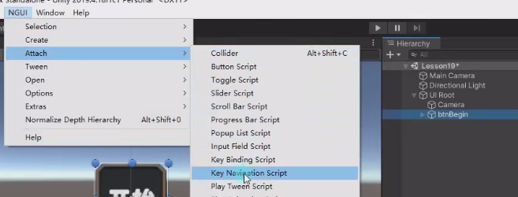

添加按tab要被选中的Sprite对象，记得要添加碰撞器，记得其它4个也要加KeyNavigation脚本
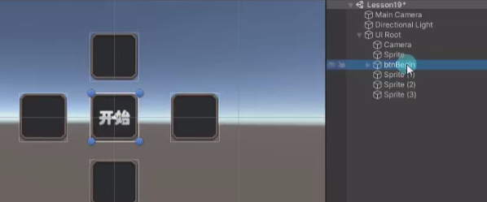
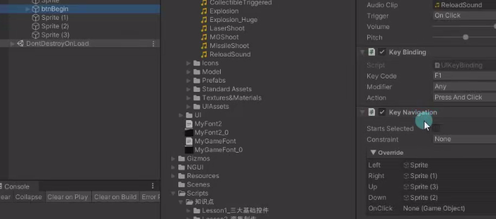

# 语言本地化
1. 在Resources下创建一个txt文件，命名必须为Localization。
   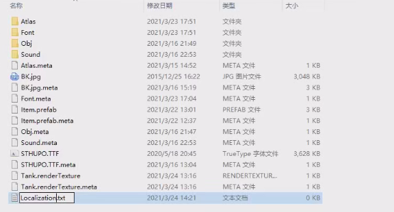
2. 配置文件，第一行是key和不同语言通过逗号隔开，下面通过Key关联不同语言的文字，也通过逗号隔开。
   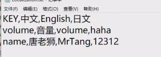
3. 给想要切换多语言文字的Label对象下挂载Localize脚本，关联Key。直接运行会默认显示第一个关联语言的key。
   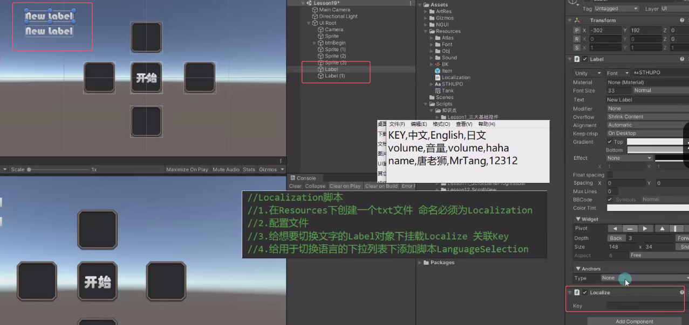
   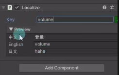
   运行后
   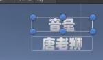
4. 给用于切换语言的下添加脚本LanguageSelection
   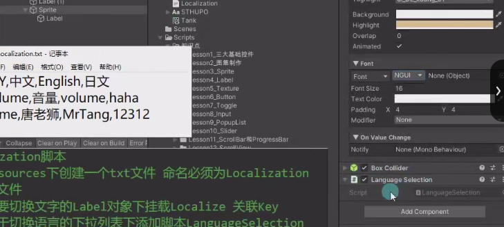
   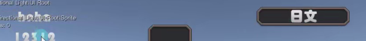
   也可以用于图片不同选项下的切换，添加keyValue是图片名字，给Sprite添加Localize脚本选择key。这样切换多语言下拉框时也会切换图片。

也可以不通过下拉列表来操作，还可以通过`Localization.language`属性来改

# 练习
在NGUI缓动的练习题基础上了，请用现在所学知识，制作一个这样的功能，所有按钮上的中文可以和英文进行语言切换，通过Toggle单选框切换语言

可以查看LanguageSelection是怎么切换的
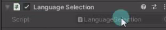

可以发现是通过Localization.language来改的

添加两个单选框，分组都为1
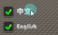
配置Localization.txt如下
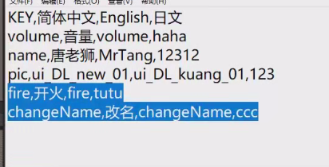
为Label添加Localize脚本
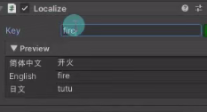

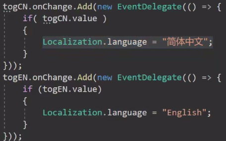