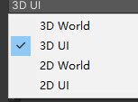

# EventSystem是用来干嘛的？
输入事件监听的基础，主要作用是让摄像机渲染出来的物体，能够接收到NGUI的事件。大部分设置不需要我们去修改，有了它我们通过鼠标 触碰 键盘 控制器 操作UI 响应玩家的输入

注意：UIRoot下的只要创建UI控件就会默认创建一个Camera对象，Camera对象默认有一个Camera组件和EventSystem组件 。Camera组件会根据创建的是2DUI还是3DUI调整是正交模式或者是透视模式

- EventSystem很重要，如果没有它，我们没有办法监听玩家输入
- 创建UI时的 2DUI 和3DUI 主要就是摄像机的模式不一样
- EventSystem的2D和3D主要是 采用2D碰撞器 还是3D碰撞器 不能直接改变摄像机模式

# 参数相关

## Event Type
事件类型
决定了脚本如何对鼠标和触屏事件进行响应
UI模式，那么他们处理事件的方式是根据组件的深度
world模式，那么则会根据距离离主摄像机的远近来进行响应排序

2D和3D的区别是，碰撞器是用3D碰撞器还是2D碰撞器

## Events go to*
事件通过刚体还是碰撞盒传递

## Process Events In*
事件更新进度在Update中还是LateUpdate中
一般不改，默认在Update中

## Event Mask
决定哪个游戏对象层级将会接受事件

## Debug
是否开启调试模式
如果开启，可以帮助你在点击时
判断当前和鼠标事件交互的是什么对象
能在Scene窗口看到信息

## Command Click*
苹果电脑上是否用Command按键模拟右键操作

## Allow Multi Touch
是否支持多点触碰

## Auto Hide Cursor*
当游戏有控制器或者其他输入设备时
是否自动隐藏光标

## Sticky Tooltip*
是否使用tooltip

## Long Press Tooltip*
是否长按出提示

## Tooltip Delay*
停留多久出现tip

## Raycast Range*
射线长度，一般不修改

## EventSources
接收的事件来源

### Mouse
鼠标

### Touch
触摸

### Keyboard
键盘

### Controller
控制器

## Thresholds*
调整鼠标事件的
点击、拖、轻拍等行为

### Mouse Drag

### Mouse Click

### Touch Drag

### Touch Tap

## Axes and keys*
热键关系
一般不修改

