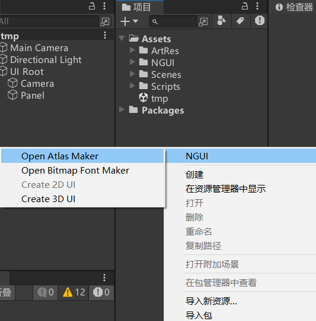
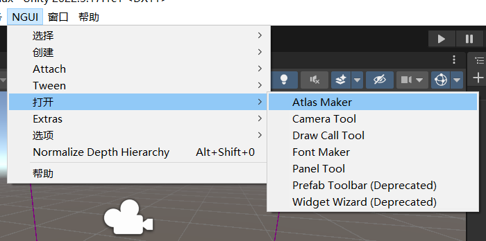
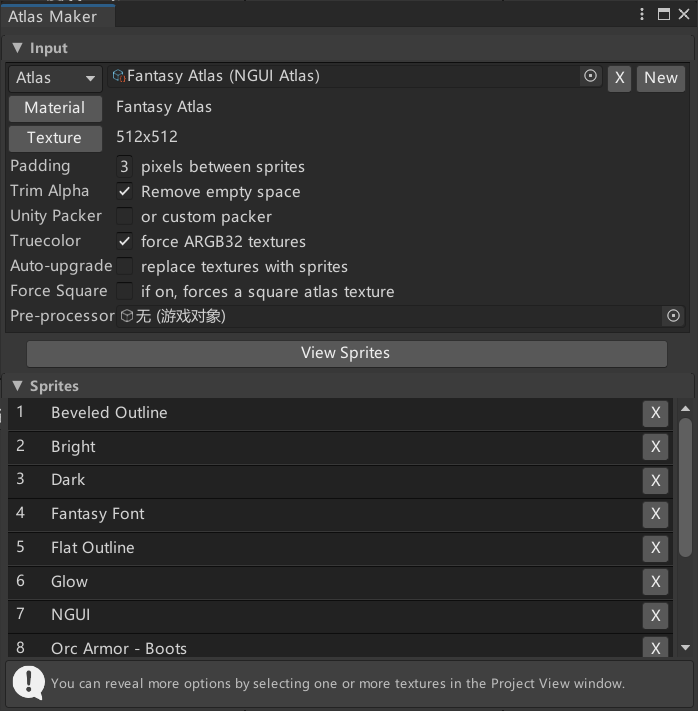
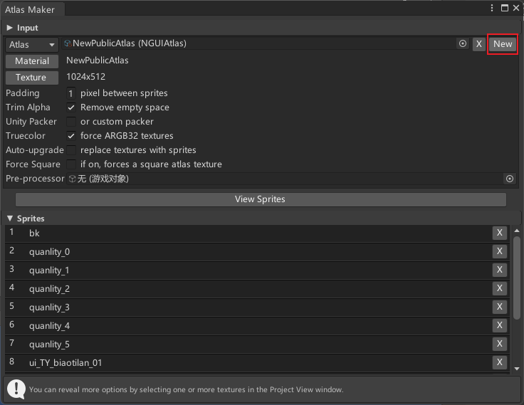
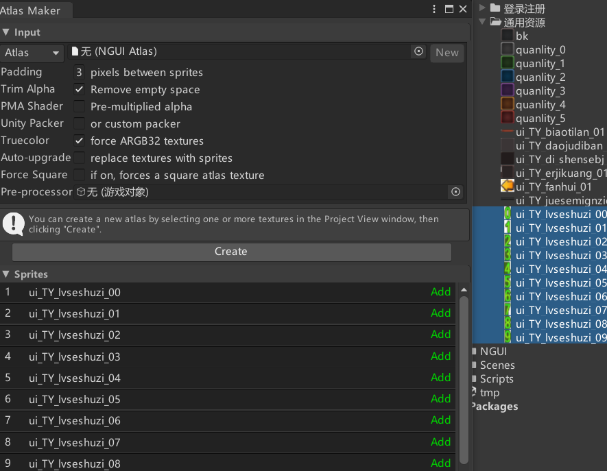
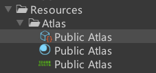
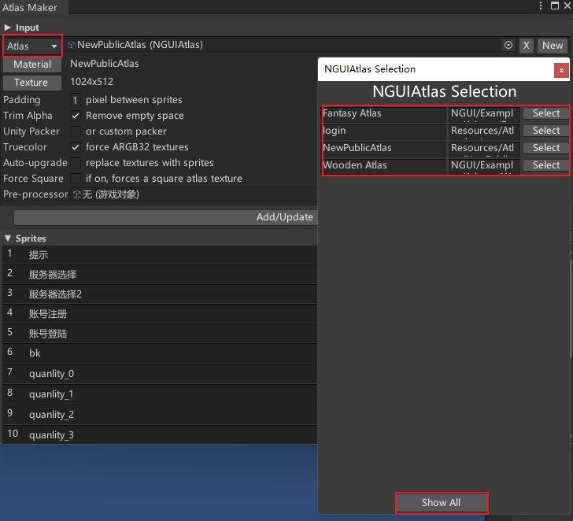
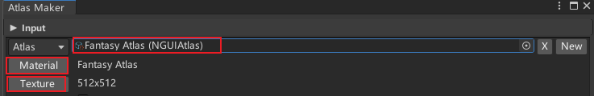
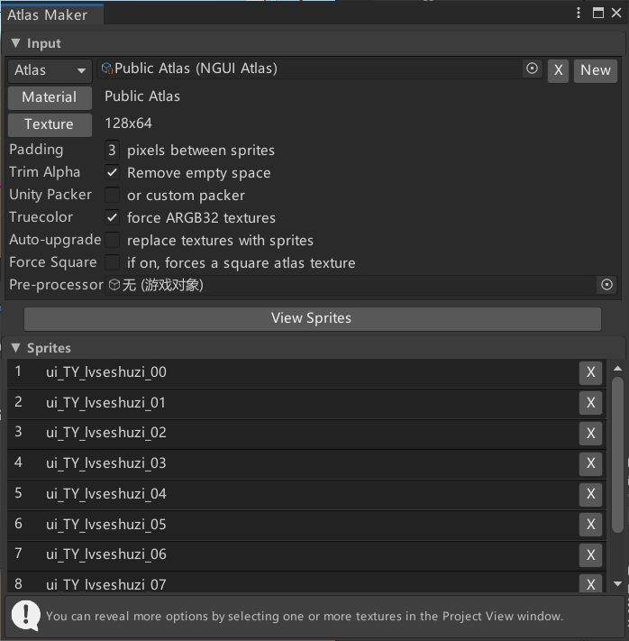
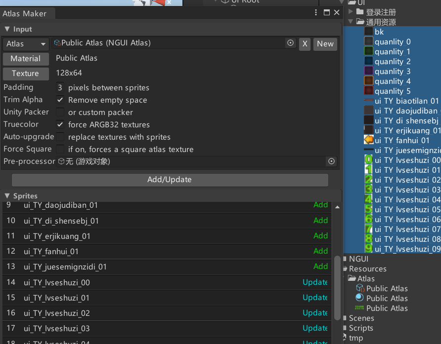

# 图集是用来干啥的？
NGUI中的最小图片控件Sprite要使用图集中的图片进行显示
图集 就是把很多单独的小图 合并为 一张大图 合并后的大图就是图集
目的：提高渲染性能

# 打开图集制作工具
方法一：Project窗口右键

方法二：工具栏 Open

# 新建图集
在图集制作工具点击New，进入创建图集界面，假如点不了New直接下一步

选择要打成图集的文件

点击Create创建图集，一般创建在Resources文件夹下

可以在Resources文件夹下看到创建出来的图集，图集关键文件有三个，分别是：图集文件，图集材质，图集图片

# 参数相关

点击会弹出图集选择窗口，点击ShowAll可以显示这个项目里的所有图集，点击Select可以选择切换编辑哪个图集

点击这三个按钮可以分别让指定的图集文件，图集材质，图集图片在Project窗口显示出来

## Padding
图片间像素间隔

## Trim Alpha
移除图片多余空白空间

## PMA Shader*
预乘透明通道

## Unity Packer*
自定义打包器

## Truecolor
强制ARGB32纹理

## Auto-upgrade*
自动更新，用精灵替换纹理

## Force Square
如果启用，将强制方形图集纹理
长宽都为2的n次方

## Pre-processor
预处理器

# 修改删除图集元素
选中想新增加到图集里的的图，点击Add/Update添加或更新，等一会后新加的图片就会打到图集里去了

删除
