# Sprite精灵图片
NGUI中所有中小尺寸图片显示都用Sprite显示
使用它来显示图集中的单个图片资源
可以简单的理解为Sprite就是用来显示图片的控件

# 创建Sprite精灵图片

方法一：NGUI菜单栏下拉框创建精灵Sprite
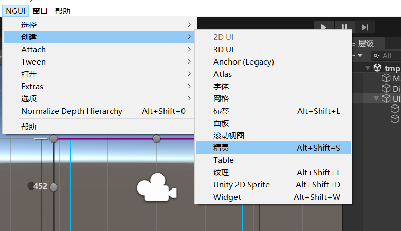

方法二：选中UIRoot，点击红框创建精灵Sprite
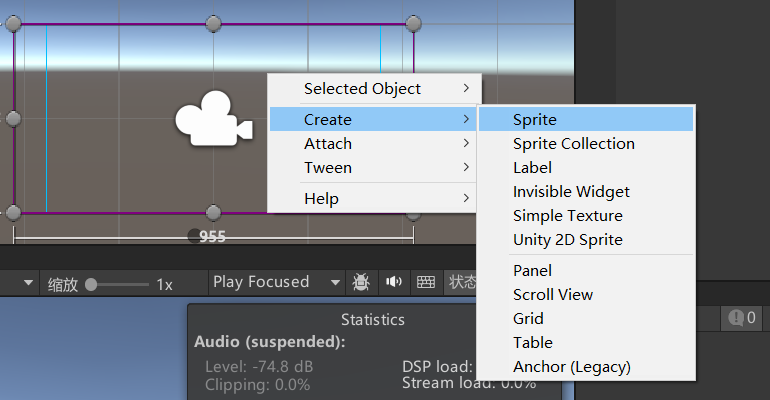

# Sprite精灵组件参数
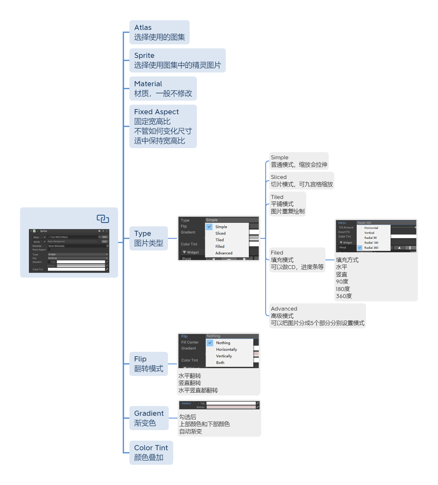


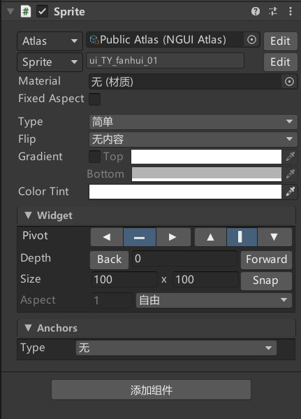

## Atlas 图集
选择使用的图集

## Sprite 选择使用图集中的精灵图片

<a id="section1"></a>
（点击旁边的Edit编辑按钮可以编辑选中的跳转到图集文件编辑选中的图集中的小图，但是一般不会去编辑，保持默认就行

## Material 材质
一般不修改

## Fixed Aspect 固定宽高比
不管如何变化尺寸
适中保持宽高比

## Type 图片类型


- Simple
  普通模式，缩放会拉伸
- Sliced
  切片模式，可九宫格缩放，拉升的时候不会改变4个角
  要用切片模式一定要去[设置单张图片](#section1)
  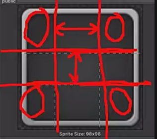
  拉伸变形如下图：
  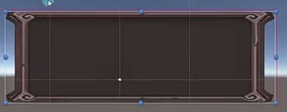
  对使用的精灵图片设置如下：
  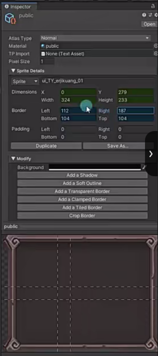
  设置完拉伸后的效果：
  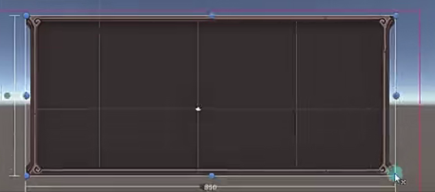
- Tiled
  平铺模式
  图片重复绘制
  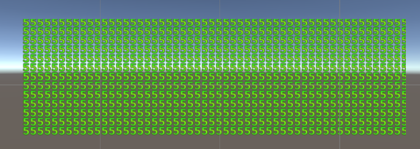
- Filed
  填充模式
  可以做CD，进度条等
  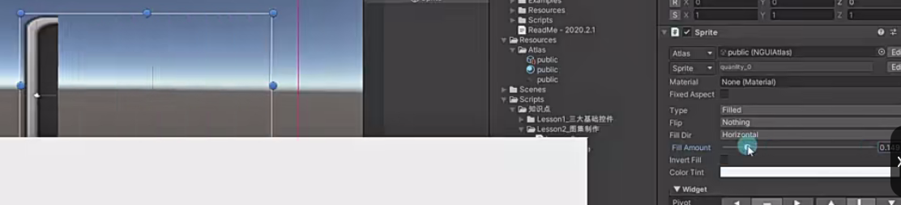
  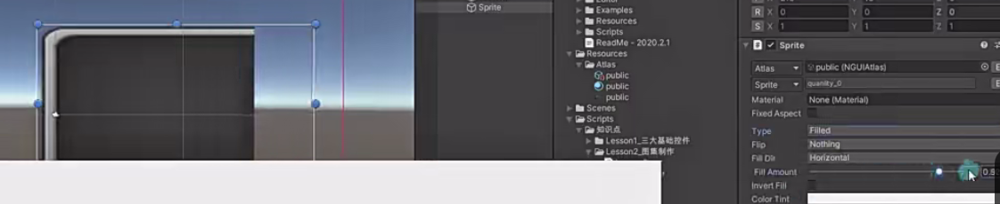
  - 填充方式
    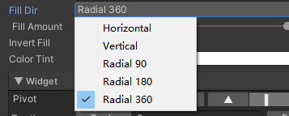
    水平
    竖直
    90度
    180度
    360度

- Advanced
  高级模式
  可以把图片分成5个部分分别设置模式

## Flip 翻转模式
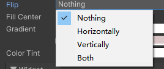
水平翻转
竖直翻转
水平竖直都翻转

## Gradient 渐变色
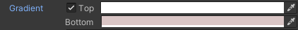
勾选后
上部颜色和下部颜色
自动渐变


## Color Tint颜色叠加


# 公共内容参数 Wiget
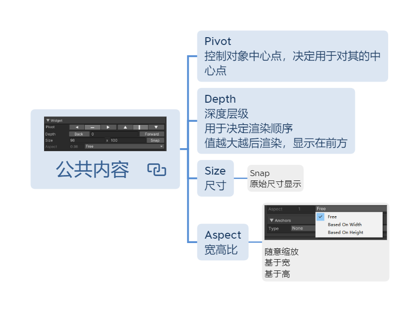

## Pivot 控制对象中心点
决定用于对其的中心点

比如设置左上点
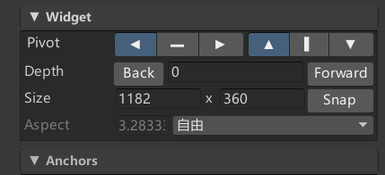
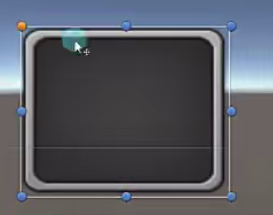

## Depth 深度层级
**当不同组件在同一面板下，用于决定渲染顺序** 
值越大越后渲染，显示在前方
以排完序之后在按照这里的Depth排

## Size 尺寸
Snap 原始尺寸显示

## Aspect 宽高比
随意缩放
基于宽
基于高

# Sprite精灵图片代码控制
创建UISprite实例，首先一定要得到NGUI的精灵图片游戏对象，可以拖拽场景中的游戏对象到代码的Inspector窗口赋值
```cs
//NGUI中的UISprite
public UISprite uISprite;
```

修改精灵图片宽高：
```cs
//修改精灵图片宽高
uISprite.width = 200;
uISprite.height = 300;
```

改变精灵图片的图为**当前同一图集中选择的图片**，直接设置名字即可：
```cs
uISprite.spriteName = "bk";
```

改变精灵图片的图为**其他图集中的图片**：
```cs
// 先加载图集，指定类型为NGUIAtlas
NGUIAtlas atlas = Resources.Load<NGUIAtlas>("Atlas/login");
// 设置精灵图片图集
uISprite.atlas = atlas;
// 再设置精灵图片的图
uISprite.spriteName = "ui_DL_anniuxiao_01";
```