# Label是用来干嘛的？
NGUI中所有文本显示都使用Label来显示

# 创建Label文本

方法一：NGUI菜单栏下拉框创建Label文本控件
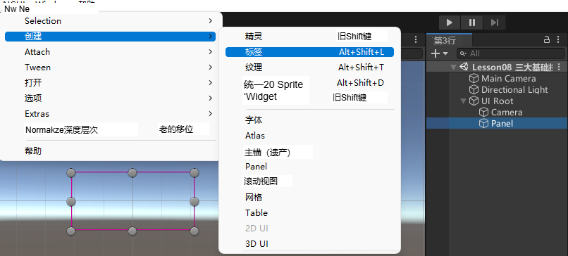

方法二：选中UIRoot，点击红框创建Label文本控件
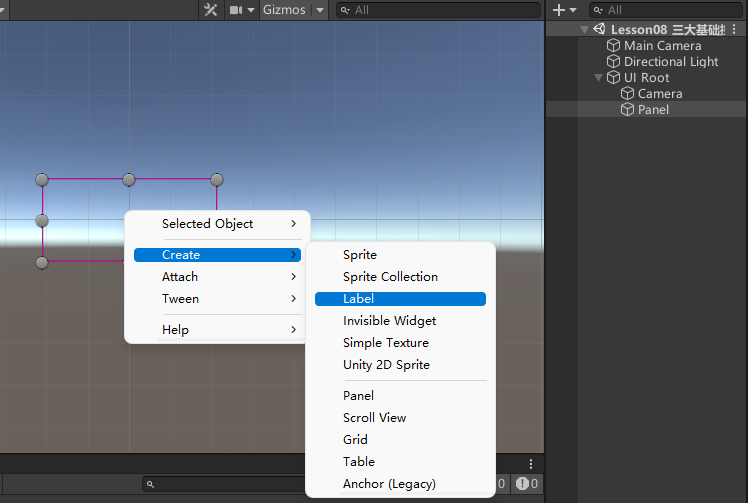


# Label参数
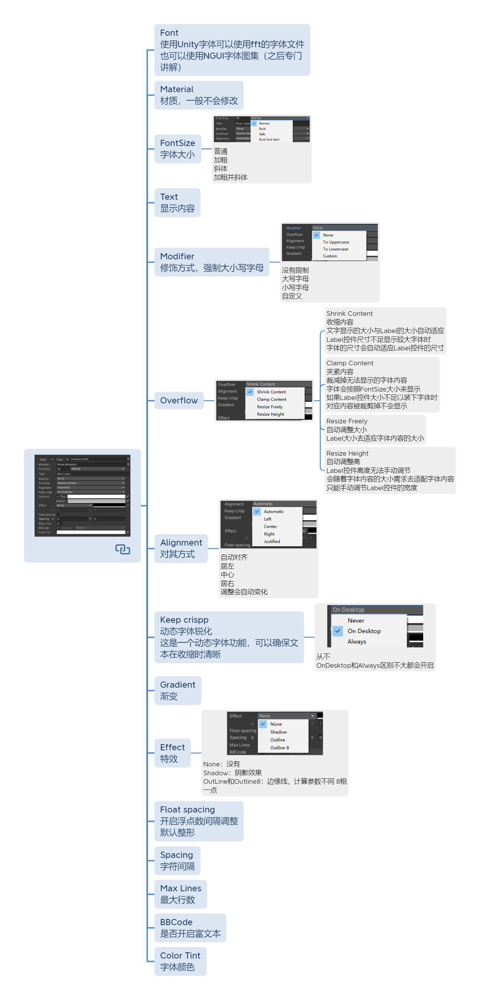


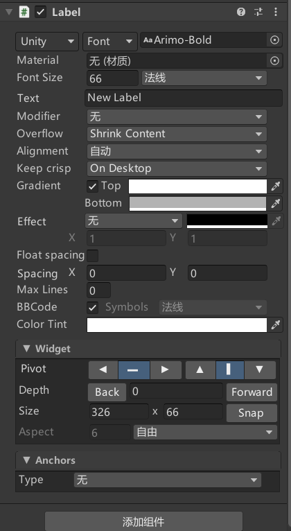

## Font 字体
使用Unity字体可以使用fft的字体文件
也可以使用NGUI字体图集（之后专门讲解）
系统自带字体：C:\Windows\Fonts

## Material材质
一般不会修改

## FontSize字体大小
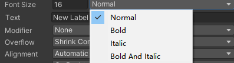
普通
加粗
斜体
加粗并斜体

## Text 显示内容

## Modifier 修饰方式 强制大小写字母
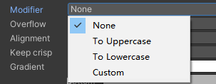
没有限制
大写字母
小写字母
自定义

## Overflow
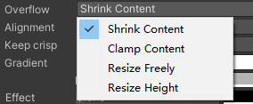

- **Shrink Content 收缩内容**
  文字显示的大小与Label的大小自动适应
  Label控件尺寸不足显示较大字体时
  字体的尺寸会自动适应Label控件的尺寸
  
- **Clamp Content 夹紧内容**
  裁减掉无法显示的字体内容
  字体会按照FontSize大小来显示
  如果Label控件大小不足以装下字体时
  对应内容被裁剪掉不会显示
  
- **Resize Freely 自动调整大小**（比较常用）
  Label大小去适应字体内容的大小
  
- **Resize Height 自动调整高**
  Label控件高度无法手动调节
  会随着字体内容的大小需求去适配字体内容
  只能手动调节Label控件的宽度

## Alignment 对其方式
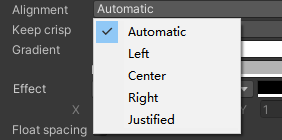
自动对齐
居左
中心
居右
调整会自动变化

## Keep crispp 动态字体锐化
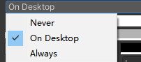
这是一个动态字体功能，可以确保文本在收缩时清晰

从不
OnDesktop和Always区别不大都会开启

## Gradient 渐变

## Effect 特效
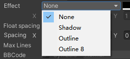
None：没有
Shadow：阴影效果
OutLine和Outline8：边缘线，计算参数不同 8粗一点

## Float spacing 开启浮点数间隔调整
默认整形

## Spacing 字符间隔

## Max Lines 最大行数

## BBCode 是否开启富文本

## Color Tint 字体颜色

# 富文本
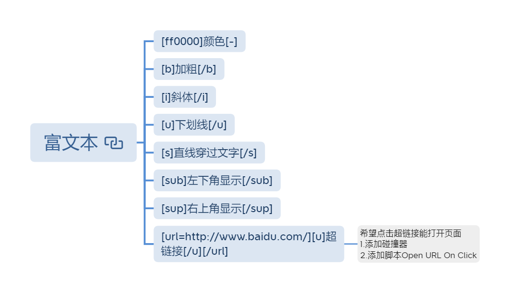


## [ff0000]颜色[-]

## [b]加粗[/b]

## [i]斜体[/i]

## [u]下划线[/u]

## [s]直线穿过文字[/s]

## [sub]左下角显示[/sub]

## [sup]右上角显示[/sup]

## [url=http://www.baidu.com/](#)超链接[/u](#)
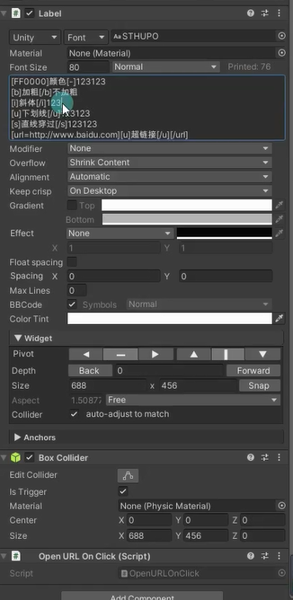
希望点击超链接能打开页面
1.添加碰撞器 （NGUI菜单栏下拉框创建
2.添加脚本Open URL On Click


# 代码设置Label
创建UILabel实例，首先一定要得到NGUI的Label对象，可以拖拽场景中的游戏对象到代码的Inspector窗口赋值
```cs
//NGUI中的UILabel
public UILabel uILabel;
```

想修改Label的相关变量，用UILabel实例.出相关变量修改赋值即可
```cs
//创建UILabel实例 首先一定要得到NGUI的Label对象 可以拖拽场景中的游戏对象到代码的Inspector窗口赋值
//想修改Label的相关变量 用UILabel实例.出相关变量修改赋值即可
uILabel.text = "123123123123";
```

