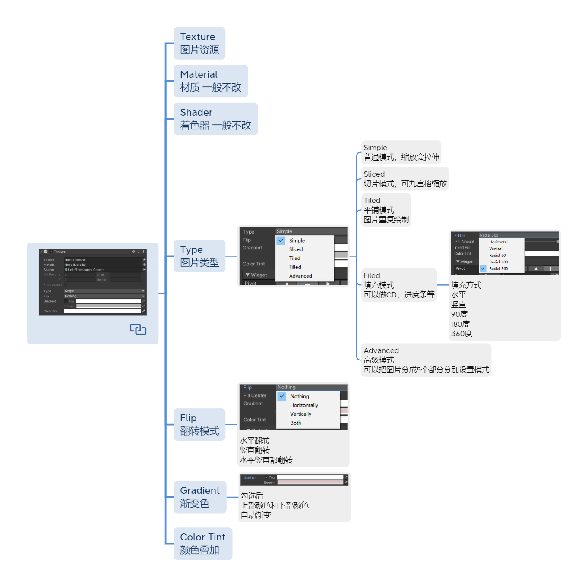
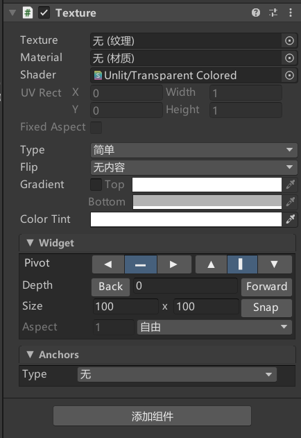

# Texture是用来干嘛的？
Texture是用于显示不用打进图集的大图片的
Sprite只能显示图集中图片，一般用于显示中小图片
如果使用大尺寸图片，没有必要打图集
直接使用Texture组件进行大图片显示


# 创建Texture


# Texture参数





## Texture 图片资源

## Material 材质 
一般不改

## Shader 着色器
一般不改

## Type 图片类型

- Simple
  普通模式，缩放会拉伸
- Sliced
  切片模式，可九宫格缩放
- Tiled
  平铺模式
  图片重复绘制
- Filed
  填充模式
  可以做CD，进度条等
  

  - 填充方式
    水平
    竖直
    90度
    180度
    360度

- Advanced
  高级模式
  可以把图片分成5个部分分别设置模式

## Flip 翻转模式

水平翻转
竖直翻转
水平竖直都翻转

## Gradient 渐变色

勾选后
上部颜色和下部颜色
自动渐变

## Color Tint 颜色叠加


# 代码设置Texture
```cs
public UITexture uITexture;

//加载名为“BK”的图片资源
Texture myTexture = Resources.Load<Texture>("BK");
//如果成功加载了图片资源，则将UITexture组件的主纹理(mainTexture)替换成该图片
if (myTexture != null)
    uITexture.mainTexture = myTexture;
```