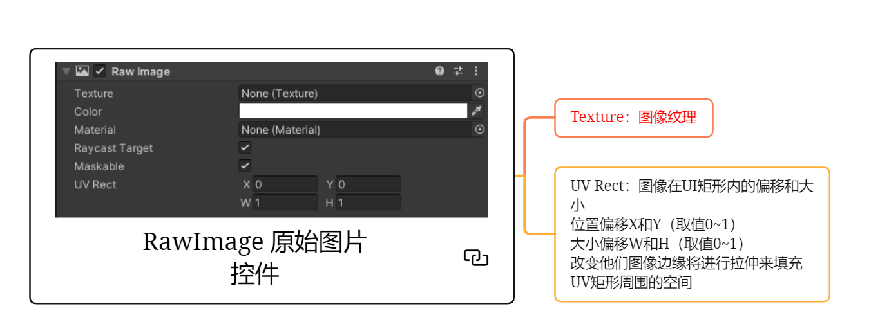
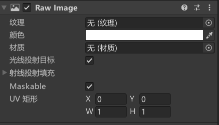

# RawImage是什么
RawImage是原始图像组件，是UGUI中用于显示任何纹理图片的关键组件。
它和Image的区别是 一般RawImage用于显示大图(**背景图，不需要打入图集的图片，网络下载的图**等等)


# RawImage原始图像组件参数






注意这里的纹理可以填任何类型的图
无关Sprite UI什么的

UV Rect UV矩形
图像在UI矩形内的偏移和大小
一般不会改变


# 代码
```cs
RawImage rawImage = this.GetComponent<RawImage>();

rawImage.texture = Resources.Load<Texture>("ui_TY_lvseshuzi_08");

rawImage.uvRect = new Rect(0, 0, 1, 1);
```

