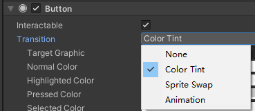

# Button是什么
Button是按钮组件，是UGUI中用于处理玩家按钮相关交互的关键组件。

默认创建的Button由2个对象组成：
父对象——Button组件依附对象，同时挂载了一个Image组件，作为按钮背景图。
子对象——按钮文本（可选）。


# Button 按钮参数


## Interactable：是否接受输入
按钮是否能被我们点击和响应

## Transition：响应用户输入的过渡效果


### None*：没有状态变化效果

### ColorTint：用颜色表示不同状态的变化

TargetGraphic：控制的目标图形 
Normal Color：正常状态颜色 
Highlighted Color：鼠标进入时显示高亮颜色 
Pressed Color：按下颜色 
Selected Color：选中的颜色 
Disabled Color：禁用时的颜色 （就是上面 Interactable为false时的颜色）
Color Multiplier：颜色倍增器，过渡颜色乘以该值 
FadeDuration：衰减持续时间，从一个状态进入另一个状态时需要的时间

### Sprite Swap：用图片表示不同状态的变化

Highlighted Sprite：鼠标进入时图片 
Pressed Sprite：按下时图片 
Selected Color：选中时的颜色 
Disabled Sprite：禁用时显示的图片

### Animation：用动画表示不同状态的变化

Normal Trigger：正常动画触发器 
Highlighted Trigger：鼠标进入状态时触发器
Pressed Trigger：按下时触发器 
Selected Trigger：选中时触发器 
Disabled Trigger：禁用时触发器

可以自动生成动画状态控制器

## Navigation：导航模式

可以设置UI元素如何在播放模式中控制导航


None：无键盘导航
Horizontal：水平导航 
Verticval：垂直导航 
Automatic：自动导航 
Explicit：指定周边控件进行导航


### 可以在场景窗口看到导航连线

## OnClick：单击（按下再抬起）执行的函数列表

# 代码相关
```cs
Button button = this.GetComponent<Button>();

// 可交互
button.interactable = true;

// 设置过渡效果
button.transition = Selectable.Transition.None;

Image image = this.GetComponent<Image>();
```

# 监听点击事件的两种方式
一、拖脚本


二、代码添加
```cs
Button button = GetComponent<Button>(); 
button.onClick.AddListener(() =>
{
    print("按钮被点击了");
});
// 移除指定的监听
button.onClick.RemoveListener(MyOnclick);
// 移除所有的监听
button.onClick.RemoveAllListeners();
```

# 练习
场景上有一个对象，点击UGUI的发射按钮，可以让对象发射一颗子弹

先设置
创建玩家，子弹预设体，拼好面板


各自关联的脚本
PlayerObj.cs
```cs
public class PlayerObj : MonoBehaviour
{
    void Update()
    {
        if (Input.GetMouseButtonDown(0))
        {
            Fire();
        }
    }

    public void Fire()
    {
        Instantiate(Resources.Load<GameObject>("Bullet"), this.transform.position, this.transform.rotation);
    }
}
```

Bullet.cs
```cs
public class Bullet : MonoBehaviour
{
    public float speed = 10;
    void Start()
    {
        Destroy(this.gameObject, 2);
    }

    void Update()
    {
        this.transform.Translate(Vector3.forward * speed * Time.deltaTime); 
    }
}
```
GamePanel.cs
```cs
public class GamePanel : MonoBehaviour
{
    public Button btnAtk;
    public PlayerObj player;
    void Start()
    {
        btnAtk.onClick.AddListener(() =>
        {
            player.Fire();
        });
    }
}
```