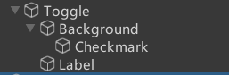
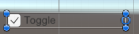
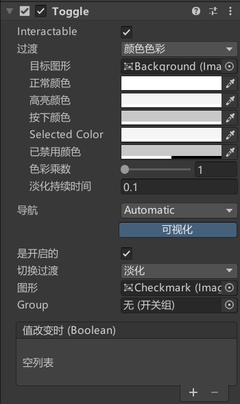
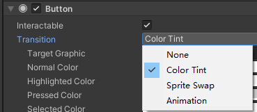
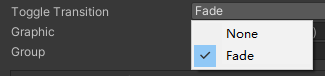
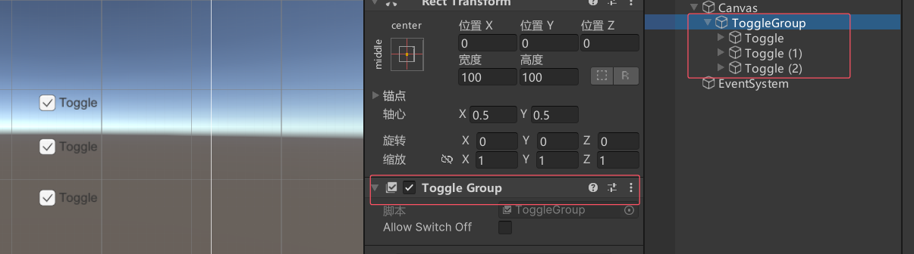
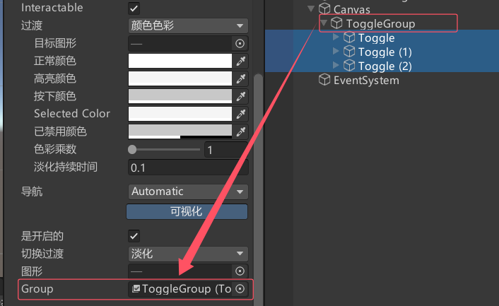
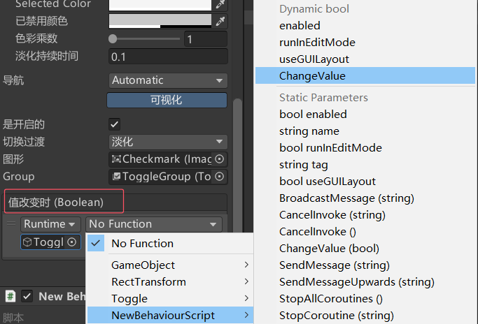
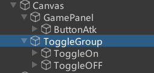

# Toggle是什么
Toggle是开关组件，是UGUI中用于处理玩家单选框多选框相关交互的关键组件。

默认创建的Toggle由4个对象组成：
父对象——Toggle组件依附。
子对象——背景图（必备）、选中图（必备）、说明文字（可选）。




# Toggle参数



## Interactable：是否接受输入


## Transition：响应用户输入的过渡效果


## Navigation：
导航模式，可以设置UI元素如何在播放模式中控制器导航



## IsOn：当前是否处于打开状态

## Toggle Transition：在开关值变化时的过渡方式

None：无任何过渡，直接显示隐藏 Fade：淡入淡出
## Graphic：用于表示选中状态的图片

## Group：单选框分组
### eg: 创建一个单选框分组
创建一个空对象，添加Toggle Group脚本，将想做成单选框组的Toggle作为其子对象


然后将想做成单选框组的Toggle中的Group关联一下添加Toggle Group脚本

### Allow Switch Off：是否允许不选中任何一个单选框
注意：单选框分组组件可以挂载在任何对象上，只需要将其和一组的单选框关联即可


## OnValueChanged：
开关状态变化时执行的函数列表


# 代码控制
```cs
Toggle toggle = this.GetComponent<Toggle>();

// 设置 toggle 的状态
toggle.isOn = true;


ToggleGroup toggleGroup = this.GetComponent<ToggleGroup>();
toggleGroup.allowSwitchOff = false;

// ToggleGroup 中目前处于选中状态的 Toggle
foreach (Toggle item in toggleGroup.ActiveToggles())
{
    print(item.name + " " + item.isOn);
}
```


# Toggle监听事件的两种方式

一、拖脚本添加事件监听
这里的函数需要一个bool参数


二、代码监听
```cs
private void ChangeValue(bool v)
{
    print("代码监听 " + v);
}  

toggle.onValueChanged.AddListener(ChangeValue);

toggle.onValueChanged.AddListener((b) =>
{
    print("lambda表达式 " + b);
});
```


# 练习
在上节课的Button练习题基础上，请用现在所学知识，制作一个这样的功能：场景上对象发射子弹有音效，通过用UGUI的Toggle开关 控制音效开关


GamePanel.cs
```cs
public class GamePanel : MonoBehaviour
{
    public Button btnAtk;
    public PlayerObj player;

    public Toggle toggleOn;
    public Toggle toggleOff;
    void Start()
    {
        btnAtk.onClick.AddListener(() =>
        {
            player.Fire();
        });

        UpdateSoundState();
        toggleOn.onValueChanged.AddListener(OnToggleSoundOnChanged);
        toggleOff.onValueChanged.AddListener(OnToggleSoundOffChanged);
    }

    private void OnToggleSoundOnChanged(bool isOn)
    {
        if (isOn)
        {
            // 开启音效
            AudioListener.volume = 1;
        }
    }

    private void OnToggleSoundOffChanged(bool isOn)
    {
        if (isOn)
        {
            // 关闭音效
            AudioListener.volume = 0;
        }
    }

    private void UpdateSoundState()
    {
        if (toggleOn.isOn)
        {
            AudioListener.volume = 1;
        }
        else if (toggleOff.isOn)
        {
            AudioListener.volume = 0;
        }
    }
}
```

PlayerObj.cs
```cs
public class PlayerObj : MonoBehaviour
{
    public AudioClip audioClip;

    public void Fire()
    {
        // 播放音效
        AudioSource audioSource = this.gameObject.AddComponent<AudioSource>();
        audioSource.clip = audioClip;
        audioSource.Play();
        Destroy(audioSource, 1);
        Instantiate(Resources.Load<GameObject>("Bullet"), this.transform.position, this.transform.rotation);
    }
}
```

**另外一种写法如下**

新建一个MusicData.cs用来接受来自UI的数据
然后用接受来的数据来做操作

MusicData类负责管理音效的状态，GamePanel负责处理UI交互并将数据传递给MusicData。这种设计模式使得代码更清晰、更易于扩展和维护。

```cs
public class MusicData
{
    public static bool SoundIsOpen = true;
}
```

GamePanel.cs
```cs
public class GamePanel : MonoBehaviour
{
    public Button btnAtk;
    public PlayerObj player;

    public Toggle toggleOn;
    public Toggle toggleOff;
    public ToggleGroup tg;
    void Start()
    {
        btnAtk.onClick.AddListener(() =>
        {
            player.Fire();
        });

        toggleOn.onValueChanged.AddListener(TogChangeValue);
        toggleOff.onValueChanged.AddListener(TogChangeValue);
    }

    public void TogChangeValue(bool v)
    {
        foreach (Toggle item in tg.ActiveToggles())
        {
            if (item == toggleOn)
            {
                MusicData.SoundIsOpen = true;
            }
            else if (item == toggleOff)
            {
                MusicData.SoundIsOpen = false;
            }
        }
    }
}
```
PlayerObj.cs
```cs
public class PlayerObj : MonoBehaviour
{
    public AudioClip audioClip;

    public void Fire()
    {
        // 然后用接受来的数据来做操作
        if (MusicData.SoundIsOpen)
        {
            // 播放音效
            AudioSource audioSource = this.gameObject.AddComponent<AudioSource>();
            audioSource.clip = audioClip;
            audioSource.Play();
            Destroy(audioSource, 1);
        }
        Instantiate(Resources.Load<GameObject>("Bullet"), this.transform.position, this.transform.rotation);
    }
}

```