# InputField是什么
InputField是输入字段组件，是UGUI中用于处理玩家文本输入相关交互的关键组件。

在 Unity 的 Hierarchy 面板中，右键点击 -> UI -> InputField，创建一个 `InputField`。

默认情况下，创建的InputField由3个对象组成，同时在其上挂载了一个Image作为背景图，`InputField` 会附带一个 `Text` 组件（用于显示用户输入的文本）和一个 `Placeholder` 组件（用于显示提示文本）。
默认创建的InputField由3个对象组成

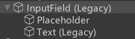
# InputField 参数


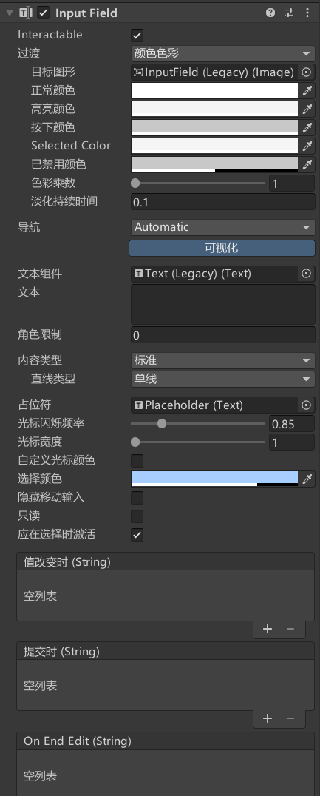
## Interactable：是否接受输入

## Transition：输入的过渡效果
响应用户输入的过渡效果

## Navigation：导航模式
可以设置UI元素如何在播放模式中控制器导航

## TextComponent：关联显示输入内容的文本组件

## Text：用户输入的文本内容

## Character Limit：输入字符长度的最大值
输入字符的最大长度。设置为 0 表示无限制。

## Content Type：输入的字符类型限制
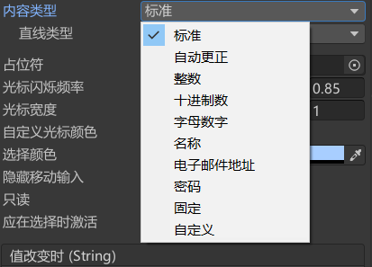
Standard：标准模式；可以输入任何字符

Autocorrected：自动更正模式；跟踪未知单词，向用户建议合适的替换候选词

Integer Number：整数模式；用户只能输入整数

Decimal Number：十进制数模式；用于只能输入数字包括小数

Alphanumeric：字母数字模式；只能输入字母和数字

Name：名字模式；自动将每个单子首字母大写

Email Address：邮箱地址模式；允许最多输入一个@符号组成的字符和数字字符串

Password：密码模式；用星号隐藏输入的字符，允许使用符号

Pin：别针模式；用星号隐藏输入的字符，只允许输入整数

Custom：自定义模式；允许自定义行类型，输入类型，键盘类型和字符验证

## Line Type：行类型，定义文本格式
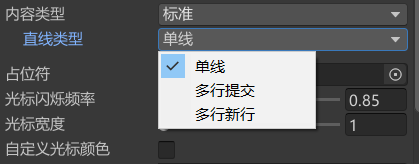
Single Line：只允许单行显示 
Multi Line Submit：允许使用多行。仅在需要时使用新的一行 
Multi Line NewLine：允许使用多行。用户可以按回车键空行

## Placeholder：提示文本
关联用于显示初始内容文本控件
提示文本（例如“请输入用户名”），当输入框为空时显示。
## Caret Blink Rate*：光标闪烁速率

## Caret Width*：光标宽

## Custom Caret Color*：自定义光标颜色

## Selection Color*：批量选中的背景颜色
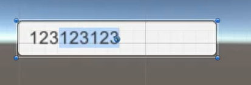
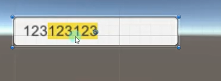
## Hide Mobile Input*：隐藏移动设备屏幕上键盘
隐藏移动设备屏幕上键盘，仅适用于IOS

## Read Only*：只读


## OnValueChanged：内容改变时执行的函数列表

## OnEndEdit：结束输入时执行的函数列表

# 代码控制
```cs
public InputField usernameInputField; // 引用InputField组件 
public Text feedbackText; // 用于显示反馈的Text组件


// 限制字符长度
usernameInputField.characterLimit = 10;

// 用户输入的文本
string username = usernameInputField.text;
usernameInputField.text = "默认用户名";

// 清空输入框的内容
usernameInputField.text = "";

// 通过 Placeholder 属性设置提示文本
usernameInputField.placeholder.GetComponent<Text>().text = "请输入用户名";

```

## **常见问题与解决方案**
**如何禁止用户输入空格？**
可以通过监听 onValueChanged 事件，移除输入的空格
```cs
usernameInputField.onValueChanged.AddListener((text) =>
{
    usernameInputField.text = text.Replace(" ", "");
});
```

**如何自动聚焦到输入框？**
调用 ActivateInputField 方法
```cs
usernameInputField.ActivateInputField();
```

# 事件监听的两种方式
**一、拖脚本监听事件**
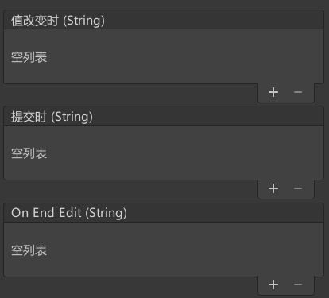


```cs
public class InputFieldTest : MonoBehaviour
{
    public void OnInputFieldEndEdit(string text)
    {
        Debug.Log("OnInputFieldEndEdit: " + text);
    }
    
    public void OnInputFieldValueChanged(string text)
    {
        Debug.Log("OnInputFieldValueChanged: " + text);
    }

    public void OnInputFieldSubmit(string text)
    {
        Debug.Log("OnInputFieldSubmit: " + text);
    }
}
```
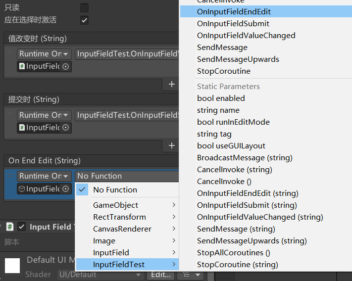


**二、代码监听**
```cs
using UnityEngine;
using UnityEngine.UI;

public class InputFieldExample : MonoBehaviour
{
    public InputField usernameInputField; // 引用InputField组件
    public Text feedbackText; // 用于显示反馈的Text组件

    private void Start()
    {
        // 监听输入框内容变化
        usernameInputField.onValueChanged.AddListener(OnUsernameChanged);

        // 监听输入框结束编辑
        usernameInputField.onEndEdit.AddListener(OnUsernameSubmitted);
    }

    // 当输入框内容变化时调用
    private void OnUsernameChanged(string newText)
    {
        Debug.Log("输入内容变化: " + newText);
    }

    // 当用户结束编辑时调用
    private void OnUsernameSubmitted(string finalText)
    {
        if (string.IsNullOrEmpty(finalText))
        {
            feedbackText.text = "用户名不能为空！";
            feedbackText.color = Color.red;
        }
        else
        {
            feedbackText.text = "欢迎, " + finalText + "!";
            feedbackText.color = Color.green;
        }
    }
}
```


# 练习
在上节课Toggle的练习题基础上，请用现在所学知识，制作一个这样的功能：
场景左上角会显示玩家的姓名，右侧有一个改名按钮，点击改名按钮后会弹出一个改名窗口，在窗口上可以输入你的新名字，点击确定键后，原左上角的名字将改变
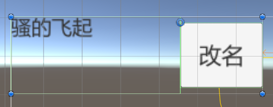

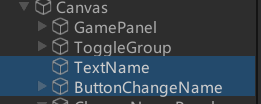

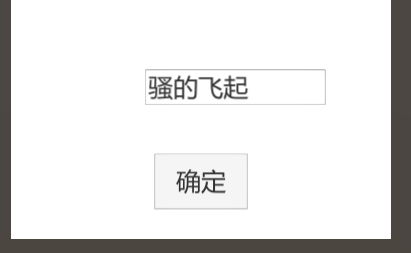


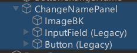

ChangeNamePanel.cs
```cs
public class ChangeNamePanel : MonoBehaviour
{
    public InputField inputName;
    public Button btnSure;

    public static ChangeNamePanel instance;

    private void Awake()
    {
        instance = this;
        this.gameObject.SetActive(false);
    }
    void Start()
    {
        btnSure.onClick.AddListener(() =>
        {
            GamePanel.instance.txtName.text = inputName.text;
            this.gameObject.SetActive(false);
        });
    }
}
```

GamePanel.cs
```cs
public class GamePanel : MonoBehaviour
{
    public static GamePanel instance;
    private void Awake()
    {
        instance = this;
    }

    // 名字
    public Text txtName;
    public Button btnChangeName;
    void Start()
    {
        // 改名
        btnChangeName.onClick.AddListener(() =>
        {
            ChangeNamePanel.instance.gameObject.SetActive(true);
        });
    }
}

```