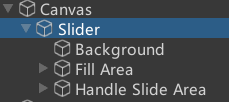
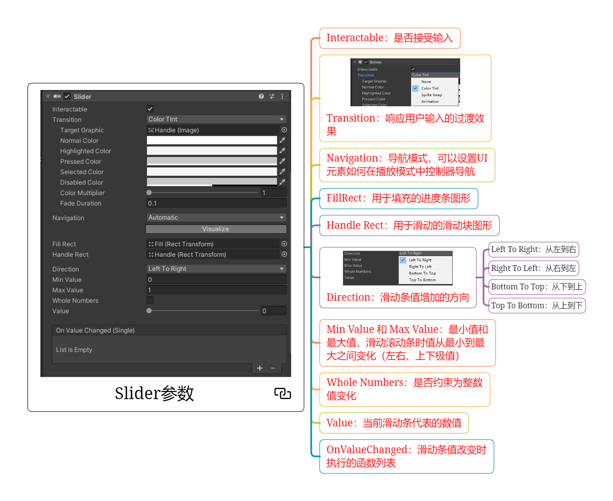
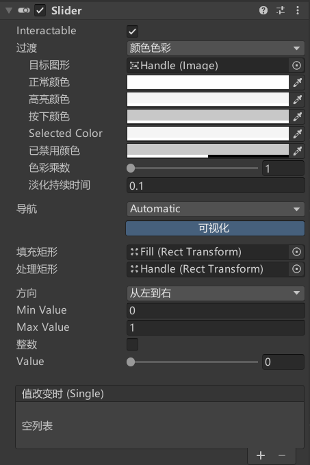
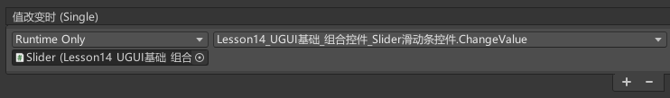
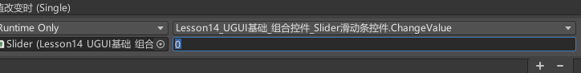
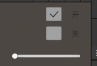

# Slider是什么
Slider是滑动条组件，是UGUI中用于处理滑动条相关交互的关键组件。

Slider 由以下几个部分组成：
**Background 背景图**：滑块的背景，表示整个范围。
**Fill 进度图**：填充区域，表示当前值所占的比例。
**Handle 滑动块**：滑块的手柄，用户可以拖动它来改变值。

在 Unity 的 Hierarchy 窗口中右键选择 UI > Slider，即可创建一个默认的 Slider。


# Slider参数



## Interactable：是否接受输入

## Transition：响应用户输入的过渡效果

## Navigation：导航模式
可以设置UI元素如何在播放模式中控制器导航

## FillRect：用于填充的进度条图形

## Handle Rect：用于滑动的滑动块图形

## Direction：滑动条值增加的方向

Left To Right：从左到右

Right To Left：从右到左

Bottom To Top：从下到上

Top To Bottom：从上到下

## Min Value 和 Max Value：滑动条最小值和最大值
滑动滚动条时值从最小到最大之间变化（左右、上下极值）

## Whole Numbers：是否约束为整数值变化

## Value：当前滑动条代表的数值

## OnValueChanged：滑动条值改变时执行的函数列表

# 代码控制
```cs
Slider slider = this.GetComponent<Slider>();
// 打印出 slider 的当前值
print(slider.value);
```

# 监听事件的两种方式
一、拖脚本

```cs
public void ChangeValue(float v)
{
    print(v);
}
```
假如选择静态会值改变时会只打印右边输入框的值。



二、代码添加监听事件
```cs
public class SliderExample : MonoBehaviour
{
    public Slider volumeSlider;

    void Start()
    {
        // 设置滑块的初始值
        volumeSlider.value = 0.5f;

        // 监听滑块值的变化
        volumeSlider.onValueChanged.AddListener(OnSliderValueChanged);
    }

    void OnSliderValueChanged(float value)
    {
        // 根据滑块的值调整音量
        AudioListener.volume = value;
        Debug.Log("当前音量: " + value);
    }
}
```


# 练习
在上节课InputField的练习题基础上，请用现在所学知识，制作一个这样的功能：场景上有一个滑动条，可以通过它控制音效的音量大小


PlayerObj.cs
```cs
public class PlayerObj : MonoBehaviour
{
    public AudioClip audioClip;

    public void Fire()
    {
        if (MusicData.SoundIsOpen)
        {
            // 播放音效
            AudioSource audioSource = this.gameObject.AddComponent<AudioSource>();
            audioSource.clip = audioClip;
            audioSource.volume = MusicData.SoundVolume;
            audioSource.Play();
            Destroy(audioSource, 1);
        }
        Instantiate(Resources.Load<GameObject>("Bullet"), this.transform.position, this.transform.rotation);
    }
}
```
GamePanel.cs
```cs
public class GamePanel : MonoBehaviour
{

    // 音效拖动条
    public Slider sliderSound;
    void Start()
    {
        // 音效大小
        sliderSound.value = MusicData.SoundVolume;
        sliderSound.onValueChanged.AddListener((float v) =>
        {
            MusicData.SoundVolume = v;
        });
    }
}
```
MusicData.cs
```cs
public class MusicData
{
    public static bool SoundIsOpen = true;
    public static float SoundVolume = 1;
}
```