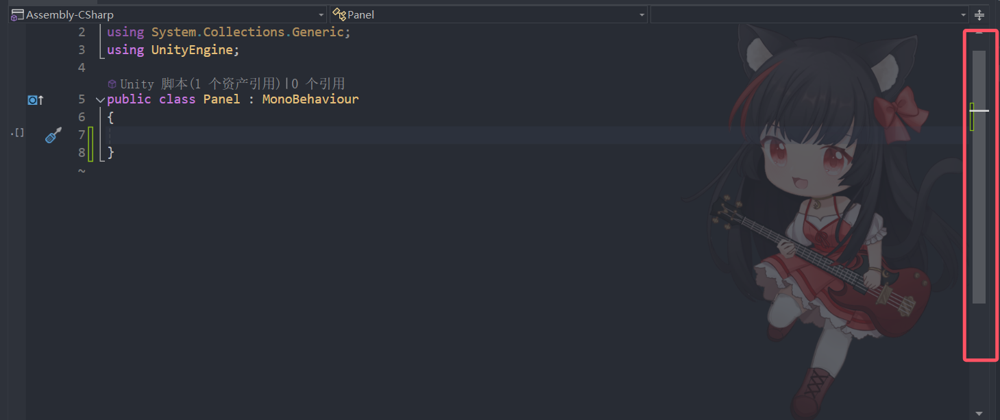
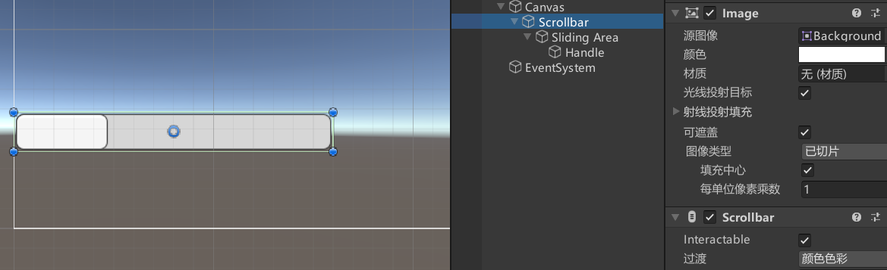
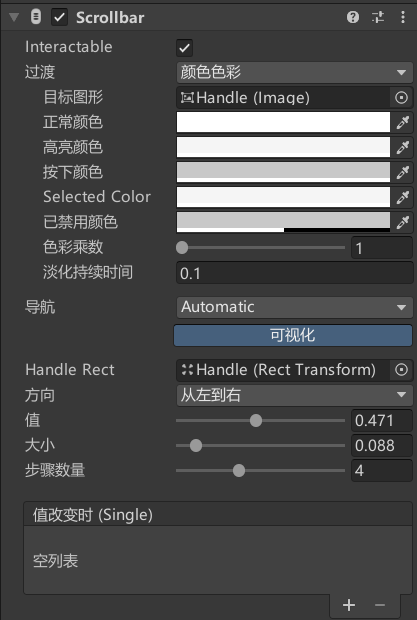
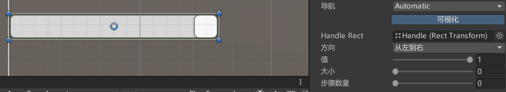
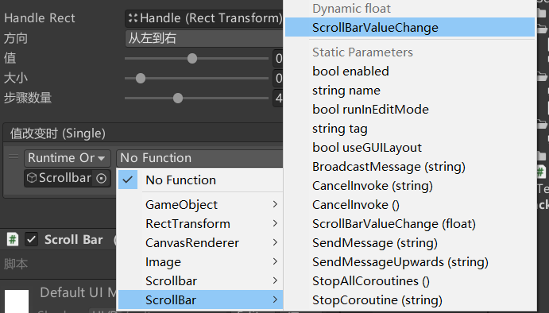

# Scrollbar是什么
Scrollbar是滚动条组件，是UGUI中用于处理滚动条相关交互的关键组件。
它通常与 `ScrollView` 一起使用，但也可以单独使用。


在Unity编辑器中，右键点击 Hierarchy 面板，选择 UI > Scrollbar。
Unity会自动创建一个 Scrollbar 对象，它包含一个 Handle（滑块）和一个 Background（背景）。
父对象——Scrollbar组件依附的对象。
子对象——滚动块对象。



# ScrollBar 滚动条参数



## Interactable：是否接受输入

## Transition：响应用户输入的过渡效果

## Navigation：导航模式
可以设置UI元素如何在播放模式中控制器导航

## Handle Rect：关联滚动块图形对象

## Direction：滑动条值增加的方向

Left To Right：从左到右

Right To Left：从右到左

Bottom To Top：从下到上

Top To Bottom：从上到下

## Value：当前滚动条的值，范围（0~1）。

## Size：滚动块在条中的比例大小（0~1）

## Number Of Steps：允许可以滚动多少次（不同滚动位置的数量）

## OnValueChanged：滚动条值改变时执行的函数列表


# 代码控制
```cs
Scrollbar scrollbar = this.GetComponent<Scrollbar>();

// scrollbar 的大小
print(scrollbar.size);

// scrollbar 的当前值
print(scrollbar.value);
```


# 监听事件的两种方式
一、拖脚本


```cs
public void ScrollBarValueChange(float value)
{
    Debug.Log("ScrollBarValueChange: " + value);
}
```


二、代码监听
```cs
using UnityEngine;
using UnityEngine.UI;

public class ScrollBarExample : MonoBehaviour
{
    public Scrollbar scrollbar;

    void Start()
    {
        // 设置初始值
        scrollbar.value = 0.5f;

        // 监听值变化
        scrollbar.onValueChanged.AddListener(OnScrollBarValueChanged);
    }

    void OnScrollBarValueChanged(float value)
    {
        Debug.Log("ScrollBar Value: " + value);
    }
}
```

