# ScrollRect是什么
ScrollRect是滚动视图组件，是UGUI中用于处理滚动视图相关交互的关键组件。
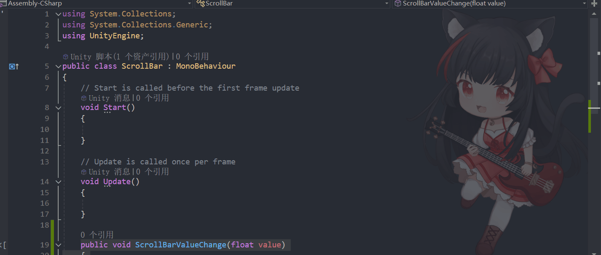

在Unity编辑器中，右键点击 Hierarchy 面板，选择 UI > ScrollView。
Unity会自动创建一个 ScrollView 对象，它包含一个 Viewport 和一个 Content 区域。
默认创建的ScrollRect由4组对象组成：

父对象——ScrollRect组件依附的对象，还有一个Image组件，作为背景图。
子对象：
Viewport：视口区域，决定了哪些内容可见。
Content：内容区域，所有要滚动显示的内容都放在这里。
Scrollbar (Horizontal/Vertical)：水平或垂直滚动条，用于控制内容的滚动。
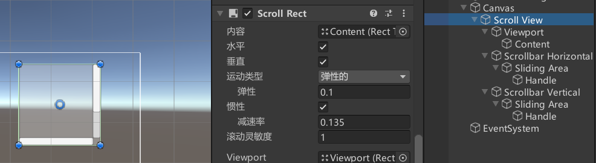


# ScrollView 滚动视图参数


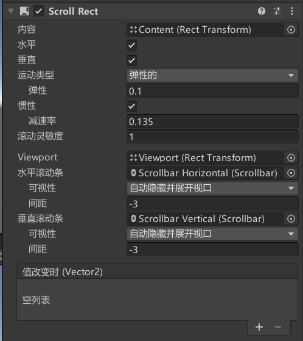
## Content：内容区域，所有显示内容父对象
控制滚动视图显示内容的父对象，它的尺寸有多大
滚动视图就能拖多远
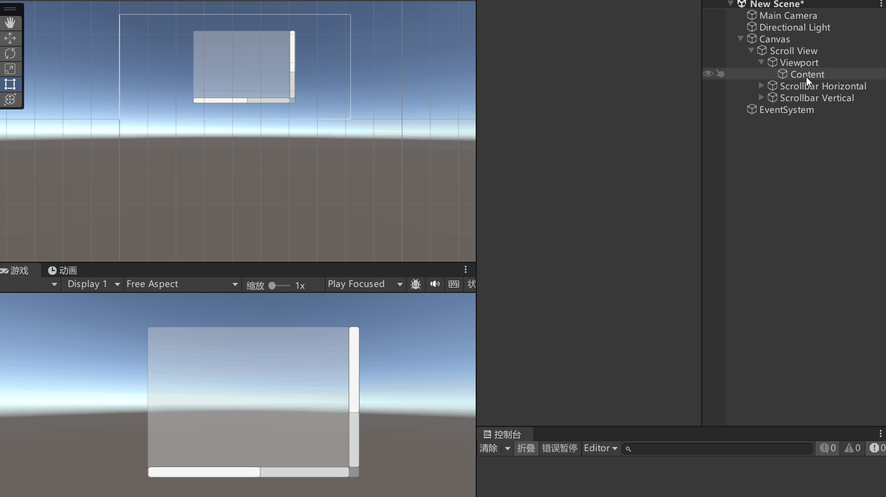

## Horizontal：启用水平滚动
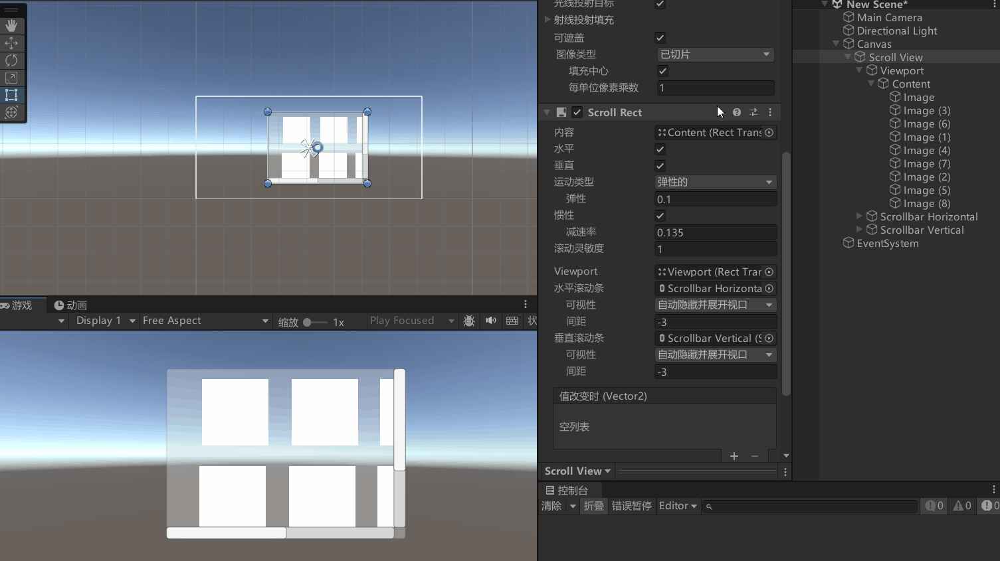
## Vertical：启用垂直滚动

## Movement Type：元素的运动类型
滚动视图元素的运动类型。主要控制拖动时的反馈效果

Unrestricted（一般不使用）：不受限制，随便拖动

Elastic（常用）：回弹效果，当滚出边缘后，会弹回边界
Elasticity：回弹系数，控制回弹效果。值越大回弹越慢

Clamped：夹紧效果，始终限制在范围内，没有回弹效果
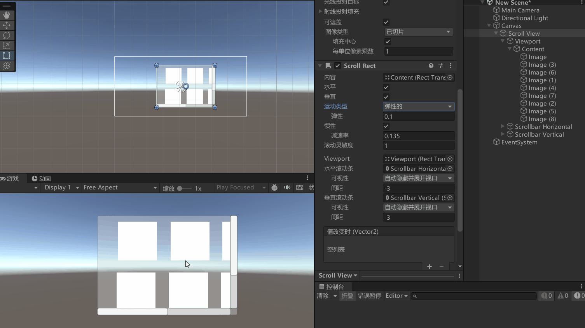


## Inertia：移动惯性
如果开启，松开鼠标后会有一定的移动惯性

Deceleration Rate：减速率（0~1），0没有惯性，1不会停止

## Scroll Sensitivity：滚轮敏感度
（鼠标中间）和触摸板（笔记本）的滚动事件敏感性

## Viewport：关联滚动视图内容视口对象

## Horizontal Scrollbar：关联水平滚动条


## Visibility：是否在不需要时自动隐藏等模式
Permanent：一直显示滚动条
Auto Hide：自动隐藏滚动条 
Auto Hide And Expand Viewport：自动隐藏滚动条并且自动拓展内容视口


## Spacing：滚动条和视口之间的间隔空间
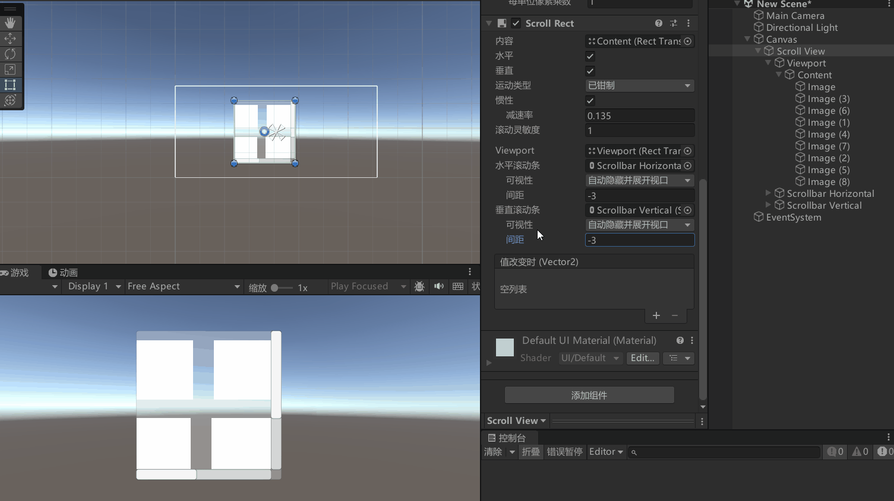

## OnValueChanged：滚动视图位置改变时执行的函数列表

# 代码控制

```cs
ScrollRect scrollRect = this.GetComponent<ScrollRect>();

// 改变内容的大小，根据内容尺寸
scrollRect.content.sizeDelta = new Vector2(1000, 1000);


// 设置归一化位置 (0, 0.5f)
// 其中 x 表示水平方向的归一化值，范围是 0 到 1，0 表示左边缘，1 表示右边缘
// y 表示垂直方向的归一化值，范围是 0 到 1，0 表示下边缘，1 表示上边缘
scrollRect.normalizedPosition = new Vector2(0, 0.5f);
```

# 监听事件两种方式
一、拖脚本
```cs
public class ScrollView : MonoBehaviour
{
    public void ScrollViewValueChange(Vector2 position)
    {
        Debug.Log("当前滚动位置: " + position);
    }
}
```
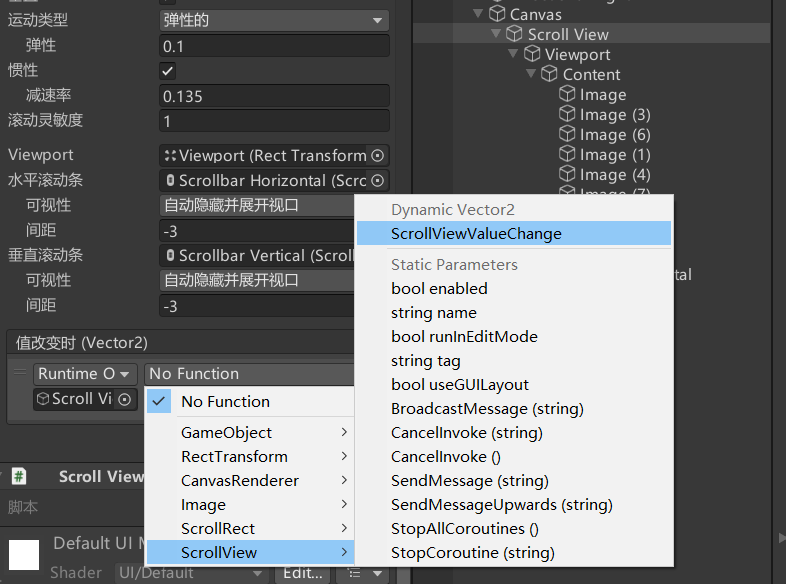

二、代码监听

```cs
using UnityEngine;
using UnityEngine.UI;

public class ScrollViewExample : MonoBehaviour
{
    public ScrollRect scrollRect; // 绑定 ScrollRect 组件
    public GameObject itemPrefab; // 绑定要添加的预制体

    void Start()
    {
        // 绑定滚动事件
        scrollRect.onValueChanged.AddListener(OnScroll);

        // 动态添加 10 个 item 到 Content 中
        for (int i = 0; i < 10; i++)
        {
            GameObject newItem = Instantiate(itemPrefab, scrollRect.content);
            newItem.GetComponentInChildren<Text>().text = "Item " + i;
        }

        // 滚动到顶部
        scrollRect.normalizedPosition = new Vector2(0, 1);
        
        // 滚动到底部
        scrollRect.normalizedPosition = new Vector2(0, 0);
        
        // 滚动到指定位置（0到1之间）
        scrollRect.horizontalNormalizedPosition = 0.5f; // 水平滚动到中间
        scrollRect.verticalNormalizedPosition = 0.5f;   // 垂直滚动到中间
    }
    
    void OnScroll(Vector2 position)
    {
        Debug.Log("当前滚动位置: " + position);
    }
}
```


# 练习
在上节课的Slider练习题基础上，请用现在所学知识，制作一个这样的功能：
有一个背包按钮，点击后可以打开一个背包面板，面板中有一个滚动视图，滚动视图中动态创建10个道具图标
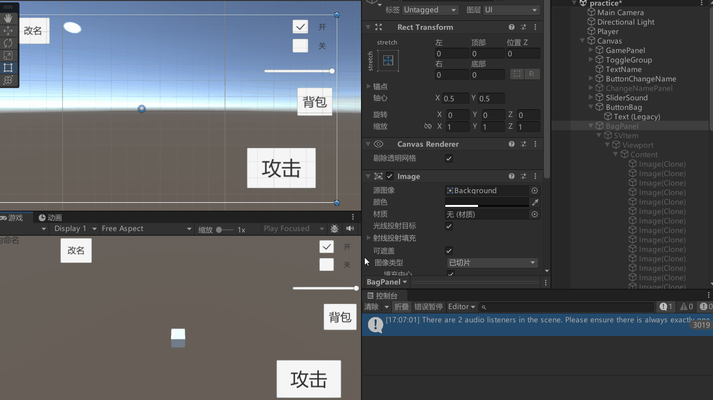


Content 的子对象的排列方式
1. 使用 Layout Group 自动排列
2. 手动设置对象位置


先创建一个背包按钮
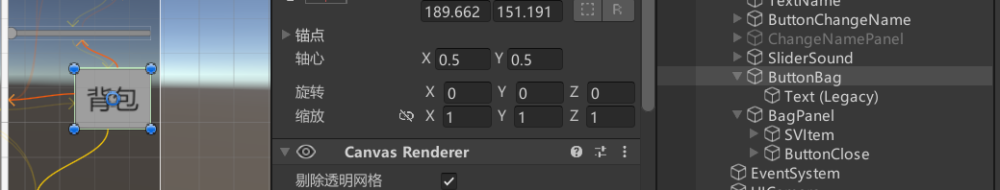

拼好背包面板
取消掉水平的滚动条，做一个退出按钮
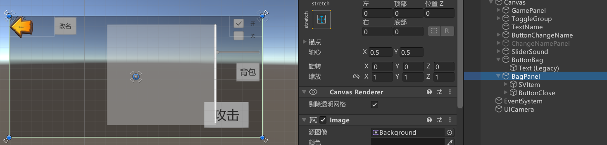


拿样例图来对比背包滚动视图的位置，确定物品的起始位置（这里是 （10，-10，0））
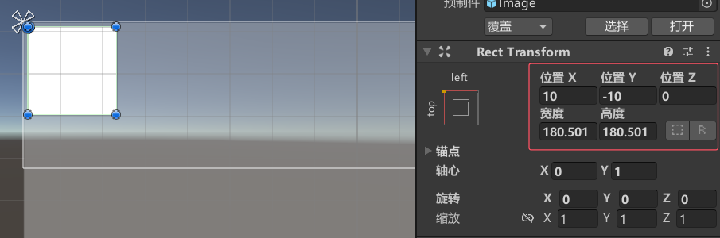


**手动设置ScrollView 的 Content 的子对象排列**
BagPanel.cs
```cs
public class BagPanel : MonoBehaviour
{
    private static BagPanel instance;
    public static BagPanel Instance => instance;

    public ScrollRect svItem;
    public int itemCount = 50;
    public float spacing = 40f; // 图与图之间的间隔
    public GameObject itemPrefab;   
    public Button btnClose;

    private void Awake()
    {
        instance = this;
    }

    void Start()
    {
        float itemwidth = itemPrefab.GetComponent<RectTransform>().rect.width;        // 元素的宽度
        float itemheight = itemPrefab.GetComponent<RectTransform>().rect.height;      // 元素的高度

        // 动态创建itemCount个图，作为滚动视图的子物体
        for (int i = 0; i < itemCount; i++)
        {
            GameObject newItem = Instantiate(itemPrefab, svItem.content);
            newItem.transform.localPosition = new Vector3(10, -10, 0) + 
                new Vector3((i % 4) * (itemwidth + spacing), -(i / 4) * (itemheight + spacing), 0);
        }
        
        // 设置content的高度
        svItem.content.sizeDelta = new Vector2(
            svItem.content.sizeDelta.x,
            (itemheight + spacing) * Mathf.Ceil(itemCount / 4f) - spacing
        );

        gameObject.SetActive(false);
        btnClose.onClick.AddListener(() =>
        {
            gameObject.SetActive(false);
        });
    }
}
```


GamePanel.cs
```cs
public class GamePanel : MonoBehaviour
{
    // 背包按钮
    public Button btnBag;

    void Start()
    {
        // 背包按钮
        btnBag.onClick.AddListener(() =>
        {
            BagPanel.Instance.gameObject.SetActive(true);
        });
    }
}

```