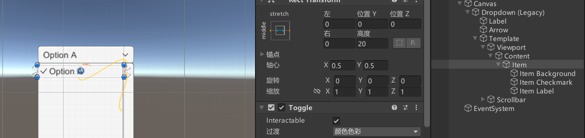
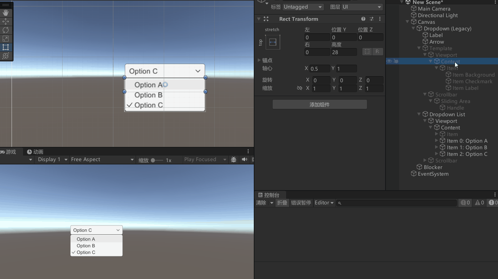
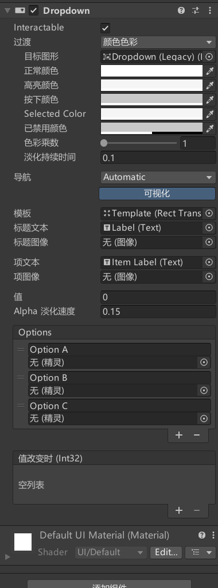
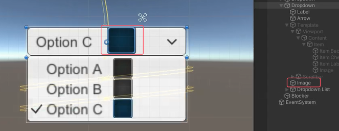
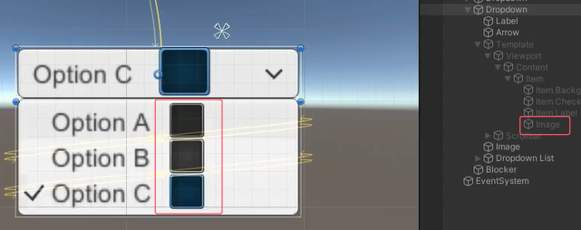
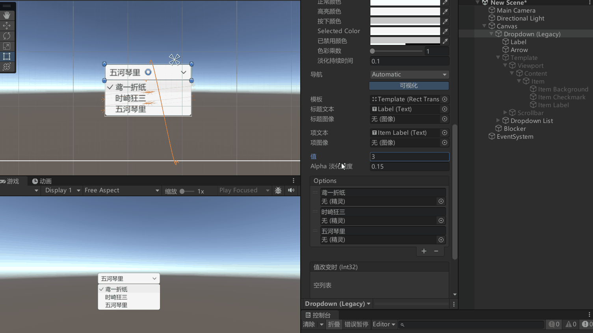
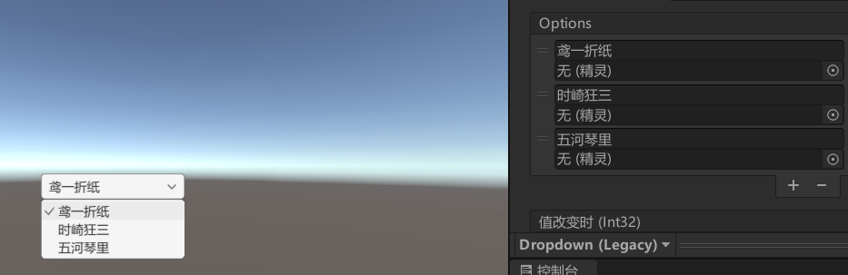
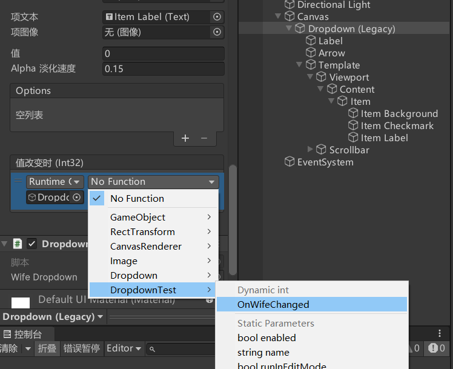
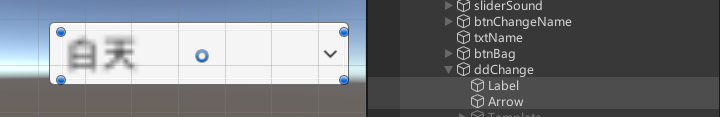

# Dropdown是什么
Dropdown是下拉列表（下拉选单）组件，是UGUI中用于处理下拉列表相关交互的关键组件。


在Hierarchy视图右键 -> UI -> Dropdown。
Unity会自动创建一个Dropdown对象，并附带必要的子对象（Label、Arrow、Template等）。
默认创建的Dropdown由4组对象组成：

父对象
Dropdown组件依附的对象，还有一个Image组件作为背景图
子对象
Label：显示当前选中的选项。
Arrow：指示这是一个下拉菜单，通常是一个向下的箭头。
Template：下拉菜单的模板，包含一个ScrollView和一个Item模板。
Item：下拉菜单中的每一项，通常是一个Toggle控件。




注意：Dropdown的Content会在游戏运行的时候自己扩展


# Dropdown 下拉列表控件参数




## Interactable：是否接受输入

## Transition：过渡效果
响应用户输入的过渡效果

## Navigation：导航模式
可以设置UI元素如何在播放模式中控制器导航

## Template：关联下拉列表对象

## Caption Text：关联显示当前选择内容的文本组件

## Caption Image：关联显示当前选择内容的图片组件

## Item Text：关联下拉列表选项用的文本控件

## Item Image：关联下拉列表选项用的图片控件



## Value：当前所选选项的索引值

## Alpha Fada Speed：下拉列表窗口淡入淡出的速度

## Options：存在的选项列表



# 代码控制
```cs
Dropdown dropdown = GetComponent<Dropdown>();

// 下拉菜单当前选中项的索引
print(dropdown.value);

// 下拉菜单当前选中项的文本内容
print(dropdown.options[dropdown.value].text);

// 在下拉菜单的选项列表末尾添加一个新选项，该选项的文本内容为 "123123123"
dropdown.options.Add(new Dropdown.OptionData("123123123"));
// 添加很多新选项 
dropdown.AddOptions(new List<string> { "Option 1", "Option 2", "Option 3" });

// 清空现有选项 
dropdown.ClearOptions();

```

# 监听事件的两种方式
一、拖脚本



二、代码监听
```cs
public class DropdownTest : MonoBehaviour
{
    public Dropdown wifeDropdown;

    void Start()
    {
        wifeDropdown.ClearOptions();
        wifeDropdown.AddOptions(new List<string> { "鸢一折纸", "时崎狂三", "五河琴里" });

        wifeDropdown.onValueChanged.AddListener(OnWifeChanged);
    }

    public void OnWifeChanged(int index)
    {
        string wifeName = wifeDropdown.options[index].text;
        Debug.Log("选择了" + wifeName);

        // 选择心意老婆
        switch(wifeName)
        {
            case "鸢一折纸":
                Debug.Log("鸢一折纸是我的心意老婆");
                break;
            case "时崎狂三":
                Debug.Log("时崎狂三是我的心意老婆");
                break;
            case "五河琴里":
                Debug.Log("五河琴里是我的心意老婆");
                break;
        }
    }
}
```

# 练习
在上节课的ScrollView练习题基础上，请用现在所学知识，制作一个这样的功能：场景上有一个下拉列表，可以通过改变下拉列表来改变当前场景是白天还是黑夜

在游戏面板创建一个下拉列表，添加白天和黑夜选项。


```cs
public Light light;  // 光源对象

public Dropdown ddChange;  

void Start()
{
    ddChange.onValueChanged.AddListener((index) => {
        switch (index)
        {
            case 0:
                light.intensity = 1;
                break;
            case 1:
                light.intensity = 0.3f; 
                break;
        }
    });
}

```