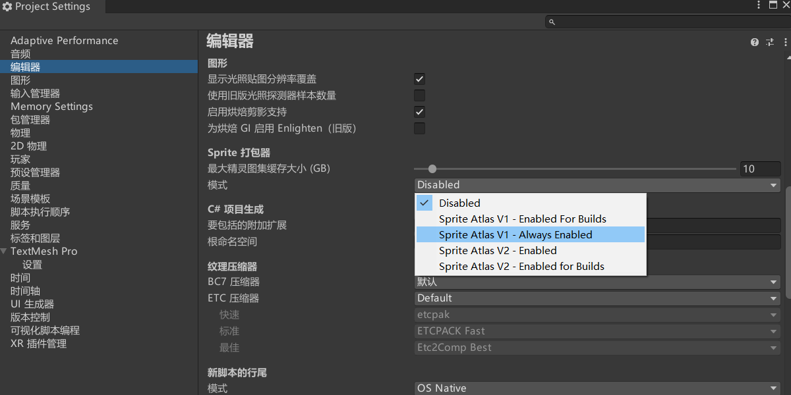
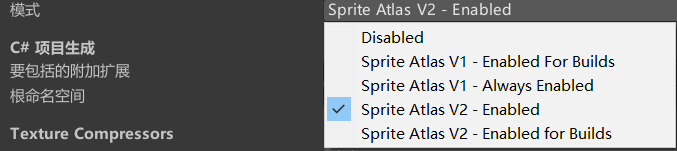
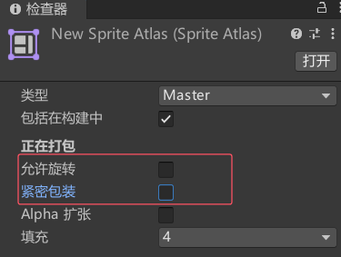
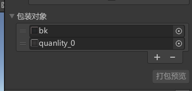

# 为什么要打图集


UGUI和NGUI使用上最大的不同是 NGUI使用前就要打图集。UGUI可以再之后再打图集。

 **图集的作用**
- 减少Draw Call：每个独立的纹理都会增加Draw Call，而Draw Call是影响性能的主要因素之一。使用图集可以将多个纹理合并为一个，从而减少Draw Call。
- 优化内存：将多个小纹理合并为一个大纹理可以减少内存碎片，提高内存利用率。
- 适合UI和2D游戏：在UI元素或2D游戏中，通常需要大量的小纹理（如按钮、图标等），使用图集可以显著提高渲染效率。

简单回顾DrawCall:
DC就是CPU通知GPU进行一次渲染的命令。
如果DC次数较多会导致游戏卡顿。
我们可以通过打图集，将小图合并成大图，将本应n次的DC变成1次DC来提高性能。


# 在Unity中打开自带的打图集功能

Unity提供了一个内置的Sprite Atlas系统，可以自动将多个Sprite打包成一张图集。
步骤：
在Project窗口中右键，选择 Create > Sprite Atlas。
将需要打包的Sprite拖入Sprite Atlas的 Objects for Packing 列表中。
在Sprite Renderer或Image组件中，直接使用Sprite，Unity会自动从图集中提取。

优点：自动生成，动态管理，适合动态变化的纹理。
缺点：需要了解Unity的Sprite Atlas系统。

可以通过在工程设置面板中选择Edit -> Project Setting -> Editor来打开Sprite Packer。




**Disabled**：
完全禁用 Sprite Atlas 功能，项目中不会使用精灵图集相关特性。

**Sprite Atlas V1 - Enabled For Builds：** 
使用 Sprite Atlas V1 版本，仅在项目构建（Build）时启用图集功能。编辑阶段不会处理图集，仅构建输出时生成图集。

**Sprite Atlas V1 - Always Enabled**：
使用 Sprite Atlas V1 版本，无论编辑阶段还是构建阶段，始终启用图集功能，实时处理图集相关操作。

**Sprite Atlas V2 - Enabled**：
使用 Sprite Atlas V2 版本（Unity 较新的图集方案，功能更灵活），默认全程启用，编辑和构建阶段均生效。

**Sprite Atlas V2 - Enabled For Builds**：
使用 Sprite Atlas V2 版本，但仅在项目构建时启用。编辑阶段不处理图集，仅构建时生成最终图集，适合需要减少编辑时资源消耗的场景。


**在创建Sprite Atlas后，可以通过以下设置优化图集：**
Include in Build：是否将图集包含在构建中。
Allow Rotation：是否允许旋转Sprite以优化图集空间。
Padding：设置Sprite之间的间距，防止纹理边缘出现混合。
Compression：设置图集的压缩格式，以平衡质量和性能。


做UI的时候一般倾向于把下面两都取消勾选



直接添加图



# 代码中使用图集
```cs
// 获取Sprite Atlas
SpriteAtlas spriteAtlas = Resources.Load<SpriteAtlas>("SpriteAtlasName");

// 获取图集中的特定Sprite
Sprite sprite = spriteAtlas.GetSprite("SpriteName");

// 应用到Sprite Renderer
SpriteRenderer renderer = GetComponent<SpriteRenderer>();
renderer.sprite = sprite;

```

# 优化建议
合理规划图集大小：图集过大会占用更多内存，过小会导致频繁切换图集。建议根据设备性能选择合适的图集大小（如2048x2048或1024x1024）。
动态加载图集：对于大型游戏，可以使用AssetBundle动态加载图集，减少初始加载时间。
避免过度打包：将不相关的Sprite打包到同一个图集中会导致资源浪费，建议按功能或场景分组打包。

# 示例场景
2D游戏中的角色动画
将角色的所有动画帧打包到一个图集中。
使用Sprite Atlas动态加载帧动画，减少Draw Call。
通过脚本控制动画播放：

```cs
public class PlayerAnimation : MonoBehaviour
{
    public SpriteAtlas playerAtlas;
    public SpriteRenderer spriteRenderer;
    private Sprite[] animationFrames;
    private int currentFrame = 0;

    void Start()
    {
        // 获取动画帧
        animationFrames = new Sprite[4];
        for (int i = 0; i < 4; i++)
        {
            animationFrames[i] = playerAtlas.GetSprite($"Frame_{i}");
        }
    }

    void Update()
    {
        // 播放动画
        spriteRenderer.sprite = animationFrames[currentFrame];
        currentFrame = (currentFrame + 1) % 4;
    }
}
```

