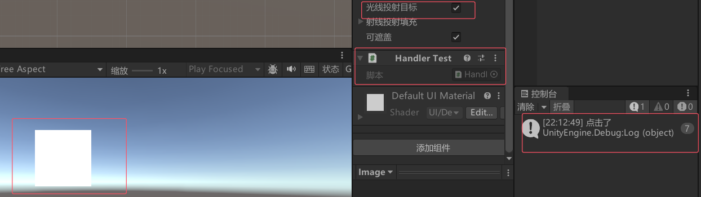
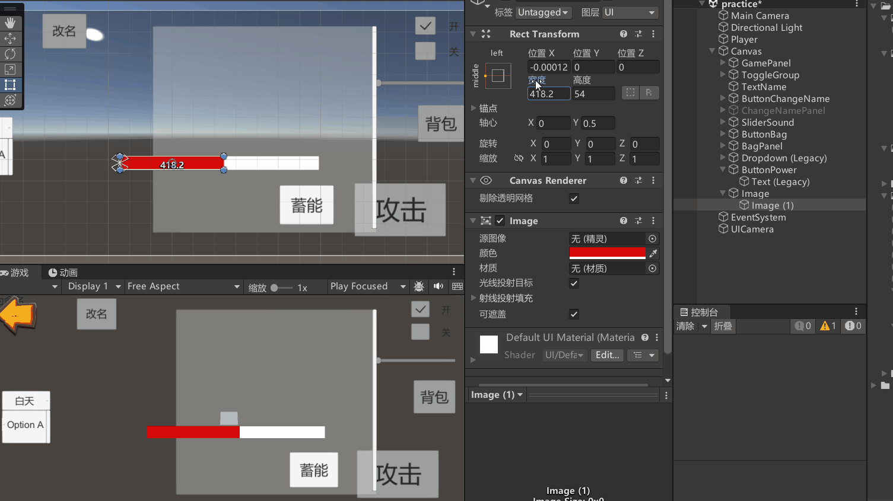

# UGUI事件接口
UGUI事件接口用于解决控件所提供的常规事件监听列表无法满足的需求，例如长按、双击、拖拽等功能，以及让基础控件如Image、Text、RawImage响应玩家输入的情况。
而事件接口就是用来处理类似问题,让所有控件都能够添加更多的事件监听来处理对应的逻辑。


# 常用事件接口

## IPointerClickHandler 鼠标点击
```cs
using UnityEngine;
using UnityEngine.EventSystems;

public class ClickHandler : MonoBehaviour, IPointerClickHandler
{
    public void OnPointerClick(PointerEventData eventData)
    {
        Debug.Log("鼠标点击");
    }
}
```

## IPointerEnterHandler 和 IPointerExitHandler 鼠标进入和离开
```cs
using UnityEngine;
using UnityEngine.EventSystems;

public class HoverHandler : MonoBehaviour, IPointerEnterHandler, IPointerExitHandler
{
    public void OnPointerEnter(PointerEventData eventData)
    {
        Debug.Log("鼠标进入");
    }

    public void OnPointerExit(PointerEventData eventData)
    {
        Debug.Log("鼠标退出");
    }
}
```

## IPointerDownHandler 和 IPointerUpHandler 鼠标按下和释放
```cs
using UnityEngine;
using UnityEngine.EventSystems;

public class MouseDownUpHandler : MonoBehaviour, IPointerDownHandler, IPointerUpHandler
{
    public void OnPointerDown(PointerEventData eventData)
    {
        Debug.Log("鼠标按下");
    }

    public void OnPointerUp(PointerEventData eventData)
    {
        Debug.Log("鼠标释放");
    }
}
```
## IBeginDragHandler, IDragHandler, IEndDragHandler 鼠标拖曳
```cs
public class DragHandler : MonoBehaviour, IBeginDragHandler, IDragHandler, IEndDragHandler
{
    public void OnBeginDrag(PointerEventData eventData)
    {
        Debug.Log("开始拖曳");
    }

    public void OnDrag(PointerEventData eventData)
    {
        Debug.Log("正在拖曳");
    }

    public void OnEndDrag(PointerEventData eventData)
    {
        Debug.Log("结束拖曳");
    }
}

```

# 不常用

## IInitializePotentialDragHandler 初始化拖曳
```cs
public class DragHandler : MonoBehaviour, IInitializePotentialDragHandler, IBeginDragHandler, IDragHandler, IEndDragHandler
{
    public void OnInitializePotentialDrag(PointerEventData eventData)
    {
        Debug.Log("初始化拖曳");
    }

    public void OnBeginDrag(PointerEventData eventData)
    {
        Debug.Log("开始拖曳");
    }

    public void OnDrag(PointerEventData eventData)
    {
        Debug.Log("正在拖曳");
    }

    public void OnEndDrag(PointerEventData eventData)
    {
        Debug.Log("结束拖曳");
    }
}
```
## UpdateSelectedHandler 选中时每帧执行
```cs
public class UpdateSelectedHandler : MonoBehaviour, IUpdateSelectedHandler
{
    public void OnUpdateSelected(BaseEventData eventData)
    {
        Debug.Log("每次勾选时在选定对象时调用");
    }
}

```
## IScrollHandler 鼠标滚轮滚动
```cs
using UnityEngine;
using UnityEngine.EventSystems;

public class ScrollHandler : MonoBehaviour, IScrollHandler
{
    public void OnScroll(PointerEventData eventData)
    {
        Debug.Log("Mouse Scroll Wheel Used!");
    }
}
```

## ISelectHandler 和 IDeselectHandler UI元素获得和失去焦点
```cs
using UnityEngine;
using UnityEngine.EventSystems;

public class SelectHandler : MonoBehaviour, ISelectHandler, IDeselectHandler
{
    public void OnSelect(BaseEventData eventData)
    {
        Debug.Log("UI Element Selected!");
    }

    public void OnDeselect(BaseEventData eventData)
    {
        Debug.Log("UI Element Deselected!");
    }
}
```


## ISubmitHandler和 ICancelHandler 提交和取消
提交（如按下回车键）和取消（如按下ESC键）的事件。
```cs
using UnityEngine;
using UnityEngine.EventSystems;

public class SubmitCancelHandler : MonoBehaviour, ISubmitHandler, ICancelHandler
{
    public void OnSubmit(BaseEventData eventData)
    {
        Debug.Log("Submit Event Triggered!");
    }

    public void OnCancel(BaseEventData eventData)
    {
        Debug.Log("Cancel Event Triggered!");
    }
}
```

## IMoveHandler 导航
```cs
using UnityEngine;
using UnityEngine.EventSystems;

public class MoveHandler : MonoBehaviour, IMoveHandler
{
    public void OnMove(AxisEventData eventData)
    {
        Debug.Log("Move Event Triggered!");
    }
}
```


# 使用UGUI事件接口
将该脚本挂载到想要监听自定义事件的UI控件上就行



# PointerEventData
PointerEventData 是 Unity 中 EventSystem 的一部分，专门用于处理与指针（如鼠标、触摸屏）相关的事件。它是一个数据结构，包含了与指针事件相关的详细信息，例如指针的位置、点击的物体、拖拽的状态等。PointerEventData 被广泛用于 Unity 的 UI 事件系统中，尤其是在实现 IPointerClickHandler、IDragHandler 等接口时。

以下是对 PointerEventData 的详细说明，包括它的常用属性和方法：
## **`position`**
 类型：`Vector2`
说明：指针**事件发生**时的屏幕坐标（以像素为单位）。
示例：`eventData.position` 可以获取鼠标点击时的屏幕位置。

## **`pressPosition`**
类型：`Vector2`
说明：指针按下时的屏幕坐标。
示例：可以用于计算拖拽的距离。


## **`pointerPress`**
类型：`GameObject`
说明：当前被指针按下的游戏对象。
示例：`eventData.pointerPress` 可以获取当前点击的 UI 元素。


## **`pointerCurrentRaycast`**
类型：`RaycastResult`
说明：指针当前射线检测的结果，包含被检测到的对象及其相关信息。
示例：`eventData.pointerCurrentRaycast.gameObject` 获取当前指针指向的对象。


## **`pointerDrag`**
类型：`GameObject`
说明：当前被拖拽的游戏对象。
示例：在 `IDragHandler` 中，`eventData.pointerDrag` 是正在被拖拽的对象。


## **`button`**
类型：`PointerEventData.InputButton`
说明：触发事件的鼠标按钮（左键、右键、中键）。
示例：
```cs
if (eventData.button == PointerEventData.InputButton.Left)
{
    Debug.Log("Left Mouse Button Clicked!");
}
```
## **`clickCount`**
类型：`int`
说明：连击次数（例如双击事件）。
示例：
```cs
if (eventData.clickCount == 2)
{
    Debug.Log("Double Clicked!");
}
```
## **`delta`**
类型：`Vector2`
说明：指针的移动距离（以像素为单位）。
示例：在 IDragHandler 中，eventData.delta 可以获取拖拽的偏移量。

## **`scrollDelta`**
类型：`Vector2`
说明：滚轮的滚动量。
示例：在 IScrollHandler 中，eventData.scrollDelta 可以获取滚轮的滚动方向。


## **`IsPointerMoving()`** 判断指针是否在移动。
```cs
if (eventData.IsPointerMoving())
{
    Debug.Log("Pointer is moving!");
}
```

## **`IsScrolling()`** 判断是否正在滚动。
```cs
if (eventData.IsScrolling())
{
    Debug.Log("Scrolling detected!");
}
```


## pressEventCamera	按下时所在的相机
处理不同相机下的坐标转换（如 UI 相机与世界相机）

## enterEventCamera	进入 UI 元素时的相机
多相机界面中事件归属判断


## **eg：**
```cs
using UnityEngine;
using UnityEngine.EventSystems;

public class PointerEventExample : MonoBehaviour, 
    IPointerDownHandler, 
    IPointerUpHandler, 
    IDragHandler,
    IPointerClickHandler
{
    // 记录按下时的信息
    private int pointerID;
    private Vector2 pressPos;
    private Camera pressCam;
    private float pressTime;

    // 拖拽相关
    private bool isDragging;
    private Vector2 startDragPos;

    // 双击检测
    private float lastClickTime;
    private int clickCount;

    public void OnPointerDown(PointerEventData eventData)
    {
        pointerID = eventData.pointerId;  // 记录触摸 ID（多指区分）
        pressPos = eventData.position;    // 按下时的屏幕坐标
        pressCam = eventData.pressEventCamera;  // 按下时的相机
        pressTime = Time.time;            // 记录按下时间

        // 初始化拖拽起点
        startDragPos = eventData.position;
        isDragging = true;
    }

    public void OnPointerUp(PointerEventData eventData)
    {
        isDragging = false;
        CheckClick(eventData);  // 抬起时检查点击行为
    }

    public void OnDrag(PointerEventData eventData)
    {
        if (!isDragging) return;

        // 计算拖拽距离（delta：当前帧移动量）
        Vector2 delta = eventData.delta;
        Debug.Log($"Drag Delta: {delta}");

        // 移动自身（示例：将 UI 元素位置增加拖拽量）
        RectTransform rect = GetComponent<RectTransform>();
        rect.anchoredPosition += delta;
    }

    public void OnPointerClick(PointerEventData eventData)
    {
        // 处理点击事件
        clickCount++;
        lastClickTime = Time.time;
        Debug.Log($"Click Count: {clickCount}");
    }

    private void CheckClick(PointerEventData eventData)
    {
        // 双击检测：两次点击时间间隔小于 0.3 秒
        if (clickCount >= 2 && (Time.time - lastClickTime) < 0.3f)
        {
            Debug.Log("Double Click Detected!");
            clickCount = 0;
        }
        else
        {
            // 单点击但未满足双击条件
            float clickDuration = Time.time - pressTime;
            if (clickDuration < 0.5f)  // 点击时间短于 0.5 秒视为有效点击
            {
                Debug.Log("Single Click!");
            }
        }
    }

    private void Update()
    {
        // 其他实时逻辑（例如根据 pressEventCamera 转换坐标）
        if (Input.GetMouseButton(0))
        {
            Vector3 worldPos = pressCam.ScreenToWorldPoint(Input.mousePosition);
            Debug.Log($"World Position: {worldPos}");
        }
    }
}
```

# 练习

这里通过宽度来设置进度条



```cs
public class GamePanel : MonoBehaviour
{
    // 关联长按事件
    public LongPress longPress;
    // 进度条根对象，用来控制显隐
    public GameObject imgRoot;
    // 进度条，用于控制进度
    public RectTransform imgBk;

    void Start()
    {
        // 长按事件
        longPress.downEvent += BtnDown;
        longPress.upEvent += BtnUp;
    }

    // 计时
    private float nowTime = 0;
    // 是否按下
    private bool isDown = false;
    // 进度条速度
    public float addSpeed = 1000;
    // 血量
    public int hp = 10;
    // 按下
    public void BtnDown()
    {
        isDown = true;
        nowTime = 0;
    }

    // 抬起
    public void BtnUp()
    {
        isDown = false;
        // 清空进度条
        imgBk.sizeDelta = new Vector2(0, imgBk.sizeDelta.y);
    }

    private void Update()
    {
        if (isDown)
        {
            nowTime += Time.deltaTime;
            if (nowTime >= 0.2f)
            {
                imgRoot.SetActive(true);
                imgBk.sizeDelta = new Vector2(imgBk.sizeDelta.x + addSpeed * Time.deltaTime, imgBk.sizeDelta.y);
                if (imgBk.sizeDelta.x >= 800)
                {
                    // 进度条满了, hp+
                    imgBk.sizeDelta = new Vector2(0, imgBk.sizeDelta.y);
                    hp += 10;
                    Debug.Log($"前血量：{hp}");
                }
            }
        }
        else
        {
            imgRoot.SetActive(false);
        }
    }
}
```

```cs
/// <summary>
/// 抛出长按事件
/// </summary>
public class LongPress : MonoBehaviour, IPointerDownHandler, IPointerUpHandler
{
    public Action downEvent;
    public Action upEvent;
    public void OnPointerDown(PointerEventData eventData)
    {
        downEvent?.Invoke();
    }

    public void OnPointerUp(PointerEventData eventData)
    {
        upEvent?.Invoke();
    }
}
```

