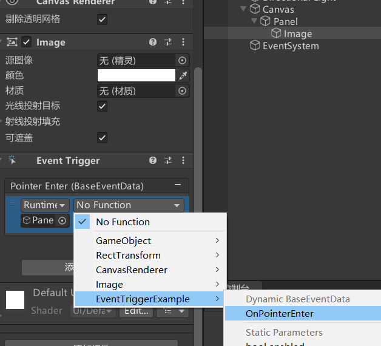
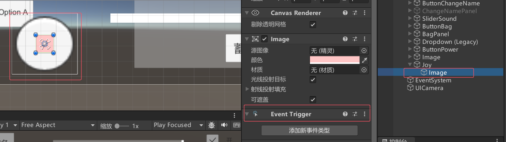

# EventTrigger事件触发器
EventTrigger是事件触发器组件，继承了中学习的所有事件接口的脚本。它可以让我们更方便地为控件添加事件监听。

# 使用EventTrigger
一·、拖曳脚本
```cs
public class EventTriggerExample : MonoBehaviour
{
    public void OnPointerEnter(BaseEventData data)
    {
        PointerEventData pointerEventData = data as PointerEventData;
        Debug.Log($"鼠标进入{pointerEventData.position}");
    }
}
```




二、代码添加

**什么是 EventTrigger.Entry？**
EventTrigger.Entry 是 Unity 中 EventTrigger 组件的一个核心部分。它表示一个事件类型（如鼠标点击、鼠标悬停等）及其对应的回调函数列表。简单来说，EventTrigger.Entry 是一个“事件条目”，它定义了：

**事件类型（eventID）**：比如 PointerClick、PointerEnter 等。EventTriggerType 枚举值
**回调函数列表（callback）**：当事件发生时，这些函数会被调用。

举个例子：
你希望一个按钮在被点击时改变颜色，同时在被悬停时显示提示信息，这时就需要两个 EventTrigger.Entry，一个用于 PointerClick，另一个用于 PointerEnter。

```cs
using UnityEngine;
using UnityEngine.EventSystems;
using UnityEngine.UI;

public class EventTriggerExample : MonoBehaviour
{
    void Start()
    {
        // 获取按钮的 EventTrigger 组件
        EventTrigger eventTrigger = gameObject.AddComponent<EventTrigger>();

        // 创建 PointerClick 事件条目
        EventTrigger.Entry clickEntry = new EventTrigger.Entry();
        clickEntry.eventID = EventTriggerType.PointerClick; // 事件类型
        clickEntry.callback.AddListener((data) => { OnPointerClick((PointerEventData)data); }); // 回调函数
        eventTrigger.triggers.Add(clickEntry); // 添加到 EventTrigger

        // 创建 PointerEnter 事件条目
        EventTrigger.Entry enterEntry = new EventTrigger.Entry();
        enterEntry.eventID = EventTriggerType.PointerEnter; // 事件类型
        enterEntry.callback.AddListener((data) => { OnPointerEnter((PointerEventData)data); }); // 回调函数
        eventTrigger.triggers.Add(enterEntry); // 添加到 EventTrigger
    }

    void OnPointerClick(PointerEventData data)
    {
        Debug.Log("按钮被点击了！");
        GetComponent<Image>().color = Color.green; // 改变按钮颜色
    }

    void OnPointerEnter(PointerEventData data)
    {
        Debug.Log("鼠标进入了按钮！");
        GetComponent<Image>().color = Color.yellow; // 改变按钮颜色
    }
}
```


# 练习
在UI事件监听接口上节课的练习题基础上，请用现在所学知识，
制作一个这样的功能：制作一个UGUI摇杆可以控制场景上的对象移动

先拼好摇杆，然后添加EventTrigger


关联好GamePanel
```cs
public class GamePanel : MonoBehaviour
{
    // 摇杆位置
    public RectTransform imgJoystick;
    // 摇杆事件
    public EventTrigger et;

    void Start()
    {
        // 摇杆事件
        EventTrigger.Entry entry = new EventTrigger.Entry();    // 拖动中
        entry.eventID = EventTriggerType.Drag;
        entry.callback.AddListener((data) =>
        {
            PointerEventData eventData = data as PointerEventData;
            imgJoystick.position += new Vector3(eventData.delta.x, eventData.delta.y, 0); // 直接拖动摇杆
            // anchoredPosition相对于锚点位置
            if (imgJoystick.anchoredPosition.magnitude > 180) // 限制摇杆范围
            {
                imgJoystick.anchoredPosition = imgJoystick.anchoredPosition.normalized * 180;
            }
            // 玩家移动
            player.Move(imgJoystick.anchoredPosition);
        });
        et.triggers.Add(entry);

        entry = new EventTrigger.Entry();    // 拖动结束
        entry.eventID = EventTriggerType.EndDrag;
        entry.callback.AddListener((data) =>
        {
            // 拖动结束，摇杆回到原点
            imgJoystick.anchoredPosition = Vector2.zero;
            // 停止移动
            player.Move(Vector2.zero);
        });
        et.triggers.Add(entry);
    }
}
```

通过摇杆方向设置玩家移动
```cs
public class PlayerObj : MonoBehaviour
{
    public AudioClip audioClip;
    private Vector3 nowMoveDir = Vector3.zero;
    public float roundSpeed = 10f;
    public float moveSpeed = 5f;
    void Start()
    {
    }

    void Update()
    {
        if (nowMoveDir != Vector3.zero)
        {
            // 移动
            this.transform.Translate(transform.forward * Time.deltaTime * moveSpeed, Space.World);
            // 旋转
            Quaternion targetRotation = Quaternion.LookRotation(nowMoveDir);
            this.transform.rotation = Quaternion.Slerp(this.transform.rotation, targetRotation, Time.deltaTime * roundSpeed);
        }
    }

    // 传入摇杆移动方向
    public void Move(Vector2 dir)
    {
        nowMoveDir.x = dir.x;
        nowMoveDir.y = 0;
        nowMoveDir.z = dir.y;
    }

    public void Fire()
    {
        if (MusicData.SoundIsOpen)
        {
            // 播放音效
            AudioSource audioSource = this.gameObject.AddComponent<AudioSource>();
            audioSource.clip = audioClip;
            audioSource.volume = MusicData.SoundVolume;
            audioSource.Play();
            Destroy(audioSource, 1);
        }
        Instantiate(Resources.Load<GameObject>("Bullet"), this.transform.position, this.transform.rotation);
    }
}

```