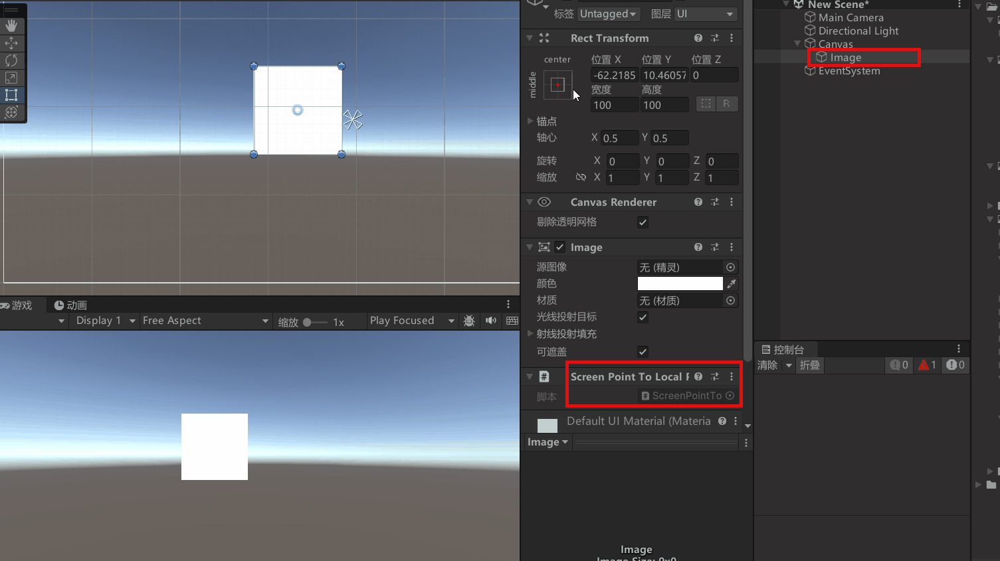
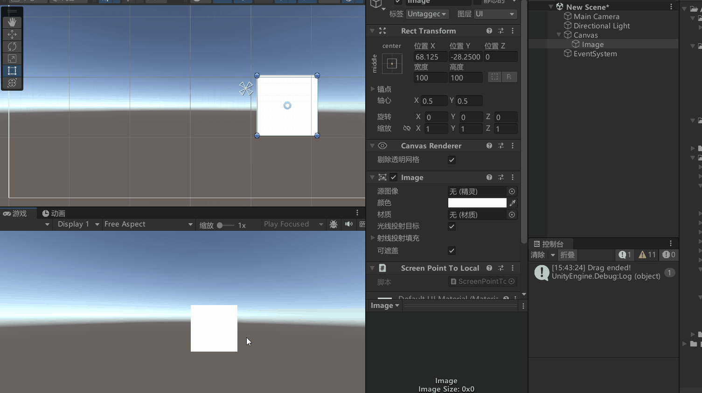

# RectTransformUtility类
RectTransformUtility 是 Unity 中的一个静态类，专门用于处理与 RectTransform 相关的计算和操作主，比如一些坐标的转换等操作。RectTransformUtility 提供了一些非常实用的方法，比如将屏幕空间坐标转换为 UI 空间的坐标，或者判断一个点是否在某个 RectTransform 的范围内。


# 常用方法

ScreenPointToLocalPointInRectangle
**将屏幕坐标点转换为RectTransform 的局部空间中的点**
**rect**：目标局部空间 RectTransform。
 这里一般是其xxx父对象

**screenPoint**： 屏幕空间中的点（通常是鼠标点击的位置）。

**cam**：
用于渲染 UI 的摄像机。如果 UI 是在世界空间中渲染的，这里需要传入摄像机；如果是在屏幕空间中渲染的，可以传入 null。
这里是根据Canvas的渲染模式来的，当Canvas的渲染模式为**摄像机模式**或者**世界空间模式**时不为空，
这里可以使用
`eventData.enterEventCamera`：当射线从摄像机发射出去并与 UI 元素交互时，此属性会记录下这一过程中使用的摄像机。
`Canvas.worldCamera`：与 Canvas 关联的摄像机

**localPoint**： 转换后的局部空间中的点。
```cs
public static bool ScreenPointToLocalPointInRectangle(
    RectTransform rect, 
    Vector2 screenPoint, 
    Camera cam, 
    out Vector2 localPoint
);
```

eg:

```cs
public class ScreenPointToLocalPointInRectangleTest : MonoBehaviour, IDragHandler, IBeginDragHandler, IEndDragHandler
{
    private RectTransform rectTransform;
    private Canvas canvas;
    private Vector2 offset; // 记录鼠标点击点与 UI 元素中心点的偏移

    private void Awake()
    {
        rectTransform = GetComponent<RectTransform>();
        canvas = GetComponentInParent<Canvas>(); // 获取 UI 所在的 Canvas
    }

    public void OnBeginDrag(PointerEventData eventData)
    {
        // 将鼠标点击的屏幕坐标转换为 UI 元素的局部坐标
        RectTransformUtility.ScreenPointToLocalPointInRectangle(
            rectTransform.parent.transform as RectTransform,
            eventData.position,
            //eventData.enterEventCamera, // 这样也行
            canvas.worldCamera,
            out Vector2 localPoint
        );

        // 计算偏移量（鼠标点击点与 UI 元素中心点的差值）
        offset = rectTransform.anchoredPosition - localPoint;
    }

    public void OnDrag(PointerEventData eventData)
    {
        // 将鼠标的屏幕坐标转换为 UI 元素的局部坐标
        RectTransformUtility.ScreenPointToLocalPointInRectangle(
            rectTransform.parent.transform as RectTransform,
            eventData.position,
            //eventData.enterEventCamera, // 这样也行
            canvas.worldCamera,
            out Vector2 localPoint
        );

        // 更新 UI 元素的位置，保持与鼠标的偏移
        rectTransform.anchoredPosition = localPoint + offset;

        // 这样也行
        
    }


    public void OnEndDrag(PointerEventData eventData)
    {
        Debug.Log("拖拽结束");
    }
}
```




```cs
public class ScreenPointToLocalPointInRectangleTest : MonoBehaviour, IDragHandler, IBeginDragHandler, IEndDragHandler
{
    private RectTransform rectTransform;
    private Canvas canvas;
    private Vector2 offset; // 记录鼠标点击点与 UI 元素中心点的偏移

    private void Awake()
    {
        rectTransform = GetComponent<RectTransform>();
        canvas = GetComponentInParent<Canvas>(); // 获取 UI 所在的 Canvas
    }

    public void OnDrag(PointerEventData eventData)
    {
        // 将鼠标的屏幕坐标转换为 UI 元素的局部坐标
        RectTransformUtility.ScreenPointToLocalPointInRectangle(
            rectTransform.parent.transform as RectTransform,
            eventData.position,
            //eventData.enterEventCamera, // 这样也行
            canvas.worldCamera,
            out Vector2 localPoint
        );

        // 更新 UI 元素的位置，保持与鼠标的偏移
        //rectTransform.anchoredPosition = localPoint + offset;
        this.transform.localPosition = localPoint;
    }
}

```
# 练习
用本章的知识改

```cs
public class GamePanel : MonoBehaviour
{
    // 摇杆位置
    public RectTransform imgJoystick;
    // 摇杆事件
    public EventTrigger et;

    void Start()
    {
        // 摇杆事件
        EventTrigger.Entry entry = new EventTrigger.Entry();    // 拖动中
        entry.eventID = EventTriggerType.Drag;
        entry.callback.AddListener((data) =>
        {
            PointerEventData eventData = data as PointerEventData;

            // 这是之前的版本
            //imgJoystick.position += new Vector3(eventData.delta.x, eventData.delta.y, 0); // 直接拖动摇杆

            // 这是新的版本
            // 将鼠标的屏幕坐标转换为 UI 元素的局部坐标
            Vector2 localPoint;
            RectTransformUtility.ScreenPointToLocalPointInRectangle(
                imgJoystick.parent as RectTransform,
                eventData.position,
                eventData.enterEventCamera,
                out localPoint
            );
            imgJoystick.localPosition = localPoint; // 更新摇杆位置


            // anchoredPosition相对于锚点位置
            if (imgJoystick.anchoredPosition.magnitude > 180) // 限制摇杆范围
            {
                imgJoystick.anchoredPosition = imgJoystick.anchoredPosition.normalized * 180;
            }
            // 玩家移动
            player.Move(imgJoystick.anchoredPosition);
        });
        et.triggers.Add(entry);

        entry = new EventTrigger.Entry();    // 拖动结束
        entry.eventID = EventTriggerType.EndDrag;
        entry.callback.AddListener((data) =>
        {
            // 拖动结束，摇杆回到原点
            imgJoystick.anchoredPosition = Vector2.zero;
            // 停止移动
            player.Move(Vector2.zero);
        });
        et.triggers.Add(entry);
    }
}

```