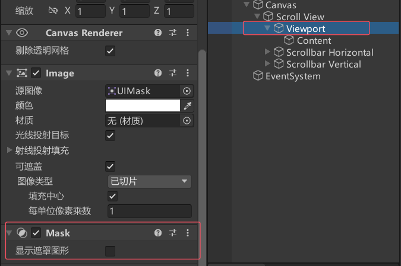
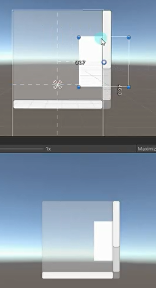
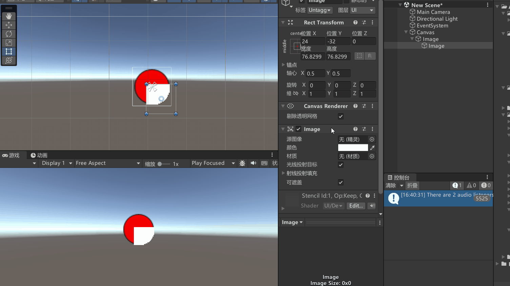
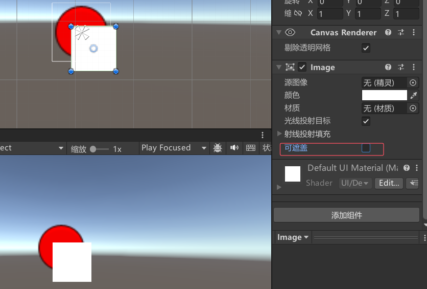

# 遮罩是什么
遮罩是一种在不改变图片的情况下，让图片在游戏中只显示其中的一部分的组件。
比如：ScrollView滚动视图中的ViewPort就包含遮罩组件，这导致在滚动视图中只有在可见范围内才能看到组件。

# 使用遮罩
遮罩的关键组件是Mask组件，通过在父对象上添加Mask组件即可遮罩其子对象。
父物体：添加了Mask组件的UI元素。
子物体：需要被遮罩的UI元素。

**创建一个父物体，给父物体添加Mask组件，然后将想被遮罩影响的添加到其子物体中**

注意：
想要被遮罩的Image需要勾选Maskable。
只要父对象添加了Mask组件，那么所有的UI子对象都会被遮罩。
遮罩父对象图片的制作，不透明的地方显示，透明的地方被遮罩。

