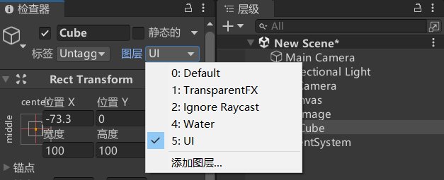
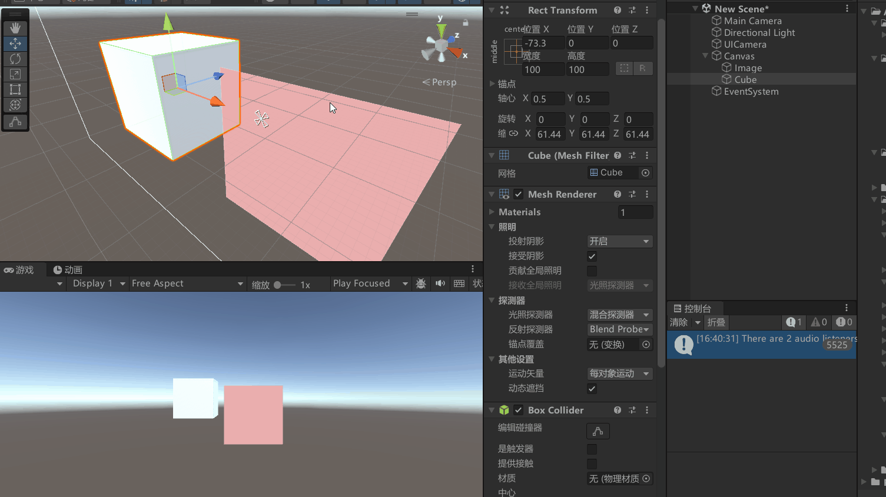
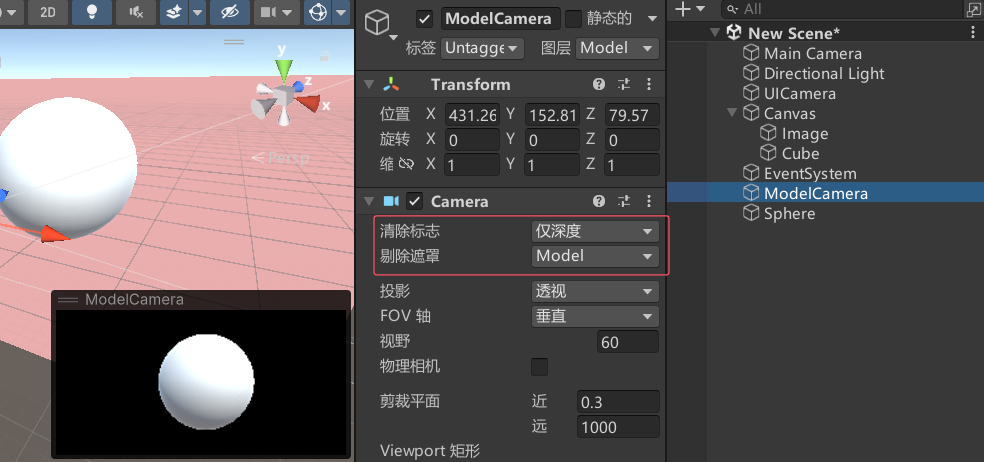
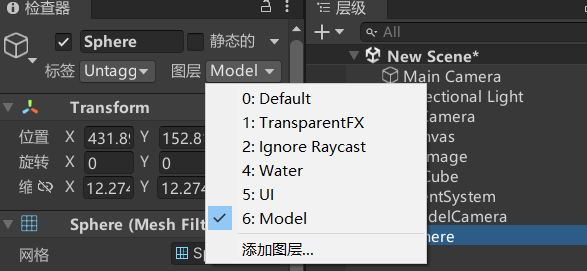
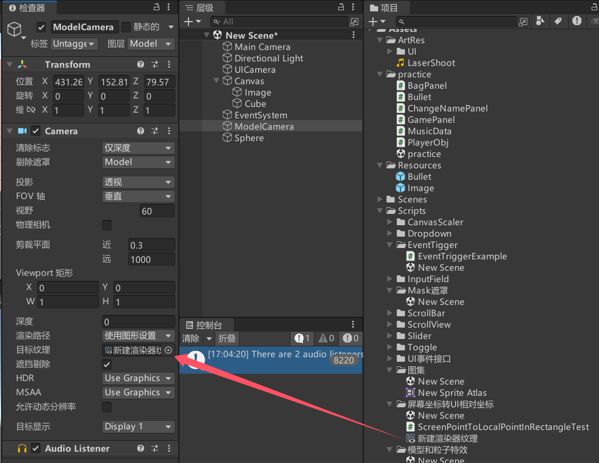
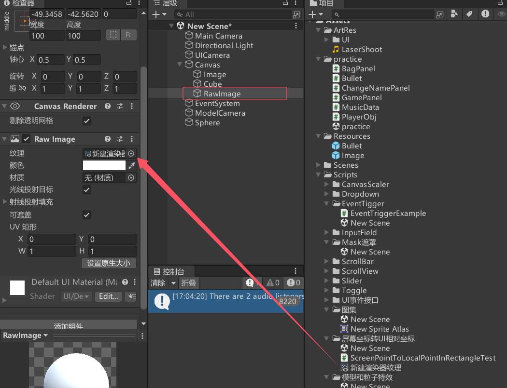
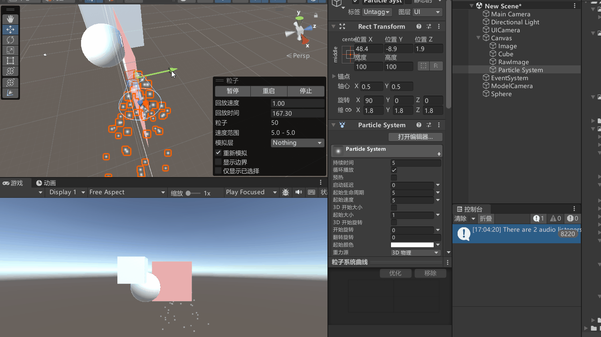
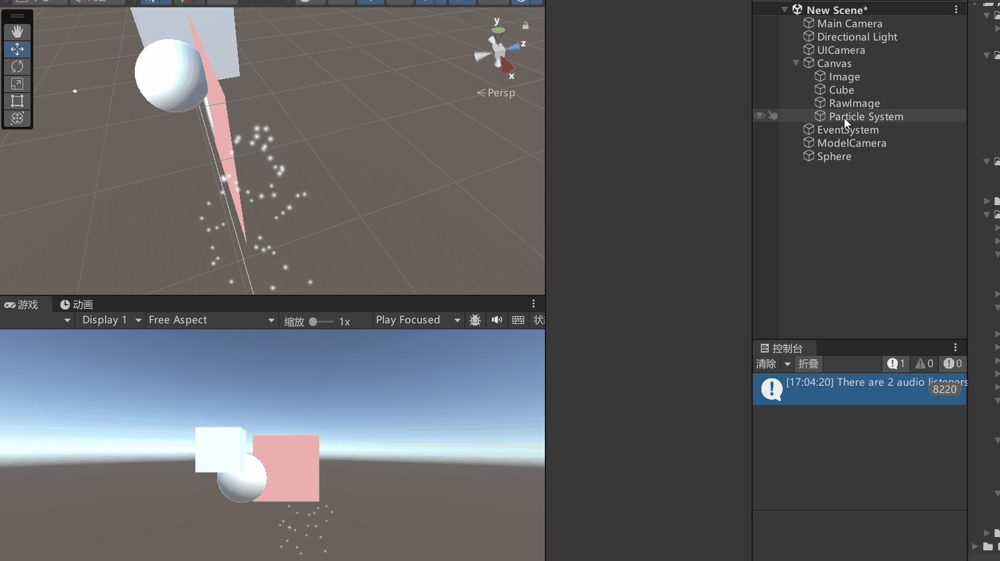

# 模型显示在UI之前
## 直接用摄像机渲染3D物体（多个）

Canvas的渲染模式只要不是覆盖模式。摄像机模式和世界（3D）模式都可以让模型显示在UI之前（Z轴在UI元素之前即可）。

注意：
建议使用专门的摄像机渲染UI相关内容。
UI面板上的3D物体建议也用UI摄像机进行渲染。

## 将3D物体渲染在图片上，通过图片显示（单个）
专门使用一个摄像机渲染3D模型，将其渲染内容输出到 Render Texture 上，然后再将渲染的图显示在UI上。
这种方式不管Canvas的渲染模式是哪种都可以使用。

创建一个摄像机，设置如下

添加想要渲染的模型，更改图层

创建渲染器纹理，然后将摄像机关联摄像机的目标纹理

然后可以通过UGUI中的RawImage来渲染出来，模型改变其渲染的图片也会改变

# 粒子特效显示在UI之前
粒子特效的显示和3D物体类似。

注意：在摄像机模式下时，可以在粒子组件的Renderer相关参数中改变排序层 让粒子特效始终显示在其之前不受Z轴影响

