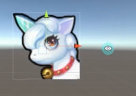
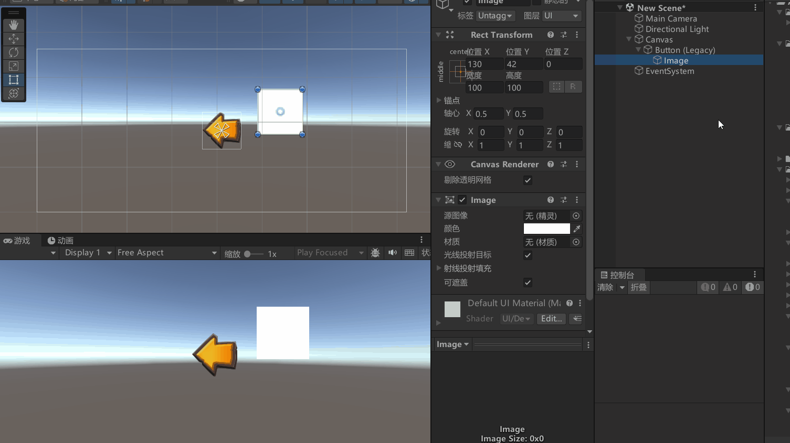
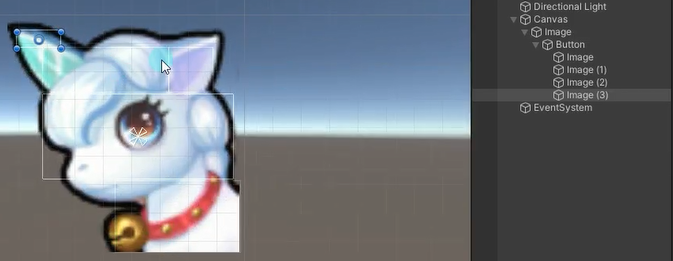
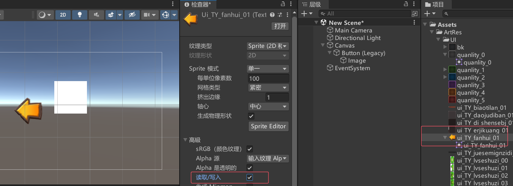

# 什么是异形按钮

异形按钮是指形状不是传统矩形的按钮。举例来说，一个异形按钮可能只有独角兽的区域能够被点击响应，而不是整个矩形。




# 如何让异性按钮准确的被点击
## 方法一：自下而上拼凑
按钮之所以能够响应点击，主要是根据图片矩形范围进行判断的。其范围判断是自下而上的，也就是说如果有子对象图片，子对象图片的范围也会算为可点击范围。



可以通过这种方式来拼凑多个矩形


## 方法二： 透明度命中最小阈值
先开启读取写入



代码设置Alpha 透明度命中测试的最小阈值
当设置了 alphaHitTestMinimumThreshold 后，只有当物体的不透明度大于等于该阈值时，才会进行命中测试。
换句话说，只有当物体的不透明度超过设定的最小阈值时，用户的点击事件或射线检测才会被认为是有效的。

```cs
// 异形图片
public Image image;

image.alphaHitTestMinimumThreshold = 0.1f;
```