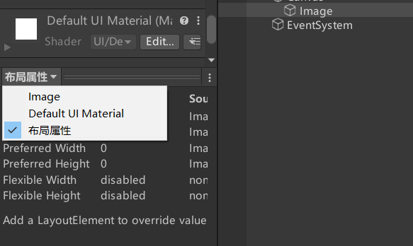
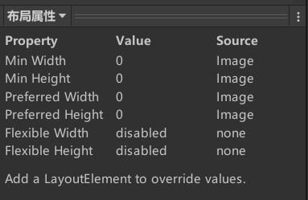
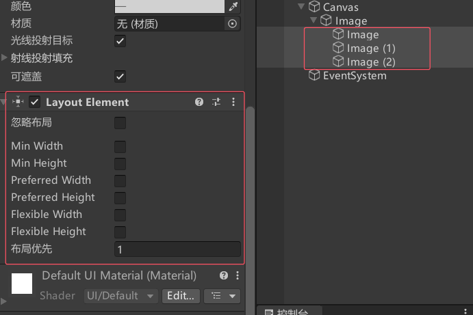
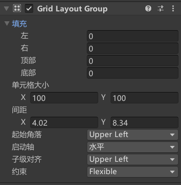

# 自动布局是什么
虽然UGUI的RectTransform已经非常方便的可以帮助我们快速布局，但UGUI中还提供了很多可以帮助我们对UI控件进行自动布局的组件。他们可以帮助我们自动的设置UI控件的位置和大小等。

自动布局的工作方式一般是：自动布局控制组件 + 布局元素 = 自动布局
自动布局控制组件：Unity提供了很多用于自动布局的管理性质的组件用于布局。
布局元素：具备布局属性的对象们，这里主要是指具备RectTransform的UI组件。

# 布局元素的布局属性
要参与自动布局的布局元素必须包含布局属性。布局属性主要有以下几条：

Minmum width：该布局元素应具有的最小宽度。
Minmum height：该布局元素应具有的最小高度。
Preferred width：在分配额外可用宽度之前，此布局元素应具有的宽度。
Preferred height：在分配额外可用高度之前，此布局元素应具有的高度。
Flexible width：此布局元素应相对于其同级而填充的额外可用宽度的相对量。
Flexible height：此布局元素应相对于其同级而填充的额外可用高度的相对量。

在进行自动布局时，会通过计算布局元素中的这6个属性来确定控件的大小和位置。

在布局时，布局元素的大小设置遵循以下基本规则：
1. 首先分配最小大小（Minmum width 和 Minmum height）。
2. 如果父容器中有足够的可用空间，则分配 Preferred width 和 Preferred height。
3. 如果上述两条规则分配完成后仍有额外空间，则分配 Flexible width 和 Flexible height。

一般情况下，布局元素的这些属性都是0。但是特定的UI组件依附的对象的布局属性可能会被改变，例如 Image 和 Text。
通常情况下，我们不会手动修改这些属性，但是如果有需要，可以手动添加一个 LayoutElement 组件来修改这些布局属性。

eg:

# Horizontal Layout Group水平垂直布局组件

布局组件一般都是在父对象基础上布局子对象
然后给父对象添加布局组件就能自动对子对象进行布局

VerticalLayoutGroup组件类似
参数相关
Padding：左右上下边缘的偏移位置。

Spacing：子对象之间的间距。
ChildAlignment：九宫格对齐方式。

Control Child Size：是否控制子对象的宽高。
Use Child Scale：在设置子对象大小和布局时，是否考虑子对象的缩放。
Child Force Expand：是否强制子对象扩展以填充额外可用空间。
[UGUI_LayoutGroup填坑细节_child force expand-CSDN博客](https://blog.csdn.net/YE_wolf/article/details/78247332)

# Grid Layout Group 网格布局组件
布局组件一般都是在父对象基础上布局子对象
然后给父对象添加布局组件就能自动对子对象进行布局

下面是参数相关

Padding：左右上下边缘的偏移位置。
Cell Size：每个格子的大小。
Spacing：格子之间的间隔。

Start Corner：第一个元素所在的位置（四个角）。
Start Axis：沿着哪个轴放置元素；Horizontal 水平放置并换行，Vertical 竖直放置并换列。
Child Alignment：格子的对齐方式（九宫格）。
Constraint：行列约束。
Flexible：灵活模式，根据容器大小自动适应。
Fixed Column Count：固定列数。
Fixed Row Count：固定行数。

# Content Size Fitter 内容大小适配器
内容大小适配器（Content Size Fitter）可以自动调整 RectTransform 的宽度和高度，以使组件自动设置大小。通常在 Text 组件上使用，或与其他布局组件一起使用。

Horizontal Fit：控制宽度的方式。
Vertical Fit：控制高度的方式。
可选参数包括：
Unconstrained：不根据布局元素伸展宽度或高度。
Min Size：根据布局元素的最小宽度或高度伸展。
Preferred Size：根据布局元素的首选宽度或高度伸展宽度。

和滚动视图

# Aspect Ratio Fitter 宽高比适配器
可以让布局元素按照一定的比例调整自身的大小，并在父对象内部根据父对象的大小进行适配。

- Aspect Mode：适配模式，用于调整矩形大小以实现宽高比。
    - None：不对矩形进行宽高比适配。
    - Width Controls Height：根据宽度自动调整高度。
    - Height Controls Width：根据高度自动调整宽度。
    - Fit In Parent：自动调整宽度、高度、位置和锚点，使矩形适应父项的矩形，同时保持宽高比，可能会出现“黑边”。
    - Envelope Parent：自动调整宽度、高度、位置和锚点，使矩形覆盖父项的整个区域，同时保持宽高比，可能会出现“裁剪”。
- Aspect Ratio：宽度除以高度的比值，即宽高比。

