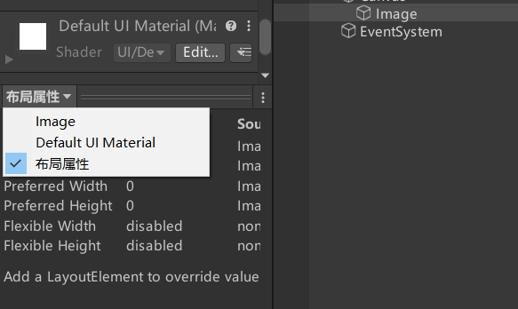
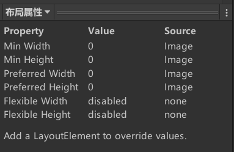
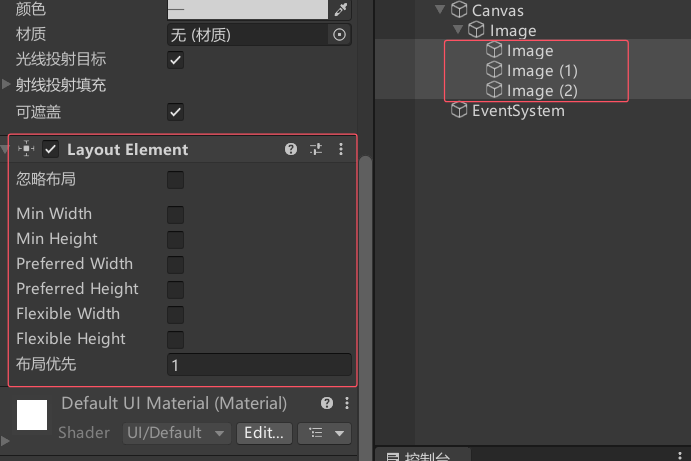
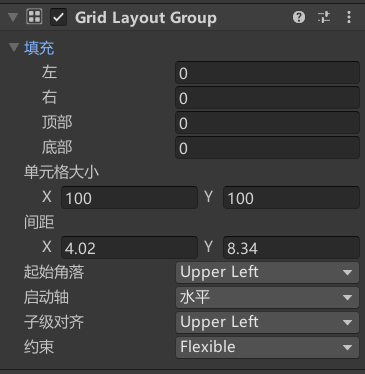

# 自动布局是什么
虽然UGUI的RectTransform已经非常方便的可以帮助我们快速布局，但UGUI中还提供了很多可以帮助我们对UI控件进行自动布局的组件。他们可以帮助我们自动的设置UI控件的位置和大小等。

自动布局的工作方式一般是：自动布局控制组件 + 布局元素 = 自动布局
自动布局控制组件：Unity提供了很多用于自动布局的管理性质的组件用于布局。
布局元素：具备布局属性的对象们，这里主要是指具备RectTransform的UI组件。

# 布局元素的布局属性
要参与自动布局的布局元素必须包含布局属性。布局属性主要有以下几条：

Minmum width：该布局元素应具有的最小宽度。
Minmum height：该布局元素应具有的最小高度。
Preferred width：在分配额外可用宽度之前，此布局元素应具有的宽度。
Preferred height：在分配额外可用高度之前，此布局元素应具有的高度。
Flexible width：此布局元素应相对于其同级而填充的额外可用宽度的相对量。
Flexible height：此布局元素应相对于其同级而填充的额外可用高度的相对量。

在进行自动布局时，会通过计算布局元素中的这6个属性来确定控件的大小和位置。

在布局时，布局元素的大小设置遵循以下基本规则：
1. 首先分配最小大小（Minmum width 和 Minmum height）。
2. 如果父容器中有足够的可用空间，则分配 Preferred width 和 Preferred height。
3. 如果上述两条规则分配完成后仍有额外空间，则分配 Flexible width 和 Flexible height。

**示例**：  
在水平布局组中，两个按钮分别设置 `Flexible Width` 为 1 和 2，则剩余空间会按 1:2 的比例分配给两个按钮，实现不等宽的拉伸效果。

一般情况下，布局元素的这些属性都是0。但是特定的UI组件依附的对象的布局属性可能会被改变，例如 Image 和 Text。
通常情况下，我们不会手动修改这些属性，但是如果有需要，可以手动添加一个 LayoutElement 组件来修改这些布局属性。

eg:

# Horizontal Layout Group水平垂直布局组件

布局组件一般都是在父对象基础上布局子对象
然后给父对象添加布局组件就能自动对子对象进行布局

VerticalLayoutGroup组件类似
参数相关
Padding：左右上下边缘的偏移位置。

Spacing：子对象之间的间距。
ChildAlignment：九宫格对齐方式。

**Control Child Size：是否控制子对象的宽高。**
**作用**：决定布局组是否强制修改子元素的宽 / 高，覆盖子元素自己的`RectTransform`尺寸设置。
它包含两个勾选框：`Width`（宽度）和`Height`（高度），可分别控制。

- **勾选某一项（如 Width）**：  
    子元素的宽度由布局组 “计算并强制设置”，子元素自己在`RectTransform`中设置的`Width`会失效。  
    计算规则：根据子元素的内容（如 Text 的文字长度）、布局元素（Layout Element）的`Preferred Size`等自动计算。
    
- **不勾选某一项（如 Width）**：  
    子元素的宽度保持自己`RectTransform`中设置的值，布局组只负责排列位置，不修改大小

**举例**：  
给一个 Panel 添加 “Horizontal Layout Group”，里面放两个 Button：
- 若勾选`Control Child Size > Width`：两个 Button 的宽度会被布局组自动调整（比如根据按钮文字长度），无论你手动给 Button 设多大的宽度都无效。
- 若不勾选`Width`：两个 Button 会保持你手动设置的宽度，布局组只负责把它们左右排开，间距由`Spacing`控制。

**Use Child Scale：在设置子对象大小和布局时，是否考虑子对象的缩放。**
**作用**：布局时是否考虑子元素的`Scale`（缩放）属性对位置和大小的影响。
UI 元素的`Transform`组件有`Scale`（默认 1,1,1），缩放会让元素视觉上变大 / 变小，但默认不影响布局（类似 “视觉缩放，物理占位不变”）。
- **勾选**：  
    布局组会把 “缩放后的尺寸” 计入布局计算。比如子元素`Scale`设为 0.5（缩小一半），布局时它占的空间也会减半，其他元素会靠近它。
    
- **不勾选（默认）**：  
    布局组忽略缩放，按子元素 “原始尺寸” 计算布局。即使子元素缩放到 0.1，它在布局中占的空间仍和没缩放时一样，其他元素不会因为它视觉变小而靠近。
**举例**：  
水平布局组中有两个 Button，给第一个 Button 的`Scale`设为 0.5（视觉上变小）：

- 勾选`Use Child Scale`：第一个 Button 在布局中占的空间会变小，第二个 Button 会向左移动，两者间距看起来更紧凑。
- 不勾选：第一个 Button 视觉上变小，但布局中占的空间不变，第二个 Button 位置不变，两者之间会出现 “视觉上的空隙”。

**Child Force Expand：是否强制子对象扩展以填充额外可用空间。**
**作用**：当布局组有 “剩余空间” 时，子元素是否主动拉伸以填满空间。
包含`Width`和`Height`两个勾选框，控制水平 / 垂直方向的拉伸。
- **勾选某一项（如 Width）**：  
    布局组在排列完所有子元素后，如果还有剩余空间（比如父物体宽度大于所有子元素总宽度 + 间距），子元素会自动拉伸宽度，填满剩余空间。  
    多个子元素时，按 “平均” 或 “权重”（通过 Layout Element 的`Flexible Width`设置）分配剩余空间。
    
- **不勾选某一项（如 Width）**：  
    子元素不会拉伸，剩余空间会保留（比如父物体很宽，但子元素还是按自己的大小排列，右边留空）。
**举例**：  
一个宽 500px 的 Panel，添加水平布局组，里面放两个 Button（每个宽 100px，间距 20px），总宽度是 100+20+100=220px，剩余 500-220=280px 空间：
- 勾选`Child Force Expand > Width`：两个 Button 会一起拉伸 280px（如果没设权重，各拉伸 140px，最终每个宽 240px）。
- 不勾选：两个 Button 保持 100px 宽，Panel 右边会留 280px 空白。

**三个参数的协作逻辑（一句话）：**
布局组先通过**Control Child Size**决定子元素的 “基础大小”，再通过**Use Child Scale**判断是否要根据缩放调整这个大小，最后通过**Child Force Expand**决定是否用剩余空间 “拉伸” 子元素。

**实际开发中的选择建议：**
- 做 “固定大小” 的元素（如按钮组）：不勾选`Control Child Size`（自己控制大小），不勾选`Child Force Expand`（不拉伸）。
- 做 “自适应内容” 的元素（如文本框组）：勾选`Control Child Size`（让布局组根据内容算大小）。
- 做 “填满父物体” 的元素（如工具栏）：勾选`Child Force Expand`（让子元素拉伸填满空间）。
- 几乎不用`Use Child Scale`：UI 很少靠缩放调整大小，一般直接改尺寸，所以默认不勾选即可。

[UGUI_LayoutGroup填坑细节_child force expand-CSDN博客](https://blog.csdn.net/YE_wolf/article/details/78247332)

# Grid Layout Group 网格布局组件
布局组件一般都是在父对象基础上布局子对象
然后给父对象添加布局组件就能自动对子对象进行布局

下面是参数相关

Padding：左右上下边缘的偏移位置。
Cell Size：每个格子的大小。
Spacing：格子之间的间隔。

Start Corner：第一个元素所在的位置（四个角）。
Start Axis：沿着哪个轴放置元素；Horizontal 水平放置并换行，Vertical 竖直放置并换列。
Child Alignment：格子的对齐方式（九宫格）。
Constraint：行列约束。
Flexible：灵活模式，根据容器大小自动适应。
Fixed Column Count：固定列数。
Fixed Row Count：固定行数。

# Content Size Fitter 内容大小适配器
内容大小适配器（Content Size Fitter）可以自动调整 RectTransform 的宽度和高度，以使组件自动设置大小。通常在 Text 组件上使用，或与其他布局组件一起使用。

Horizontal Fit：控制宽度的方式。
Vertical Fit：控制高度的方式。
可选参数包括：
Unconstrained：不根据布局元素伸展宽度或高度。
Min Size：根据[布局元素](#布局元素的布局属性)的最小宽度或高度伸展。
Preferred Size：根据布局元素的首选宽度或高度伸展宽度。

和滚动视图

# Aspect Ratio Fitter 宽高比适配器
可以让布局元素按照一定的比例调整自身的大小，并在父对象内部根据父对象的大小进行适配。

- Aspect Mode：适配模式，用于调整矩形大小以实现宽高比。
    - None：不对矩形进行宽高比适配。
    - Width Controls Height：根据宽度自动调整高度。
    - Height Controls Width：根据高度自动调整宽度。
    - Fit In Parent：自动调整宽度、高度、位置和锚点，使矩形适应父项的矩形，同时保持宽高比，可能会出现“黑边”。
    - Envelope Parent：自动调整宽度、高度、位置和锚点，使矩形覆盖父项的整个区域，同时保持宽高比，可能会出现“裁剪”。
- Aspect Ratio：宽度除以高度的比值，即宽高比。

