# Canvas组件用来干啥
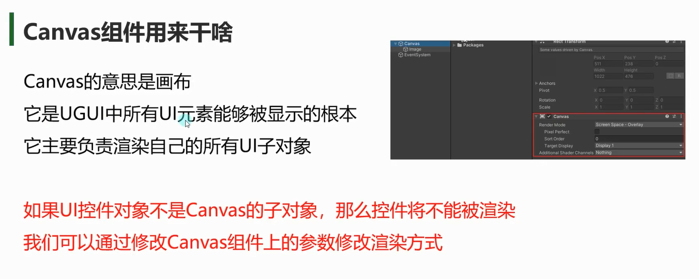

场景上可以有多个Canvas对象
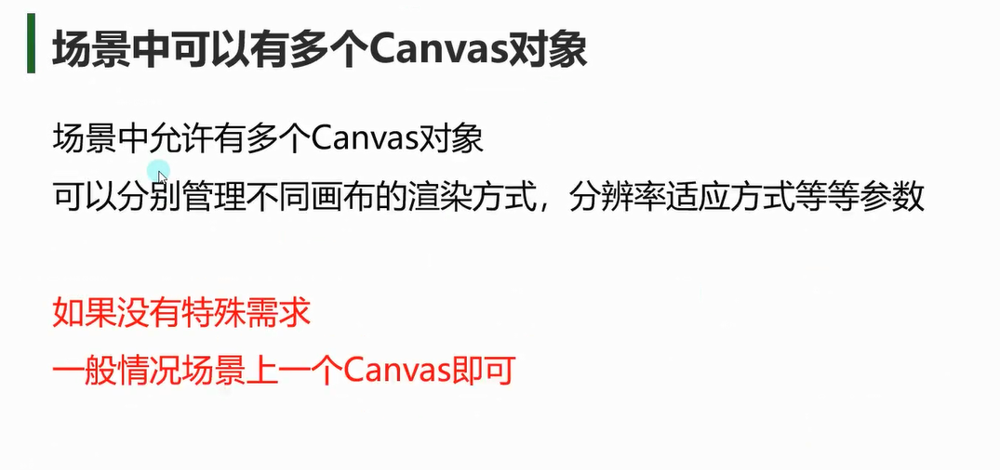

# Canvas的三种渲染方式
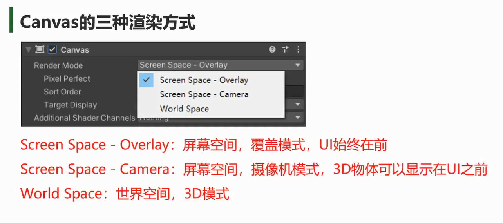

## Screen Space - Overlay
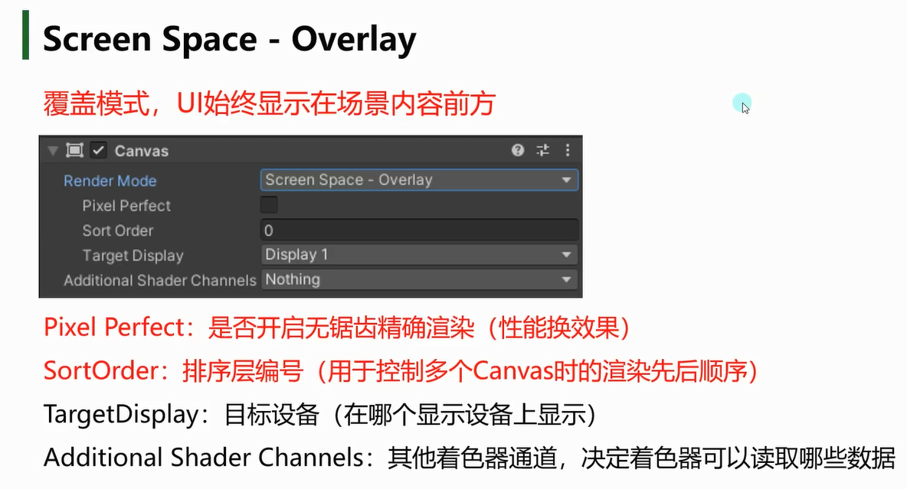

UI始终显示在3d物体前面
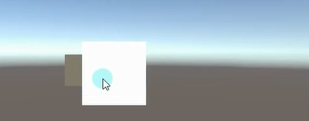

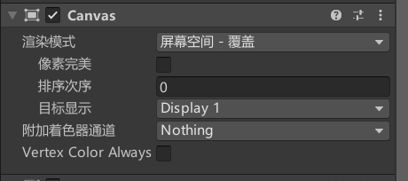

### Pixel Perfect ：
是否开启无锯齿精确渲染（性能换效果）

### SortOrder：
排序层编号
用于控制多个Canvas时的渲染先后顺序
次序越大，越后渲染，然后显示在前面

### TargetDisplay*：
目标设备（在哪个显示设备上显示）
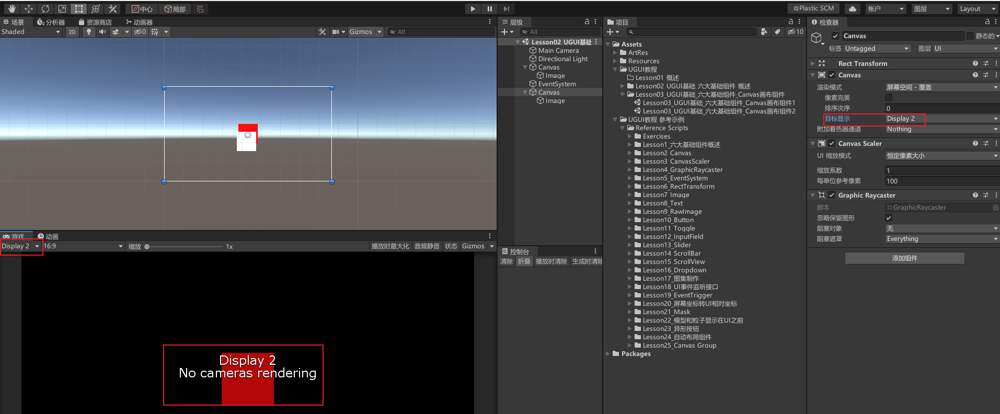

### Additional Shader Channels*：
其他着色器通道，决定着色器可以读取哪些数据

## Screen Space - Camera
手游用这个用的多
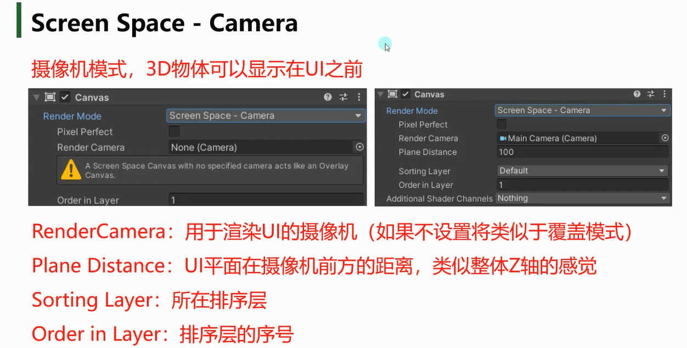

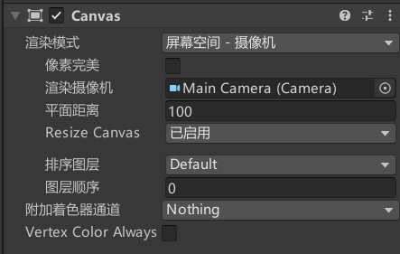
### RenderCamera：
用于渲染UI的摄像机（如果不设置将类似于覆盖模式）

不推荐设置成主摄像机
设置成主摄像机可能会不好控制哪些场景模型要在UI前面，哪些要在后面
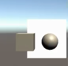

建议多创建一个只渲染UI层的摄像机并关联，设置模式为仅深度。调整深度比主摄像机高。这样UI就能一直在模型前面了。假如想创建显示在UI层前面的模型，直接创建在UI下的子物体即可。

### Plane Distance：
UI平面在摄像机前方的距离，类似整体Z轴的感觉
可以通过这个来让3d物体显示之前或者之后 **（一般不用）**
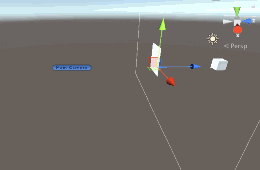

下面两参数用来决定多个Canvas之间的顺序
### Sorting Layer：所在排序层
### Order in Layer：排序层的序号

### eg：
主摄像机不渲染UI层
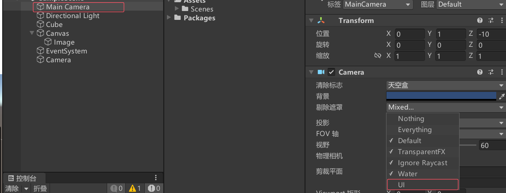

新建一个摄像机，只渲染UI层，清楚标志选择仅深度
注意：
因为**新创建的摄像机的深度（仅深度） > 主摄像机的深度（天空盒）**
所以UI元素只会显示在屏幕前面
想要在UI前面显示3d物体可以在UI的Canvas下面创建3d物体
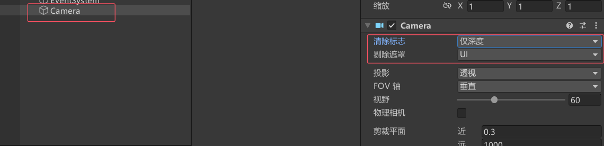

UI的渲染选择新创建的摄像机
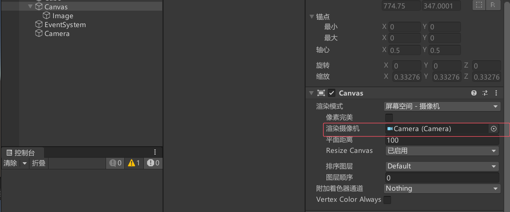

## World Space
3D模式，可以把UI对象像3D物体一样处理，常用于VR或者AR  
一般把关联的摄像机设置成主摄像机，重置UI的比例和长宽后，标准单位的UI图片大小是和立方体一样的。可以把UI当成3D物体处理。
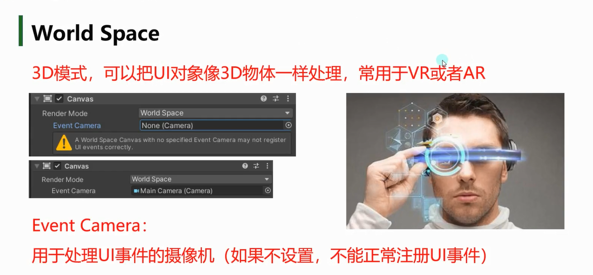

**Event Camera：**
用于处理UI事件的摄像机（如果不设置，不能正常注册UI事件）
这里关联的摄像机一般就是我们的主摄像机

# 总结
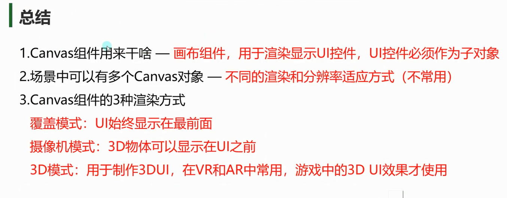