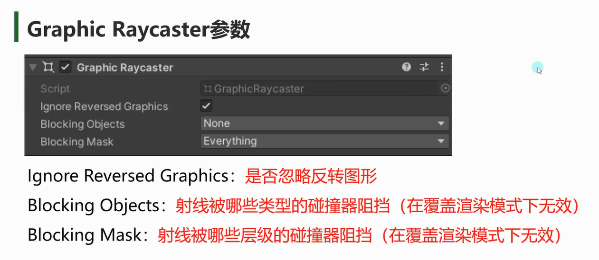

# Graphic Raycaster用来干啥

# Graphic Raycaster参数

## Ignore Reversed Graphics：忽略反转图形
勾选后，假如对象旋转了x轴或y轴，点击失效

## Blocking Objects：
射线被哪些类型的碰撞器阻挡（在覆盖渲染模式下无效）

## Blocking Mask：
射线被哪些层级的碰撞器阻挡（在覆盖渲染模式下无效）
要配合Blocking Objects使用
**Blocking Object 和 Blocking Mask两个都要满足才能阻挡射线**