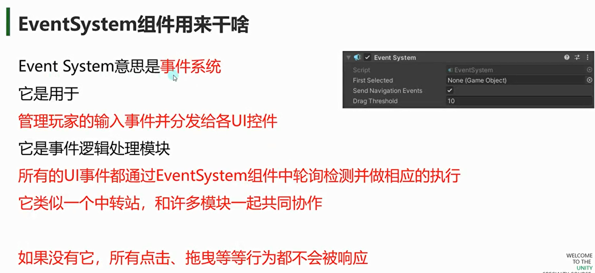
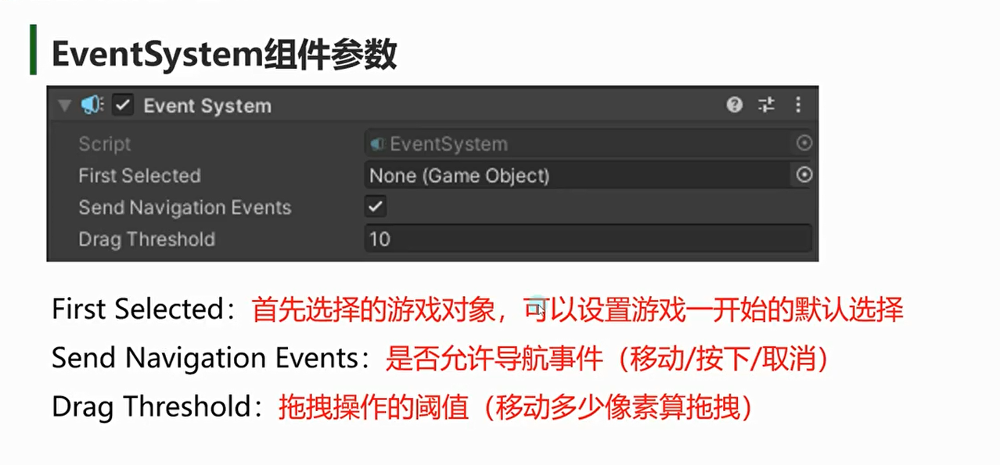
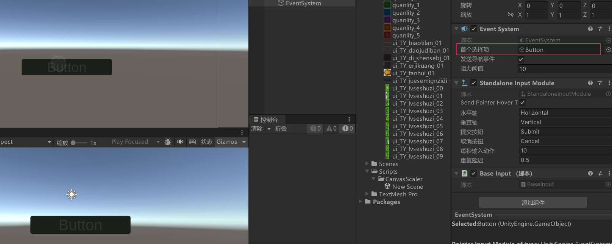
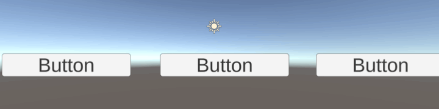
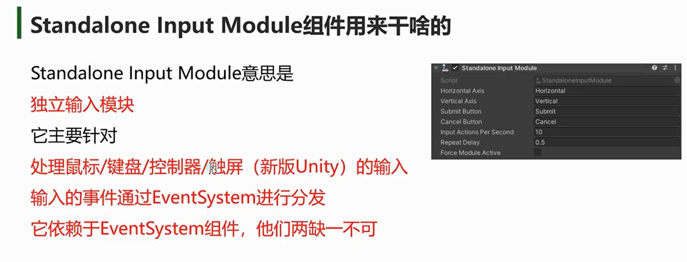
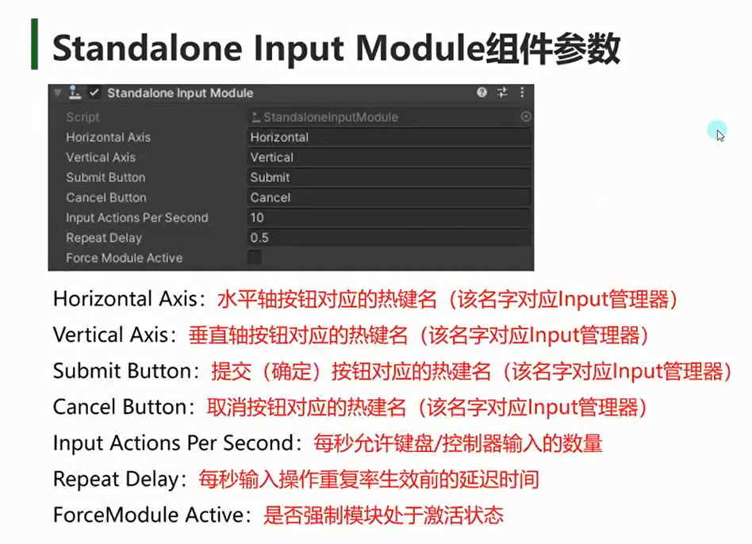
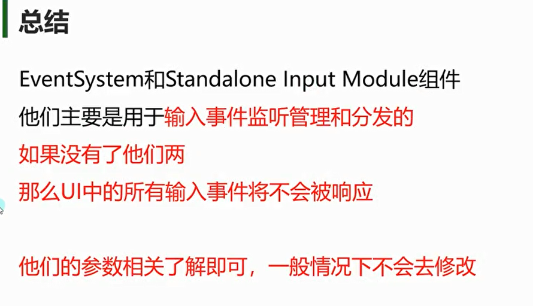

# EventSystem组件用来干啥

# EventSystem组件参数

## First Selected：首选游戏对象
首先选择的游戏对象，可以设置游戏一开始的默认选择

## Send Navigation Events：是否允许导航事件
（移动/按下/取消）
勾选后，可以按wasd或上下左右切换选择的对象

## Drag Threshold：拖拽阈值
拖拽操作的阈值（移动多少像素算拖拽）
鼠标移动多少像素进入拖拽状态

# Standalone Input Module组件用来干啥的

# Standalone Input Module参数
**一般不需要修改**

Horizontal Axis：水平轴按钮对应的热键名（该名字对应Input管理器）
Vertical Axis：垂直轴按钮对应的热键名（该名字对应Input管理器）
Submit Button：提交（确定）按钮对应的热键名（该名字对应Input管理器）
Cancel Button：取消按钮对应的热键名（该名字对应Input管理器）
Input Actions Per Second：每秒允许键盘/控制器输入的数量
Repeat Delay：每秒输入操作重复率生效前的延迟时间
ForceModule Active：是否强制模块处于激活状态
一般其实不会修改Standalone Input Module组件的

EventSystem对象提供了调试信息相关

