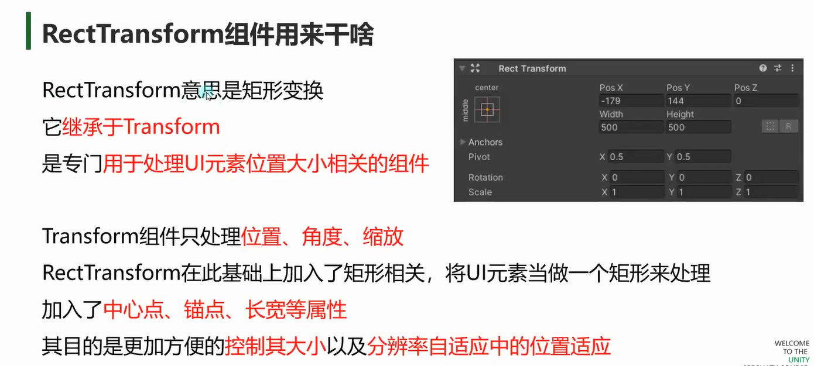
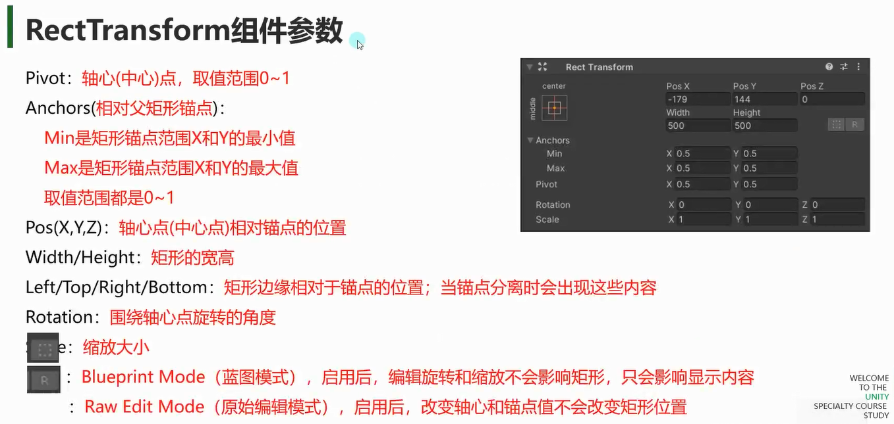
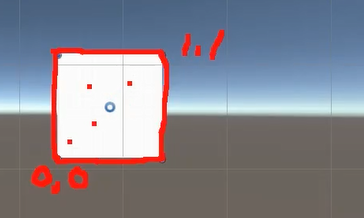
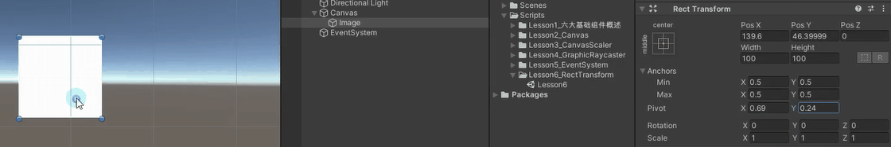
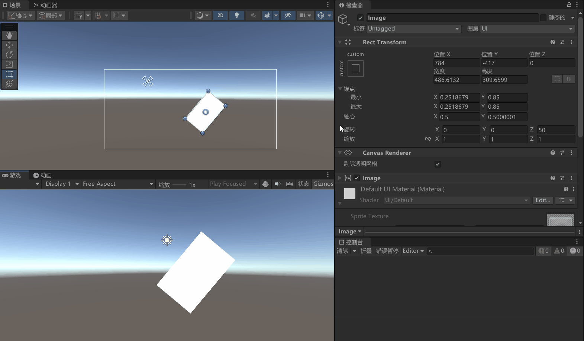
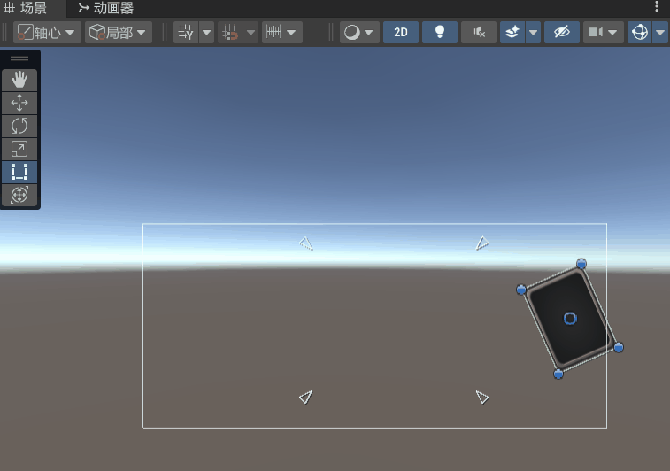
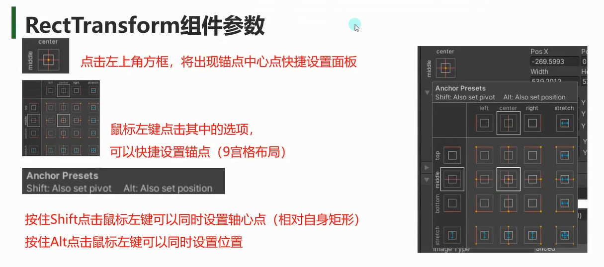

# RectTransform组件用来干啥


# RectTransform参数



## Pivot 轴心点

轴心点是旋转的中心点

轴心点会和锚点一起用于位置的计算
轴心点会影响当宽高扩大缩小时是已轴的哪个方向进行伸缩的

## Anchors 相对父矩形锚点

**锚点为点**
当锚点是一个点的时候
**轴心到锚点的距离（位置X 和 位置Y）都不变**
**UI 元素的大小不会随父对象的尺寸改变而改变。**
一般用来设置
固定位置的 UI 元素：例如游戏中的固定提示框、固定按钮等。无论父对象的大小如何变化，这些元素都会保持在相对父对象的固定位置。
不依赖布局变化的元素：一些独立的 UI 元素，如单独的图标、小窗口等，它们的大小和位置不需要根据父对象的布局进行调整。


**锚点为矩形**
参考NGUI中的 
注意观察图片周围生成的白色虚线和矩形锚点各个边


会对图片进行拉升变形，
注意红框位置的竖直都没有变，即图片的各个边到锚点矩形各边的位置没变

一般用于自适应布局的 UI 元素：例如游戏中的背景图片、全屏的菜单界面等




可以通过代码直接获取Rect Transform
```cs
this.transform as RectTransform
print((this.transform as RectTransform).sizeDelta);
```


# RectTransform 类的核心属性

## 位置和大小
### anchoredPosition
UI 元素相对于锚点的位置。注意：如果锚点不是居中的，anchoredPosition 的参考点会发生变化。

### sizeDelta
UI 元素的大小变化量，相对于父容器的锚点范围。如果锚点是拉伸的，sizeDelta 表示 UI 元素的实际大小。

### rect
获取 UI 元素的矩形信息，包括位置和大小。rect 是只读的。


## 锚点（Anchors）
锚点定义了 UI 元素相对于父容器的定位方式。锚点由四个值组成（Min X, Min Y, Max X, Max Y），范围在 0 到 1 之间。

如果锚点是一个点（如 (0.5, 0.5)），UI 元素会以该点为中心定位。
如果锚点是一个范围（如 (0, 0) 到 (1, 1)），UI 元素会拉伸以适应父容器的大小。

## 轴心点（Pivot）

## 边距（Offset）

边距定义了 UI 元素相对于锚点的偏移量。边距由四个值组成（Left, Right, Top, Bottom），用于调整 UI 元素的位置和大小。

## eg：
```cs
RectTransform rectTransform = GetComponent<RectTransform>();

// 设置位置
rectTransform.anchoredPosition = new Vector2(100, 50);

// 设置大小
rectTransform.sizeDelta = new Vector2(200, 100);

// 设置锚点
rectTransform.anchorMin = new Vector2(0, 0);
rectTransform.anchorMax = new Vector2(1, 1);

// 设置轴心点
rectTransform.pivot = new Vector2(0, 1);
```

