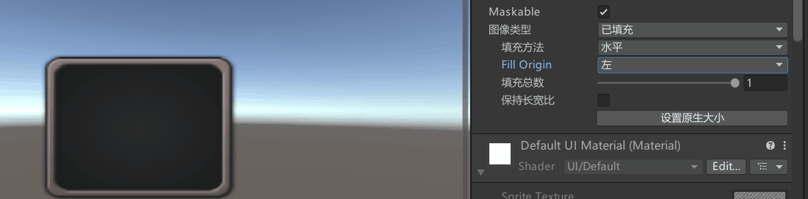

# Image图片控件是什么
Image是图像组件，是UGUI中用于显示精灵图片的关键组件。
除了背景图等大图，一般都使用Image来显示UI中的图片元素。


# Image参数


## Source Image：图片来源（图片类型必须是”精灵“类型）

## Color：图像的颜色

## Material：图像的材质（一般不修改，会使用UI的默认材质）

## Raycast Target：是否作为射线检测的目标
如果不勾选将不会响应射线检测

这里嘴一句：UGUI可以通过更改Canvas下面的顺序来调整渲染顺序的

## Maskable：是否能被遮罩
之后结合遮罩相关知识点进行讲解

## Image Type：图片类型

### Simple-普通模式，均匀缩放整个图片


### Sliced-切片模式，9宫格拉伸，只拉伸中央十字区域
记得要导入2d的sprite包


Pixels Per UnitMultiplier：每单位像素乘数（越大越细节）
Fill Center：中心填充


### Tiled-平铺模式
重复平铺，九宫格中央部分


### Filled-填充模式
Fill Method：填充方式 
Fill Origin：填充原点 
Fill Amount：填充量 
Clockwise：顺时针方向



## Use Sprite Mesh*：使用精灵网格，勾选的话Unity会帮我们生成图片网格

## Preserve Aspect*：确保图像保持其现有尺寸

## Set Native Size：设置为图片资源的原始大小
会根据你里面的恒定像素模式或者恒定物理模式计算


# 代码控制
需 `using UnityEngine.UI;`
```cs
using UnityEngine.UI;


Image image = this.GetComponent<Image>();

// 从资源文件夹中加载名为 "ui_TY_fanhui_01" 的 Sprite，并将其设置为 Image 的显示图像
image.sprite = Resources.Load<Sprite>("ui_TY_fanhui_01");

// (transform as RectTransform).sizeDelta 设置为 Image 的宽高， 修改其尺寸为宽度 200、高度 200 的 Vector2 
(transform as RectTransform).sizeDelta = new Vector2(200, 200);

// 禁用该 Image 组件的射线检测，使其不响应用户的点击事件
image.raycastTarget = false;

// 将该 Image 组件的颜色设置为红色
image.color = Color.red;
```

