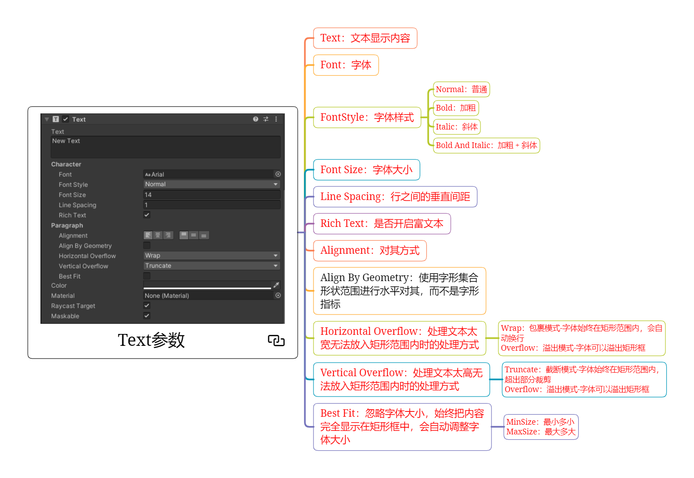
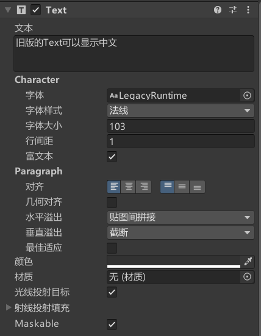
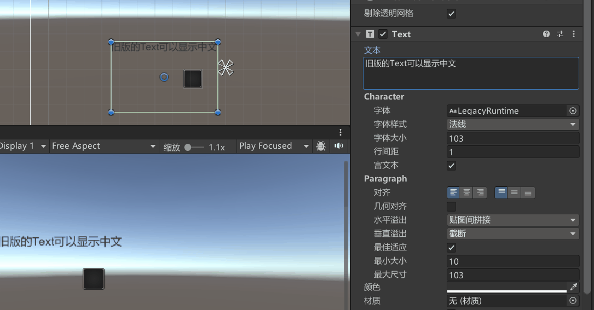
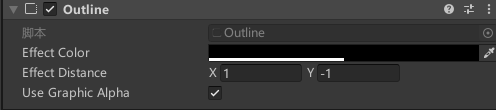
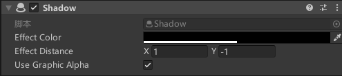

# Text是什么
Text是文本组件，是UGUI中用于显示文本的关键组件。


# Text文本组件参数

**注意：Text很有可能挡住射线，可以把射线检测取消勾选**



## Text：文本显示内容

## Font：字体

## FontStyle：字体样式
Normal：普通
Bold：加粗
Italic：斜体
Bold And Italic：加粗 + 斜体

## Font Size：字体大小

## Line Spacing：行之间的垂直间距

## Rich Text：是否开启富文本
要开启富文本选项才能起作用。

```text
加粗: <b>文本内容</b>
斜体: <i>文本内容</i>
大小: <size=50>文本内容</size>
颜色:
<color=#ff0000ff>文本内容</color>
<color=red>文本内容</color>
```
## Alignment：对其方式

## Align By Geometry*：几何对齐
使用字形集合形状范围进行水平对其，而不是字形指标

## Horizontal Overflow：水平溢出
处理文本太宽无法放入矩形范围内时的处理方式

Wrap：包裹模式-字体始终在矩形范围内，会自动换行
Overflow：溢出模式-字体可以溢出矩形框

## Vertical Overflow：垂直溢出
处理文本太高无法放入矩形范围内时的处理方式

Truncate：截断模式-字体始终在矩形范围内，超出部分裁剪
Overflow：溢出模式-字体可以溢出矩形框

## Best Fit：最佳适应
忽略字体大小，始终把内容完全显示在矩形框中，会自动调整字体大小

MinSize：最小多小
MaxSize：最大多大




# 边缘线和阴影
## Outline边缘线组件


## Shadow阴影组件



# 代码控制

```cs
Text text = this.GetComponent<Text>();

//设置文本显示内容
text.text = "hello world";

```