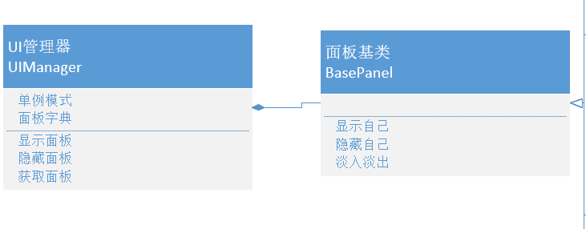

```cs
public abstract class BasePanel : MonoBehaviour
{
    private CanvasGroup canvasGroup;
    // 淡入淡出速度
    private float alphaSpeed = 10f;

    private bool isShow = false;

    // 当淡出时的委托
    public UnityAction hideCallBack;
    protected virtual void Awake()
    {
        canvasGroup = this.GetComponent<CanvasGroup>();
        if (canvasGroup == null)
        {
            canvasGroup = this.gameObject.AddComponent<CanvasGroup>();
        }
    }

    protected virtual void Start()
    {
        Init();
    }

    /// <summary>
    /// 初始化按钮事件监听
    /// </summary>
    public abstract void Init();

    public virtual void ShowMe()
    {
        isShow = true;
        canvasGroup.alpha = 0;
    }
    public virtual void HideMe(UnityAction callBack)
    {
        isShow = false;
        canvasGroup.alpha = 1;
        hideCallBack = callBack;
    }

    void Update()
    {
        // 淡入
        if (isShow && canvasGroup.alpha != 1)
        {
            canvasGroup.alpha += alphaSpeed * Time.deltaTime;
            if (canvasGroup.alpha >= 1)
                canvasGroup.alpha = 1;
        }

        // 淡出
        else if (!isShow)
        {
            canvasGroup.alpha -= alphaSpeed * Time.deltaTime;
            if (canvasGroup.alpha <= 0)
            {
                canvasGroup.alpha = 0;
                hideCallBack?.Invoke();
            }
        }
    }
}
```